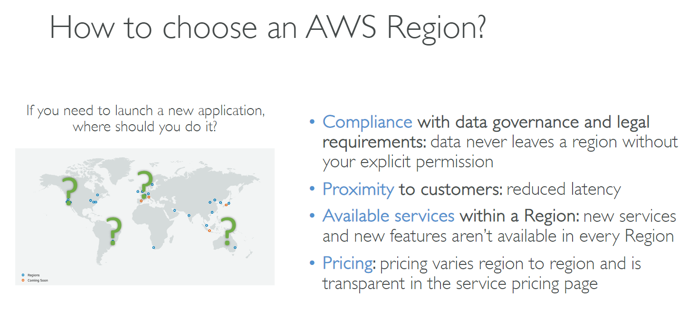

# 🌍 How to Choose an AWS Region

When selecting an AWS Region to launch your application, consider:

1. **📜 Compliance & Legal Requirements**
   Ensure the Region meets your data residency and governance needs — data stays within the Region unless you move it.

2. **📍 Proximity to Customers**
   Choose a Region closer to your users to reduce latency and improve performance.

3. **🧰 Available Services**
   Not all Regions offer every AWS service or feature — check availability first.

4. **💰 Pricing Differences**
   AWS pricing varies by Region — compare costs on the [pricing page](https://aws.amazon.com/pricing/).

---

    

---

✅ **Tip**: For a new app, prioritize **compliance**, then check **service availability**, followed by **latency** and **cost**.
