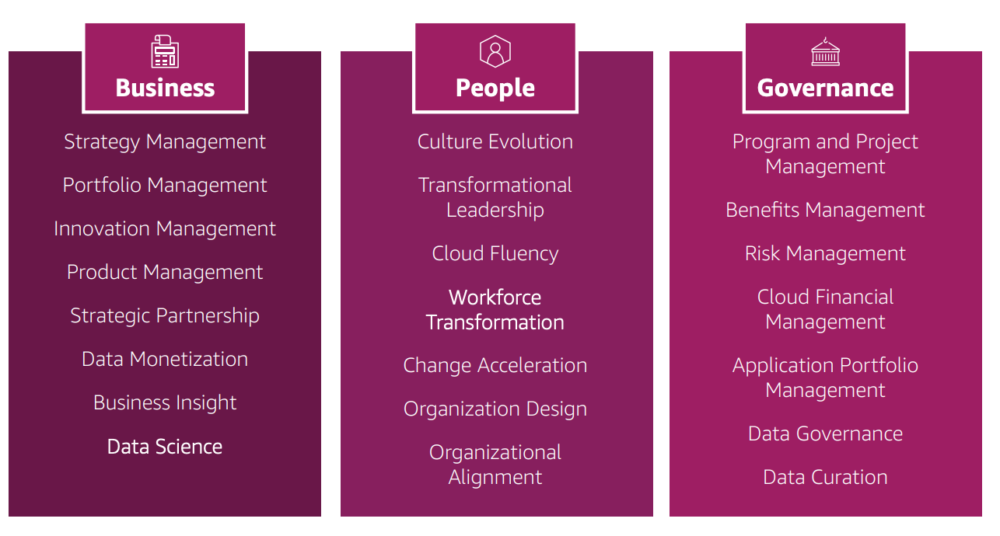
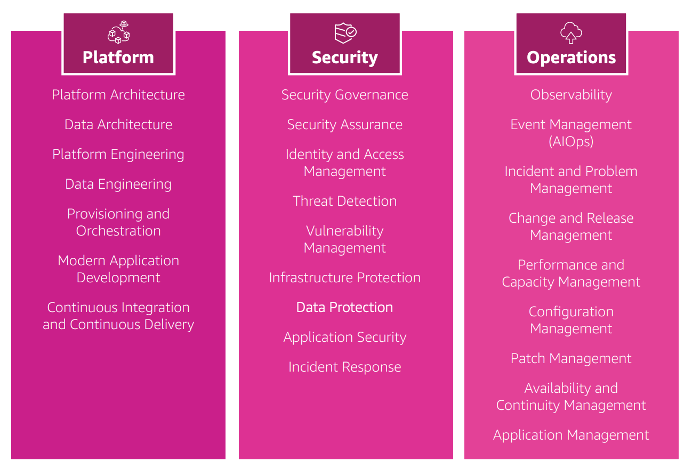
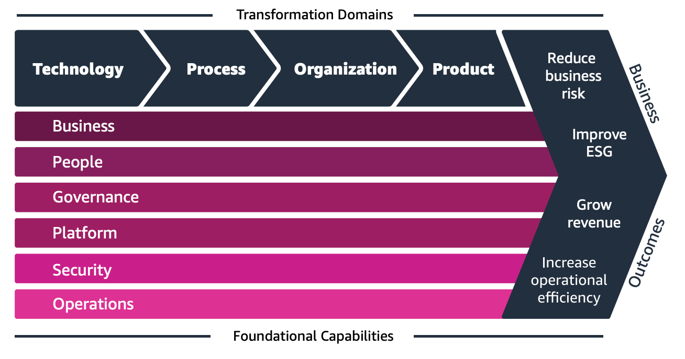

Absolutely! Let’s turn the **boring AWS Cloud Adoption Framework (CAF)** into a simple, smart, and **exam-friendly cheat topic** you’ll actually remember — especially for the **AWS Certified Cloud Practitioner (CLF-C02)** exam.

---

# 🧠 AWS Cloud Adoption Framework (AWS CAF) — Made Simple

---

## 🚀 What is AWS CAF?

> A **framework** built by AWS experts to help **organizations plan and execute** their **cloud transformation** using AWS best practices.

### 🎯 Purpose:

* Build a **clear roadmap** to the cloud.
* Guide your **people, processes, and technology** to align with your business goals.
* Based on lessons from **thousands of AWS customers**.

---

## 🧩 6 Perspectives of AWS CAF

CAF groups everything into **6 areas (Perspectives)** — think of them as lenses to look at your organization:

### 🔵 **Business**

✅ Focus: Business value
📌 Ensure cloud boosts **business outcomes and digital transformation**.

### 🧑‍🤝‍🧑 **People**

✅ Focus: Culture & skills
📌 Evolve **leadership**, org structure, and **cloud-savvy workforce**.

### 🏛️ **Governance**

✅ Focus: Control & risk
📌 Manage **policies, compliance, and investments** safely.

### 🧱 **Platform**

✅ Focus: Tech foundation
📌 Build and modernize **hybrid or cloud-native infrastructure**.

### 🔐 **Security**

✅ Focus: Protect data
📌 Ensure **confidentiality, integrity, and availability** (CIA).

### ⚙️ **Operations**

✅ Focus: Performance & reliability
📌 Deliver **resilient cloud services** aligned to business needs.

📝 **Tip to remember**:
**BPG-PSO** = *Business, People, Governance – Platform, Security, Operations*

---

## 🧬 4 Transformation Domains

AWS CAF also helps in **4 key areas of change** across your organization:

| Domain           | Focus                                                |
| ---------------- | ---------------------------------------------------- |
| **Technology**   | Migrate, modernize apps, infra, data, ML             |
| **Process**      | Automate operations, optimize workflows              |
| **Organization** | Restructure teams, adopt agile, build new models     |
| **Product**      | Innovate with new services, pricing, business models |

---

## 📈 4 Phases of Transformation

| Phase        | Goal                                                                 |
| ------------ | -------------------------------------------------------------------- |
| **Envision** | Spot **transformation opportunities** & link cloud to business goals |
| **Align**    | Identify **gaps in capabilities** using the 6 perspectives           |
| **Launch**   | Start **pilot projects** to show real business value                 |
| **Scale**    | Expand pilots to **full-scale adoption** across the organization     |

---

## 💡 Final Exam Tips

* **CAF = Business Transformation Plan**
* Always remember **6 Perspectives** → *People + Business + Governance + Tech (Platform, Security, Ops)*
* **Transformation Domains = TOPP** → Technology, Organization, Process, Product
* **Transformation Phases = EALS** → Envision, Align, Launch, Scale

---

Want a flashcard or visual memory sheet to lock this in?
