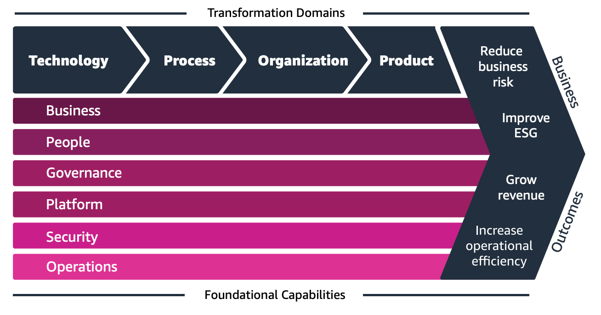
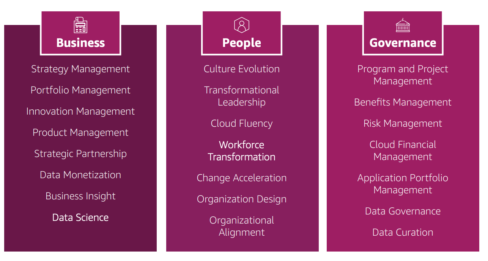
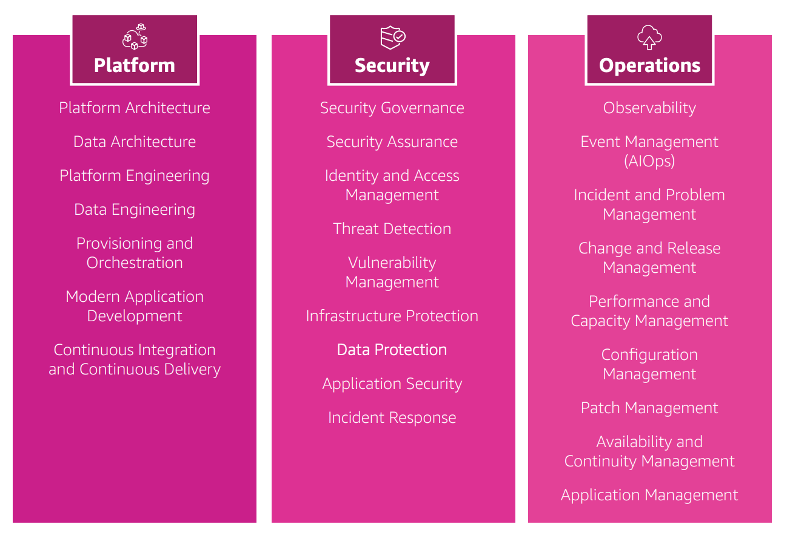

# 🧠 AWS Cloud Adoption Framework (AWS CAF) — Made Simple

## 🚀 What is AWS CAF?

> A **framework** built by AWS experts to help **organizations plan and execute** their **cloud transformation** using AWS best practices.

---

    

---

Think of **AWS CAF** as **your GPS for cloud migration**.
It helps a company figure out:
**“Where are we now? Where do we want to go in the cloud? And how do we get there without chaos?”**

AWS made it using lessons from thousands of customers. So, it's basically battle-tested advice.

### 🎯 Purpose

- Build a **clear roadmap** to the cloud.
- Guide your **people, processes, and technology** to align with your business goals.
- Based on lessons from **thousands of AWS customers**.

---

## 🧩 6 Perspectives of AWS CAF

💡 Imagine you're moving your business to the cloud.
CAF says: “You better think about these 6 things, or you'll regret it later.”

CAF groups everything into **6 areas (Perspectives)** — think of them as lenses to look at your organization:

---

    

---

    

---

### 🔵 **Business**

- ✅ Focus: Business value
- 📌 Ensure cloud boosts **business outcomes and digital transformation**.

### 🧑‍🤝‍🧑 **People**

- ✅ Focus: Culture & skills
- 📌 Evolve **leadership**, org structure, and **cloud-savvy workforce**.

### 🏛️ **Governance**

- ✅ Focus: Control & risk
- 📌 Manage **policies, compliance, and investments** safely.

### 🧱 **Platform**

- ✅ Focus: Tech foundation
- 📌 Build and modernize **hybrid or cloud-native infrastructure**.

### 🔐 **Security**

- ✅ Focus: Protect data
- 📌 Ensure **confidentiality, integrity, and availability** (CIA).

### ⚙️ **Operations**

- ✅ Focus: Performance & reliability
- 📌 Deliver **resilient cloud services** aligned to business needs.

---

✅ **Tip**: Group them like this to remember easily:

> 🔷 _Business, People, Governance_ = the people stuff  
> 🔶 _Platform, Security, Operations_ = the tech stuff

---

📝 **Tip to remember**:
**BPG-PSO** = _Business, People, Governance – Platform, Security, Operations_

---

## 🧬 4 Transformation Domains

AWS says: “Cloud isn’t just tech—it affects your whole company.”

So CAF breaks it down into **4 key areas of change** across your organization:

| Domain           | Focus                                                |
| ---------------- | ---------------------------------------------------- |
| **Technology**   | Migrate, modernize apps, infra, data, ML             |
| **Process**      | Automate operations, optimize workflows              |
| **Organization** | Restructure teams, adopt agile, build new models     |
| **Product**      | Innovate with new services, pricing, business models |

---

## 📈 4 Phases of Transformation

_How You Go from Idea to Cloud Success!_

When a company starts its cloud journey, here’s the path they usually take:

1. **Envision** → Dream big. What can cloud help us do better?
1. **Align** → What are we missing? What skills or tools do we need?
1. **Launch** → Try a small project (pilot) to test the waters.
1. **Scale** → It worked! Now go big across the company.

---

## 📝 How to Remember for the Exam

- CAF = Cloud Roadmap
- **6 Perspectives** = Business, People, Governance, Platform, Security, Operations
  - (💡BPG-PSO — memorize like a rhythm)\*
- **4 Domains** = Technology, Organization, Process, Product _(💡TOPP)_
- **4 Phases** = Envision, Align, Launch, Scale _(💡EALS)_
