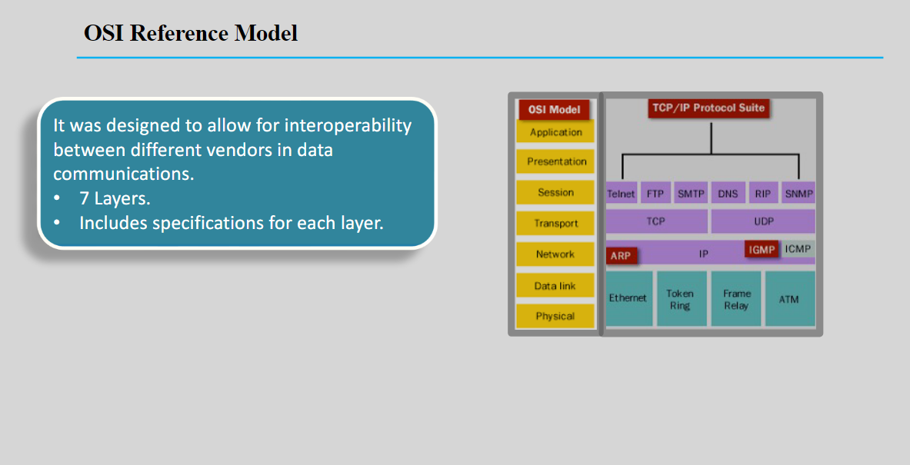
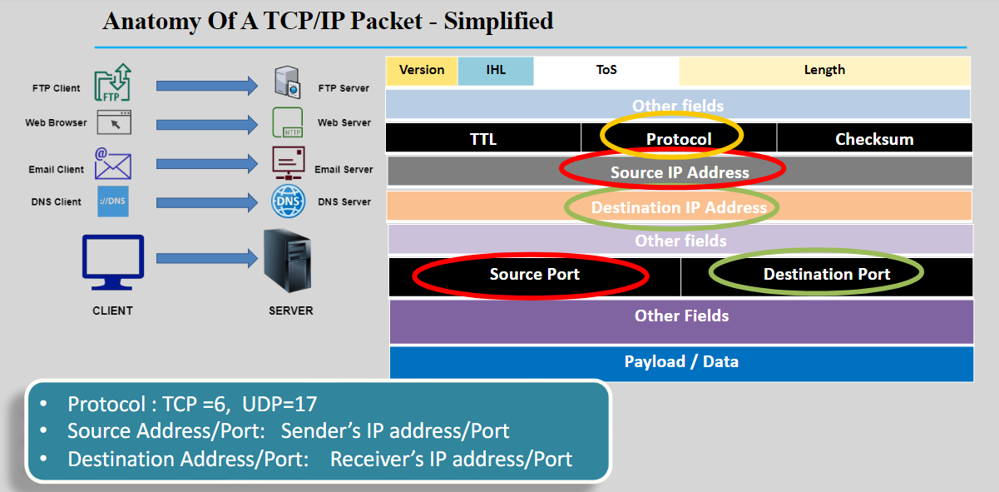
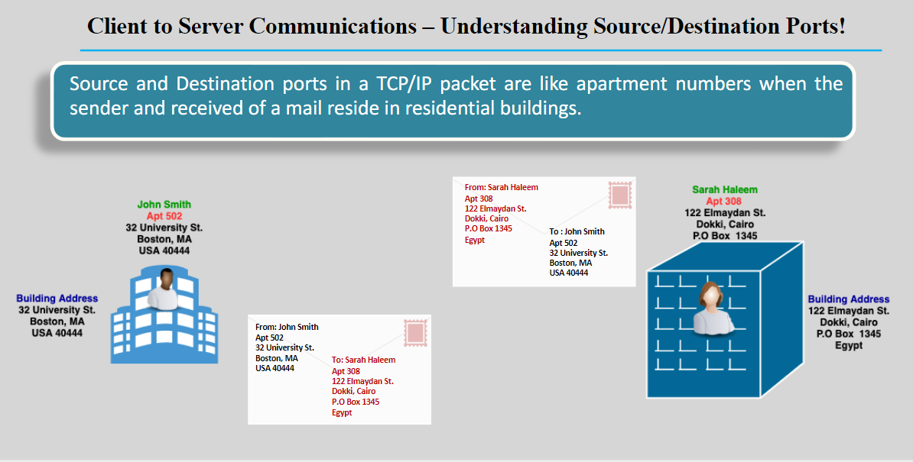
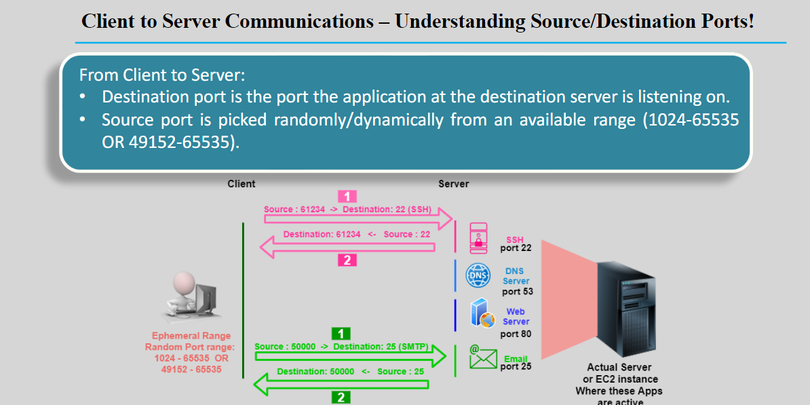

---
tags:
  - aws
  - aws/daily
  - aws/topic/aws-cloud-concepts
aliases:
  - "OSI Model"
  - "Osi Model Rcp Ip Packets Ports"
---

# OSI Model

---

## Related Notes
- [[aws-daily/aws-cloud-Concepts/0.2.whitelisting-vs-blacklisting|Whitelisting vs Blacklisting]] - next lesson

---
