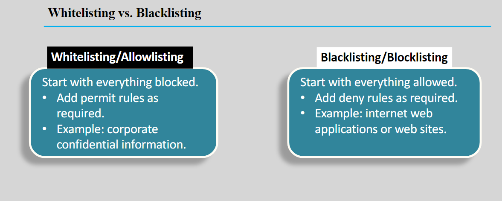

---
tags:
  - aws
  - aws/daily
  - aws/topic/aws-cloud-concepts
aliases:
  - "Whitelisting vs Blacklisting"
  - "Whitelisting Vs Blacklisting"
---

# Whitelisting vs Blacklisting

---

## Related Notes
- [[aws-daily/aws-cloud-Concepts/0.1.osi-model-rcp-ip-packets-ports|OSI Model]] - previous lesson
- [[aws-daily/aws-cloud-Concepts/0.3.backup-vs-snapshot|Backup vs Snapshot]] - next lesson

---
