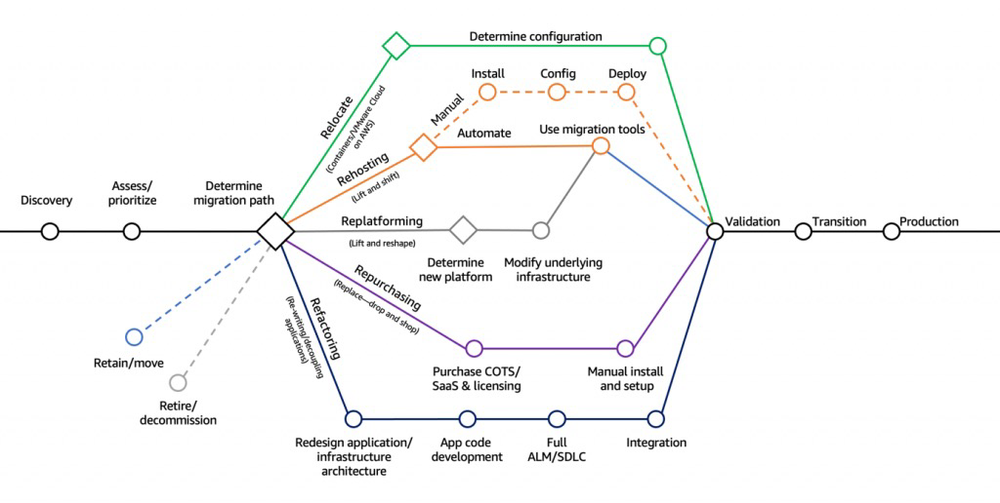
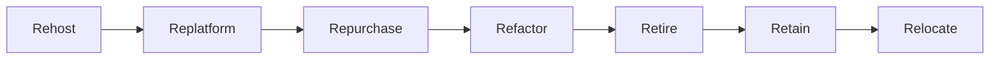

---
tags:
  - aws
  - aws/daily
  - aws/topic/aws-cloud-concepts
aliases:
  - "AWS Migration Strategies The 7 Rs Framework"
  - "Migration Strategies The 7 R S"
---

# 🚚 **AWS Migration Strategies – The 7 R’s Framework**

> _"Not every app is the same. So why migrate them all the same way?"_

---

    

---

When migrating workloads to AWS, **one size doesn’t fit all**. That’s why AWS defines **seven proven migration strategies**—commonly referred to as the **7 R’s**—to help organizations determine the best approach for each application.

Each strategy aligns with business goals like cost optimization, agility, performance, or modernization.

---

## 🧭 **What are the 7 R’s of Cloud Migration?**

Let’s break them down one by one:

---

## 1️⃣ **Rehost – “Lift and Shift”** 🏗️

> Move applications **as-is** without modifying code.

- ✅ **Best for:** Quick migrations when speed is more important than optimization.
- 🚀 **Fastest and simplest strategy** for legacy workloads.
- 🧰 Use tools like **AWS Application Migration Service** or **VMware Cloud on AWS**.

### 📦 **Example:**

Migrating a web app from your data center to an **EC2 instance** with no changes.

---

## 2️⃣ **Replatform – “Lift and Optimize”** ⚙️

> Make **minor tweaks** to optimize performance or manageability during migration.

- ✅ **Best for:** Apps that benefit from some modernization without major refactoring.
- 🧠 You may change the database, OS, or middleware without altering the core app logic.

### 📦 **Example:**

Moving a MySQL database to **Amazon RDS** and using **ElastiCache** for session storage.

---

## 3️⃣ **Repurchase – “Drop and Shop”** 🛒

> Replace the existing application with a **SaaS** or **cloud-native** solution.

- ✅ **Best for:** When legacy software becomes costly or outdated.
- 💡 Great for reducing technical debt and maintenance costs.

### 📦 **Example:**

Replacing an on-prem CRM system with **Salesforce**, or moving virtual desktops to **Amazon WorkSpaces**.

---

## 4️⃣ **Refactor – “Re-Architect”** 🏗️🔁

> **Rebuild the app** to take full advantage of cloud-native features.

- ✅ **Best for:** Legacy monoliths that need scalability, flexibility, or new features.
- 🧱 Requires deep understanding of app architecture.

### 📦 **Example:**

Breaking a monolithic app into **microservices** using **AWS Lambda**, **ECS**, or **EKS**.

---

## 5️⃣ **Retire – “Decommission”** 🧹

> Identify and **turn off apps** no longer needed.

- ✅ **Best for:** Reducing costs and eliminating obsolete workloads.
- 🎯 Common during large portfolio assessments.

### 📦 **Example:**

Decommissioning a system that was replaced by a newer ERP or SaaS solution.

---

## 6️⃣ **Retain – “Revisit Later”** 🕰️

> Keep workloads **as-is**—either temporarily or permanently.

- ✅ **Best for:** Systems not ready for migration due to complexity or compliance.
- 🧩 Might be integrated later through hybrid architecture.

### 📦 **Example:**

Keeping a critical on-prem database until full DR/migration plan is approved.

---

## 7️⃣ **Relocate – “Hypervisor Migration”** 📦☁️

> Move entire environments to the cloud **without purchasing new licenses or making changes**.

- ✅ **Best for:** Lifting virtualized environments with minimal effort.
- 🧰 Often used with **VMware Cloud on AWS** or **VM Import/Export**.

### 📦 **Example:**

Migrating an entire VMware cluster to **VMware Cloud on AWS** with **no reconfiguration**.

---

## 🌐 **When to Use Each Strategy**

| Strategy   | 🧠 Use When...                                                               |
| ---------- | ---------------------------------------------------------------------------- |
| Rehost     | You need speed and minimal disruption.                                       |
| Replatform | You want **quick wins** with minor cloud benefits.                           |
| Repurchase | Your current software is outdated or there's a better SaaS alternative.      |
| Refactor   | You need agility, scale, or want to modernize for the long run.              |
| Retire     | Some systems are **not worth migrating**—too old or unused.                  |
| Retain     | You’re **not ready yet**, or migration is not worth the effort.              |
| Relocate   | You want to **move quickly** without changes, often for **VM environments**. |

---

## 🛠️ **AWS Tools to Help**

| Tool                          | Purpose                                     |
| ----------------------------- | ------------------------------------------- |
| **AWS Migration Hub**         | Central dashboard to track migrations       |
| **AWS Application Discovery** | Inventory and analyze on-prem apps          |
| **AWS DMS**                   | Migrate relational/NoSQL databases          |
| **AWS MGN**                   | Rehost virtual and physical servers         |
| **VMware Cloud on AWS**       | For relocating existing VMware environments |
| **AWS Snow Family**           | Migrate **PBs of data** offline if needed   |

---

## 💡 **Migration Strategy in Action**

Let’s say you’re migrating a legacy on-prem system with 3 components:

- 🧾 A legacy Oracle DB → **Repurchase** with Amazon RDS or Aurora
- 🎛️ A file server → **Rehost** on Amazon FSx
- 🧩 A monolithic web app → **Refactor** into microservices using ECS + Fargate

👉 You can apply **different R’s** for different components of the same app!

---

## 🧠 **Pro Tips for Choosing the Right Strategy**

✅ **Ask these questions:**

- ⏱️ How urgent is the migration?
- 💰 What’s the cost of running this app on-prem vs. cloud?
- 🧱 How complex is the architecture?
- 🔐 Are there regulatory or compliance constraints?
- 🛠️ Is the app vendor-supported in AWS?

---

## 🏁 **Conclusion**

The **7 R’s framework** offers a flexible, structured approach to modernizing IT infrastructure with AWS. There’s no universal path—just the right choice for each app.

By evaluating your workloads based on these strategies, you can:

- ✅ Reduce costs
- ✅ Accelerate cloud adoption
- ✅ Improve performance and scalability

**Ready to migrate?** Use the 7 R’s to build your custom journey to the cloud. ☁️💼
---

## Related Notes
- [[aws-daily/aws-cloud-Concepts/4.3.cap|Cap]] - previous lesson
- [[aws-daily/aws-cloud-Concepts/6.disaster-recovery|Disaster Recovery DR in AWS]] - next lesson
- [[aws-services/9.migration-and-transfer/mgn-application-migration-service/2.aws-application-migration-service|AWS MGN Application Migration Service]] - mentions AWS Application Migration Service
- [[aws-services/5.compute/7.2.vmware-cloud-on-aws/vmware-cloud-on-aws|VMware Cloud on AWS Your Data Center Meets the Cloud]] - mentions Vmware Cloud On AWS
- [[aws-services/9.migration-and-transfer/aws-migration-hub/aws-migration-hub|AWS Migration Hub Your Central Command for Cloud Migrations]] - mentions AWS Migration Hub
- [[aws-daily/aws-waf/5.1.cost-optimization|Cost Optimization]] - mentions Cost Optimization
- [[aws-services/4.storage/3.1.snow-family/x.aws-snow-family|Amazon Snow Family]] - mentions AWS Snow Family
- [[aws-services/4.storage/3.1.snow-family/1.aws-snow-family|AWS Snow Family 2025 Edition]] - mentions AWS Snow Family
- [[aws-services/5.compute/1.1.ec2/1.1.hypervisor|Hypervisors in AWS Xen vs Nitro Deep & Clear]] - mentions Hypervisor
- [[aws-services/6.containers/3.eks/1.1.eks|Amazon EKS Simplifying Kubernetes on AWS]] - mentions EKS
- [[aws-services/6.containers/2.ecs/1.1.ecs|Amazon ECS Elastic Container Service]] - mentions ECS

---
