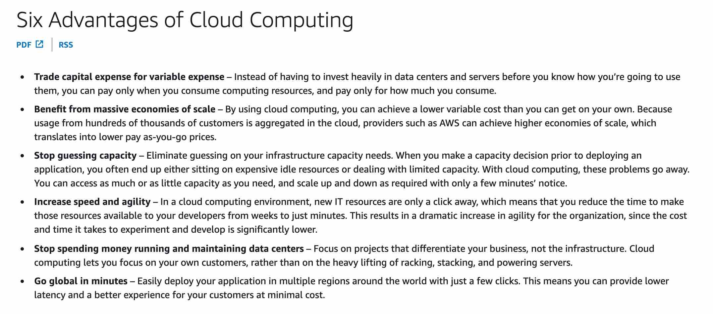

---
tags:
  - aws
  - aws/daily
  - aws/topic/aws-cloud-concepts
aliases:
  - "Six Advantages of Cloud Computing"
  - "Six Advantage Of Cloud Computing"
---

# 🚀 Six Advantages of Cloud Computing

1. **💸 Trade capital expense for variable expense**

   - Pay only for what you use—no need to invest upfront in data centers or servers.

2. **📊 Benefit from massive economies of scale**

   - Cloud providers lower costs by serving thousands of customers efficiently.

3. **📏 Stop guessing capacity**

   - Scale up or down on demand—no more over- or under-provisioning.

4. **⚡ Increase speed and agility**

   - Launch IT resources in minutes instead of weeks—boost innovation speed.

5. **🏢 Stop spending money running and maintaining data centers**

   - Focus on your business, not infrastructure management.

6. **🌍 Go global in minutes**
   - Deploy apps worldwide with a few clicks—improve user experience at low cost.

---

  

---
---

## Related Notes
- [[aws-daily/aws-cloud-Concepts/7.1.five-characteristics-of-cloud-computing|Five Key Characteristics of Cloud Computing]] - previous lesson
- [[aws-daily/aws-cloud-Concepts/7.3.shared-responsibility-model|AWS Shared Responsibility Model]] - next lesson

---
