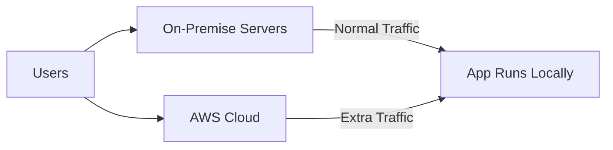

# ☁️💥 What Is **Cloud Bursting**?

**Cloud bursting** is a hybrid cloud strategy where an application **runs in a private cloud (on-premises)** under normal load, but **“bursts” into a public cloud (like AWS)** when demand spikes.

---

## 🧠 **Imagine This...**

You have a web app hosted in your company's data center. Everything runs smoothly most of the time.
But during **sales events** or **holiday traffic**, user demand **suddenly explodes**! 💥

Instead of buying and managing extra hardware for just those busy times...

👉 **You temporarily use AWS resources to handle the extra traffic.**

---

## 🛠️ How It Works

- ✅ **Normal load**: Handled by your private/on-prem infrastructure.
- ⚠️ **Peak load**: Automatically redirected to **AWS (public cloud)** to scale out.
- 🧯 When traffic drops, workloads go back to normal without using AWS resources anymore.

---

## 🧩 Use Cases

| Use Case                 | Description                                 |
| ------------------------ | ------------------------------------------- |
| 🚀 Marketing Campaigns   | Traffic spikes during ads or events.        |
| 🧪 Big Data / Batch Jobs | Short-term, resource-heavy tasks.           |
| 🎄 Seasonal Traffic      | Holiday spikes in e-commerce.               |
| 🧬 Research Workloads    | Labs bursting to the cloud for simulations. |

---

## ✅ Benefits

- Cost-effective 💰 — you only pay for extra resources _when needed_.
- Scalable 📈 — instantly handle unexpected demand.
- Flexible 🌐 — use your reliable on-prem infra, and still scale to AWS.

---

## ⚠️ Challenges

- Networking & latency concerns 🌐
- Data synchronization ⏳
- App architecture must support **elastic scaling**
- Secure connection between on-prem and AWS (e.g., via VPN or AWS Direct Connect)

---

## 🧠 In AWS

To implement cloud bursting in AWS, companies might use:

- **Amazon EC2 Auto Scaling**
- **AWS Direct Connect / VPN**
- **Amazon EKS or ECS (if containerized)**
- **Elastic Load Balancing**
- Hybrid services like **AWS Outposts** or **VMware Cloud on AWS**
