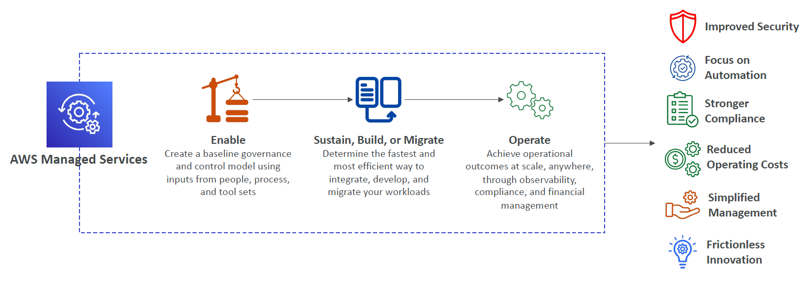
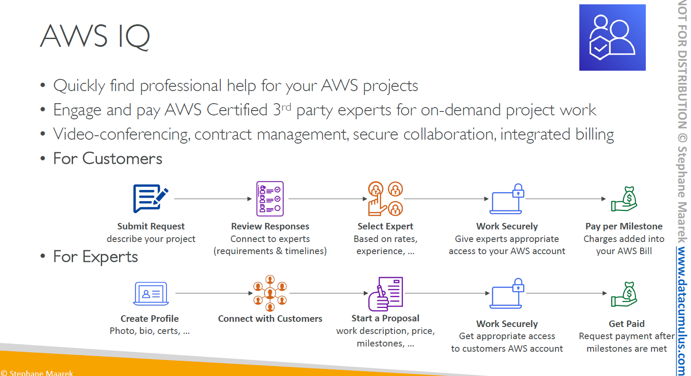

# 🌐 AWS Ecosystem — Simplified for Humans (and Exams)

Think of the **AWS Ecosystem** as a **giant toolbox + expert team + support hub** that helps you **learn, build, manage, and grow** in the cloud.

---

## 📚 1. Free Learning Resources

You don’t have to pay to start learning AWS — they offer tons of **free stuff**:

| Resource                     | What It's For                                                     |
| ---------------------------- | ----------------------------------------------------------------- |
| **📝 AWS Blogs**             | Latest features, updates, and how-tos from AWS engineers          |
| **🧠 AWS Whitepapers**       | Deep dives on security, architecture, and best practices          |
| **🛠️ AWS Solutions Library** | Pre-built, production-ready templates (e.g., live streaming apps) |
| **💬 AWS re\:Post**          | Q\&A hub (replaced old forums) — ask, answer, earn reputation     |
| **🏛 AWS Forums(community))** | Community help (legacy but still referenced)                      |

---

## 🎓 2. AWS Training & Certification

| Training Type                       | What You Get                                       |
| ----------------------------------- | -------------------------------------------------- |
| **🎥 AWS Digital Training**         | Learn at your own pace, online                     |
| **🏫 Classroom & Private Training** | Live, in-person or virtual, for teams or companies |
| **🎓 AWS Academy**                  | Universities teach AWS to students                 |
| **🧑‍🏫 AWS Partners**              | 3rd-party training providers approved by AWS       |

---

## 🛠️ 3. AWS Support Plans

You’re not alone — AWS support has levels, like game difficulty modes 🎮:

| Plan           | Response Times                                                  |
| -------------- | --------------------------------------------------------------- |
| **Developer**  | Email support only. General questions < 24 hours                |
| **Business**   | 24/7 access. System impaired < 12 hours                         |
| **Enterprise** | Priority. Production down < 1 hour / Business critical < 15 min |

Also includes:

- **TAM** (Technical Account Manager)
- **Concierge Support** for billing/account help

---

## 🛒 4. AWS Marketplace

A giant **app store for cloud software** — 3rd-party vendors offer:

- 🔹 Preconfigured AMIs (custom OS, firewall, etc.)
- 🔹 SaaS & container apps
- 🔹 CloudFormation templates
- 🔹 You can **sell your own** apps too!
- 🔹 Charges appear on your AWS bill directly

---

## 🧑‍💼 5. AWS Professional Services & Partner Network

Need expert help? AWS has options:

| Type                 | What They Do                                                          |
| -------------------- | --------------------------------------------------------------------- |
| **AWS Pro Services** | AWS’s own elite consultants help with big projects                    |
| **APN Partners**     | Certified companies that build, migrate, train, or sell AWS solutions |
| **Partner Types**    | Technology, Consulting, Training                                      |
| **Programs**         | AWS Competency, Navigate, etc. — helps partners specialize and shine  |

---

## 👨‍🔧 6. AWS IQ – On-Demand Help from Experts

    

---

A **freelance platform** for AWS pros. Think “Upwork for AWS,” but inside AWS:

1. You post a project
2. Experts apply
3. You choose one
4. They do the work, securely
5. You pay per milestone — billing goes to your AWS bill

✅ Bonus: Only **AWS-certified experts** can work on IQ.

---

## 🛡️ 7. AWS Managed Services (AMS)

    

---

> Don’t want to manage your AWS infra yourself? Let AWS handle it.

- AWS runs your cloud for you: security, updates, backups, monitoring, etc.
- 24/365 operations
- Great for companies who want **hands-off** cloud with best practices built-in

---

## 🧠 Final Cheat Sheet for Exam

| Category    | Keyword to Remember                         |
| ----------- | ------------------------------------------- |
| Learning    | **Blogs, Whitepapers, Solutions, re\:Post** |
| Training    | **Digital, Classroom, Academy, Partners**   |
| Support     | **Dev → Biz → Enterprise**, TAM, Concierge  |
| Marketplace | **Buy & Sell Cloud Software**               |
| Pro Help    | **AWS Pro Services, APN, AWS IQ**           |
| Managed Ops | **AMS = AWS manages your infra for you**    |
