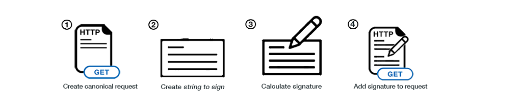
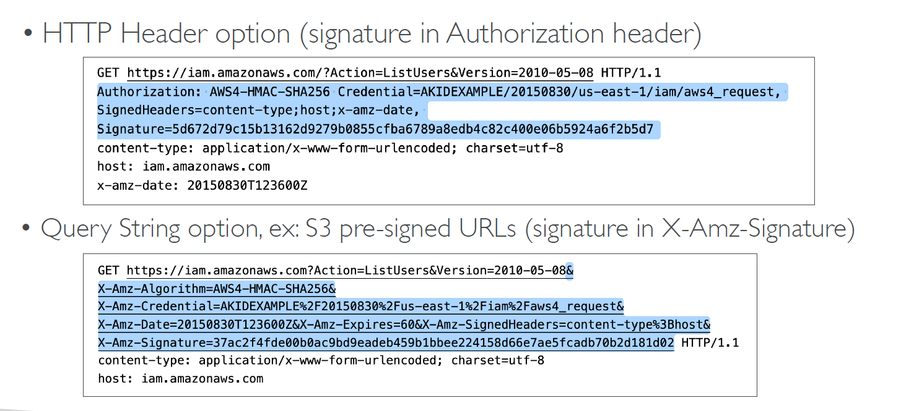
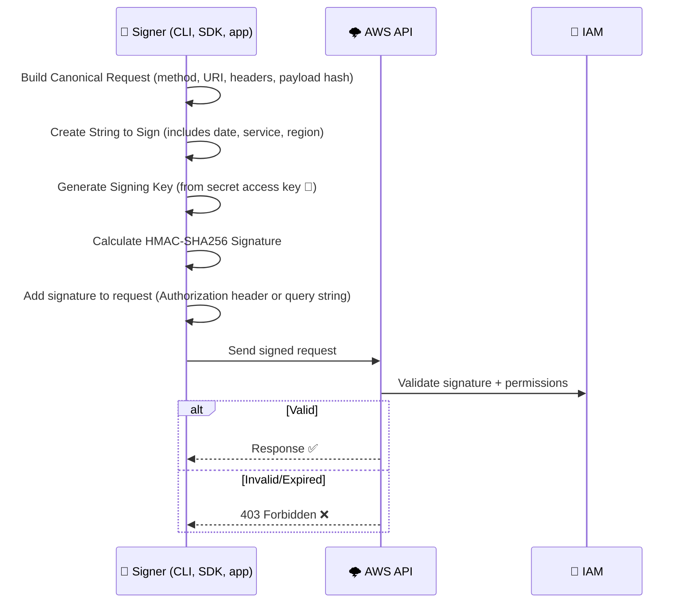
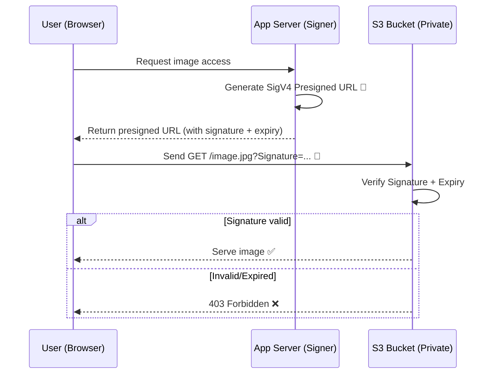
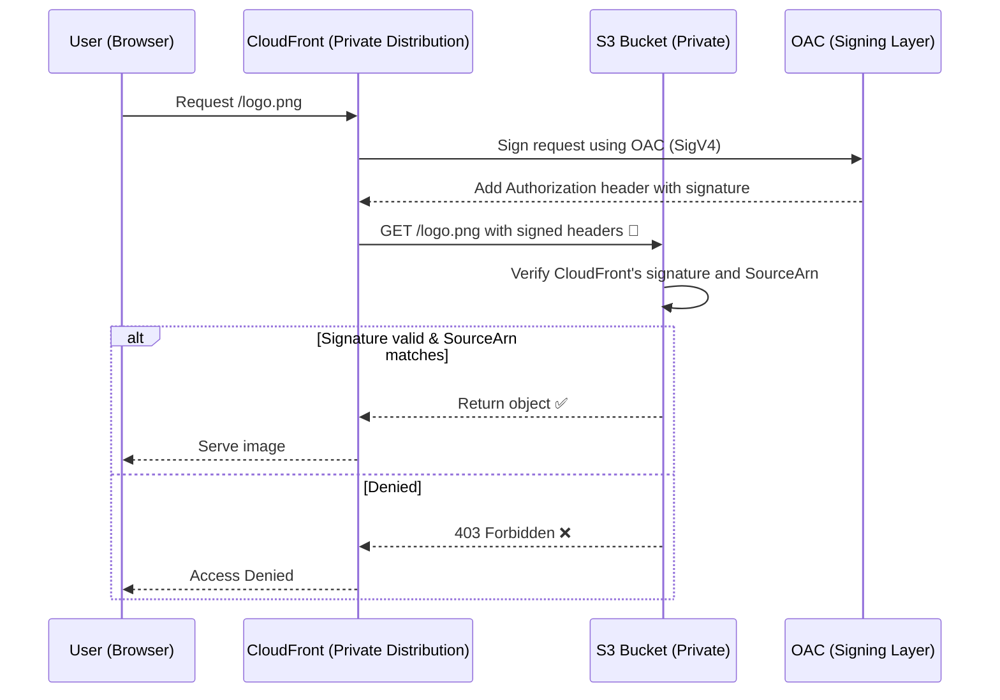

# 🔐 **AWS Signature Version 4 (SigV4) – How It Works & Where It’s Used**

> _SigV4 is the standard authentication method used across AWS APIs to verify identity, integrity, and permissions — all through cryptographic signing._

---

    

---

    

---

## 🧠 **What Is SigV4?**

**SigV4** is AWS’s **request signing protocol**. It ensures:

- ✅ The request is from a **trusted identity**
- 🔐 It hasn’t been **tampered** in transit
- ✅ The requester has the **correct IAM permissions**

It works by adding a **cryptographic signature** (based on your secret key) to the request — either in the **Authorization header** or as a **presigned URL query string**.

---

## 🛠️ **How SigV4 Works (Step-by-Step)**

---

## 🔍 **What Gets Signed?**

The signature covers:

- HTTP method (`GET`, `POST`, etc.)
- Canonical URI and query string
- Important headers (`host`, `x-amz-date`, etc.)
- Hashed body payload
- Date, region, service

> 🔐 **It’s tamper-proof** — any changes invalidate the signature.

---

## 📦 **Where SigV4 Is Used Across AWS**

### 🔹 1. 🧑‍💻 **AWS API Calls**

| Scenario                                    | SigV4 Role                                           |
| ------------------------------------------- | ---------------------------------------------------- |
| `aws s3 ls`, `aws ec2 describe-instances`   | CLI auto-signs each HTTP call using your credentials |
| SDK calls (`boto3`, `AWS SDK for JS`, etc.) | Automatically signs via built-in SigV4 signer        |

> ✅ You don’t need to handle signing manually unless you’re calling APIs via `curl` or custom HTTP clients.

---

### 🔹 2. 🗂️ **Amazon S3: Presigned URLs**

> **Presigned URLs** are time-limited, signed S3 links.

| Use Case                | Example                                     |
| ----------------------- | ------------------------------------------- |
| Share private image     | Generate presigned `GET` URL to `/file.jpg` |
| Upload file without IAM | Generate presigned `PUT` URL                |

🔐 These URLs contain:

- Signature
- Expiry timestamp
- Access key ID
- Signed headers

📎 Used in browsers or mobile apps to safely interact with **private S3**.

---

### 🔹 3. 🌍 **CloudFront: Origin Access Control (OAC)**

> CloudFront uses SigV4 to **authenticate itself** when accessing a private S3 origin.

| Behavior                           | SigV4 Role                                                        |
| ---------------------------------- | ----------------------------------------------------------------- |
| CloudFront fetches private S3 file | Signs the request with SigV4 using OAC                            |
| S3 bucket policy                   | Allows only signed requests from specific CloudFront distribution |

📦 The signature is added to the **Authorization header** and validated by S3 before serving the file.

> 🧱 This prevents **direct S3 access** and enforces that only **CloudFront can retrieve** your content.

---

## 📦 Use Case 1: Viewing an S3 Image via Signed URL

### ✅ Scenario

You want to **show a private image** stored in S3 **to the browser**, so you generate a **presigned URL** using SigV4.

---

### 🧭 SigV4 Workflow with S3 Presigned URL

---

### 💡 Key Points

| Component           | Role                                                  |
| ------------------- | ----------------------------------------------------- |
| App Server          | Uses AWS SDK to create **presigned URL** (SigV4)      |
| Browser             | Just uses the URL to fetch the image (no credentials) |
| S3 Bucket (private) | Verifies signature before serving the object          |

---

## 🌍 Use Case 2: CloudFront Fetching from Private S3 via OAC

### ✅ Scenario

You have a **private S3 bucket**, and CloudFront is configured with an **Origin Access Control (OAC)** to fetch content securely using **SigV4**.

---

### 🧭 SigV4 Workflow with CloudFront OAC → S3

---

### 💡 Key Points

| Component           | Role                                                  |
| ------------------- | ----------------------------------------------------- |
| CloudFront          | Acts on behalf of the user                            |
| OAC                 | Automatically signs origin requests using SigV4       |
| S3 Bucket (private) | Accepts only signed requests from **that CloudFront** |

---

## ✅ TL;DR – SigV4 In a Nutshell

| Feature            | Purpose                                |
| ------------------ | -------------------------------------- |
| SigV4 Algorithm    | HMAC-SHA256-based request signing      |
| Signature Includes | Headers, method, URI, body hash        |
| Who Uses It?       | CLI, SDKs, signed URLs, CloudFront     |
| Manual Use Cases   | Raw HTTP calls or temporary access     |
| Benefits           | Identity verification + data integrity |

---

## 🔒 Summary Table: How AWS Services Use SigV4

| Service        | How SigV4 is Used                                   |
| -------------- | --------------------------------------------------- |
| AWS CLI & SDKs | Automatically sign all API requests                 |
| S3             | Presigned URLs for secure access to private objects |
| CloudFront     | OAC signs origin requests to S3 using SigV4         |
| API Gateway    | Authenticated client requests (IAM-based auth)      |
