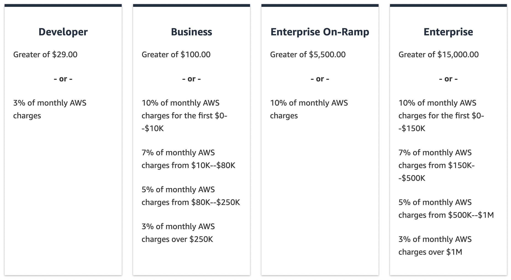

# 💼 AWS Support Plans Pricing – Explained with Use Cases

    

---

## 🧠 What Are AWS Support Plans?

> AWS Support Plans offer **technical help**, **account guidance**, and **best-practice reviews** based on the **criticality of your workloads** — from hobby projects to mission-critical apps.

You pay **based on your AWS usage** and the **support level you choose**.

---

## 🛠️ Support Plan Comparison

| Plan                   | Best For                   | Price         | Support Access                         | Response Time (Critical)     |
| ---------------------- | -------------------------- | ------------- | -------------------------------------- | ---------------------------- |
| **Basic (Free)**       | Hobby / learning projects  | Free          | Docs, forums, 7 Trusted Advisor checks | ❌ No technical support      |
| **Developer**          | Testing & dev environments | ~\$29+/mo     | Email during business hours            | < 12 hours (System impaired) |
| **Business**           | Production workloads       | ~\$100+/mo    | 24×7 phone, chat, email                | < 1 hour (System down)       |
| **Enterprise On-Ramp** | Business-critical systems  | ~\$5,500+/mo  | TAM pool, concierge support            | < 30 min (Business-critical) |
| **Enterprise**         | Mission-critical systems   | ~\$15,000+/mo | Dedicated TAM, full services           | < 15 min (Business-critical) |

---

## 🔎 Detailed Breakdown

### 🔹 1. **Basic Support (Free)**

- ✅ 24/7 access to:
  - AWS documentation & whitepapers
  - Support forums
  - **7 core** Trusted Advisor checks
  - AWS Personal Health Dashboard

> 🔓 No technical support included

---

### 🔹 2. **Developer Support**

> Ideal for developers testing workloads

- 💬 Email support during **business hours**
- Unlimited cases / contacts
- 🕒 Response Time:
  - General guidance: < 24 hours
  - System impaired: < 12 hours

💵 Starts at ~\$29/month (tiered with usage)

---

### 🔹 3. **Business Support (24/7)**

> Required if you're running **production workloads**

- 🔑 Full Trusted Advisor checks & API access
- 📞 24/7 phone, chat, and email support
- 🌐 AWS Infrastructure Event Management (optional fee)
- 🕒 Response Time:
  - Production system impaired: < 4 hours
  - System down: < 1 hour

💵 Starts around \$100/month or **10% of monthly AWS usage**

---

### 🔹 4. **Enterprise On-Ramp Support (24/7)**

> For businesses with **critical workloads**, but not full enterprise scale

- 📌 All of Business Plan +
- 🔁 Access to a **pool of TAMs** (Technical Account Managers)
- 🤝 Concierge support for billing and account best practices
- 📋 Access to **Well-Architected Reviews**

🕒 Response Time:

- Business-critical system down: < 30 minutes

💵 ~\$5,500/month minimum

---

### 🔹 5. **Enterprise Support Plan (24/7)**

> Maximum support level for **mission-critical** environments

- 🌟 All of On-Ramp Plan +
- 🧑‍💼 Dedicated TAM
- 🛠️ Incident Detection & Response (extra)
- 🧭 Infrastructure Event Management (IEM)
- 📊 Deep architecture and operations review

🕒 Response Time:

- Business-critical system down: < 15 minutes

💵 ~\$15,000/month minimum

---

## 🧩 Smart Use Case Mapping

| Your Use Case                        | Recommended Plan   |
| ------------------------------------ | ------------------ |
| Just learning AWS or doing tutorials | Basic              |
| Building dev/test apps               | Developer          |
| Running a small production site      | Business           |
| Business-critical internal systems   | Enterprise On-Ramp |
| Public mission-critical SaaS app     | Enterprise         |

---

## 🧠 Best Practices for Accounts & Support

- Use **AWS Organizations** to separate workloads by account
- Apply **SCPs** (Service Control Policies) to enforce boundaries
- Use **Trusted Advisor** based on your support plan
- Enable **AWS Config**, **CloudTrail**, and **CloudWatch Logs**
- Lock down accounts with **IAM best practices** (MFA, least privilege)
- If compromised? Rotate keys, change root password, **call AWS Support**

---

## ✅ Summary

| Plan       | Support Type         | Key Benefit                           |
| ---------- | -------------------- | ------------------------------------- |
| Basic      | Docs & community     | Free! No tech support                 |
| Developer  | Email (biz hours)    | Affordable tech support for dev/test  |
| Business   | 24×7 all channels    | Full support for production workloads |
| On-Ramp    | 24×7 + TAM pool      | Great for growing critical systems    |
| Enterprise | 24×7 + Dedicated TAM | Ultimate support + fast response SLA  |

---

Would you like a **diagram comparing features** across the plans too?
