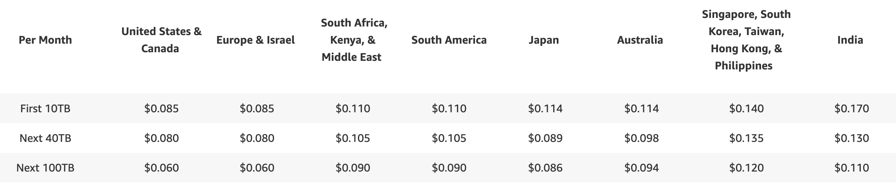
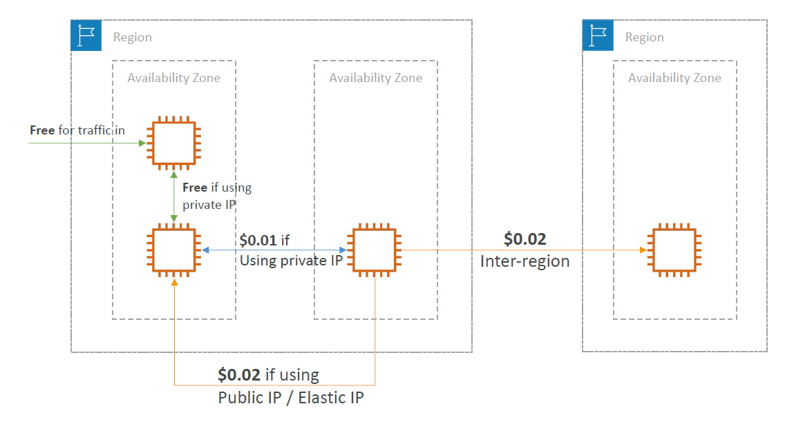

# 💸 AWS Pricing Models: Full Overview & Practical Guide

## 🧠 What Are AWS Pricing Models?

> AWS offers **flexible pricing models** to fit every use case — whether you're a startup prototyping or an enterprise running mission-critical workloads.

---

## ⚙️ The 4 AWS Pricing Models

| Model                         | Summary                                                                                                                                                                                                                                             |
| ----------------------------- | --------------------------------------------------------------------------------------------------------------------------------------------------------------------------------------------------------------------------------------------------- |
| **1. Pay As You Go**          | Pay only for the **resources you consume**. No long-term commitment.                                                                                                                                                                                |
| **2. Save When You Reserve**  | Pay less by **committing to 1–3 years**. Ideal for predictable workloads.available for:   (**EC2 Reserved Instances**, **RDS Reserved Instances**, **DynamoDB Reserved Capacity**, **Elasticache Reserved Nodes**, **Redshift Reserved Nodes**) |
| **3. Pay Less by Using More** | **Volume-based discounts** as your usage grows. (like **s3**)                                                                                                                                                                                       |
| **4. Pay Less as AWS Grows**  | As AWS optimizes, it passes savings to customers over time.                                                                                                                                                                                         |

---

## 🆓 AWS Free Tier and Always-Free Services

| Type                   | Examples                                                          |
| ---------------------- | ----------------------------------------------------------------- |
| **Always Free**        | IAM, VPC, CloudFormation, Elastic Beanstalk, Auto Scaling         |
| **12-Month Free Tier** | EC2 t2.micro, 5 GB S3, 750 hours/month RDS (certain engines)      |
| **Free Tools**         | AWS Billing Dashboard, Cost Explorer, Budgets, Pricing Calculator |

🔗 [Explore Free Tier](https://aws.amazon.com/free/)

> ⚠️ 12-Month Free Tier Means Available to new AWS customers for one year from the date of account activation.  
> ⚠️ You **still pay for resources** provisioned inside these services (e.g., EC2 volumes).

---

## 🧮 Compute Pricing (EC2, Lambda, ECS)

### ☁️ EC2 Instance Pricing Models

| Model           | Notes                                                                                                                                 |
| --------------- | ------------------------------------------------------------------------------------------------------------------------------------- |
| On-Demand       | Billed per second (Linux/Windows), per hour (others). Good for burst usage.                                                           |
| Reserved        | 1–3 year commitment. Up to **75% off**. Payment options: `All upfront`, `Partial`, `None upfront`. (All upfront is have top discount) |
| Spot            | Use unused capacity. Up to **90% off**. (**Can be interrupted**).                                                                     |
| Dedicated Hosts | For licensing or regulatory needs. Long-term reservations available.                                                                  |
| Savings Plans   | Flexible alternative to Reserved Instances. Pay per usage commitment.                                                                 |

### 🧠 Lambda

- Pay **per request** and **per execution duration**
- Scales automatically; no need to manage servers.

### 🐳 ECS / Fargate

| Mode    | Pricing Method                        |
| ------- | ------------------------------------- |
| ECS-EC2 | You pay for underlying EC2 resources. |
| Fargate | Pay for **vCPU & memory per second**. |

---

## 🗃️ Storage Pricing (S3, EBS, EFS)

### 📦 S3 Pricing Factors

- **Storage class** (Standard, IA, Glacier, Deep Archive, Intelligent Tiering)
- **Object size & count**
- **Request types** (PUT, GET, LIST)
- **Data transfer OUT**
- **Lifecycle management** (automated tiering, transitions)

### 💾 EBS Pricing Factors

| Factor         | Impact                                                     |
| -------------- | ---------------------------------------------------------- |
| Volume Type    | SSD, Provisioned IOPS, Magnetic (affects cost/performance) |
| GB provisioned | Charged per month                                          |
| Snapshots      | Pay per GB/month                                           |
| IOPS           | Provisioned IOPS incur additional cost                     |
| Data transfer  | Inbound free; outbound tiered                              |

### 📁 EFS Pricing (Bonus)

- Pay per **used GB**
- Use **Infrequent Access (IA)** tier for cost optimization
- Lifecycle policies for automatic tiering

---

## 🧮 Database Pricing (RDS)

- Charged per **hour of instance usage**
- Instance specs (engine, memory class, size) impact cost
- Purchase type: **On-Demand** or **Reserved**
- **Backups** up to 100% of instance size free
- Extra charges for:
  - Additional storage (per GB/month)
  - Read/Write requests
  - Multi-AZ deployments
  - Data transfer (outbound is tiered, inbound is free)

---

## 🌐 CloudFront (CDN) Pricing

- **Depends on geographic region**
- **Data Transfer Out**: tiered discount model
- **Number of requests**: HTTP/HTTPS charges
- Cost is aggregated across all edge locations

---

    

---

## 🌍 Networking Pricing in AWS

| Type                     | Cost        |
| ------------------------ | ----------- |
| Same AZ (Private IP)     | **Free** 💸 |
| Same Region (Private IP) | ~\$0.01/GB  |
| Same Region (Public IP)  | ~\$0.02/GB  |
| Inter-Region             | ~\$0.02+/GB |

---

    

---

📌 **Optimization Tip**:  
Use **Private IPs and same AZ** to minimize costs and reduce latency.

---

## ✅ Summary Table

| Area       | Optimized With…                                        |
| ---------- | ------------------------------------------------------ |
| Compute    | Spot, Reserved, Savings Plans                          |
| Storage    | Lifecycle policies, S3 Tiering, EBS volume selection   |
| Databases  | Reserved RDS, auto-backup policies                     |
| Networking | Use same AZ, private IP, minimize inter-region traffic |
| Lambda     | Optimize function size and duration                    |
