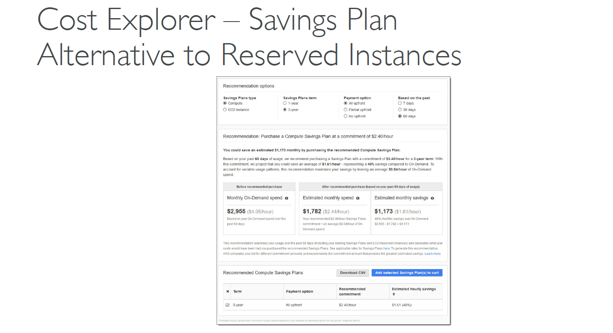
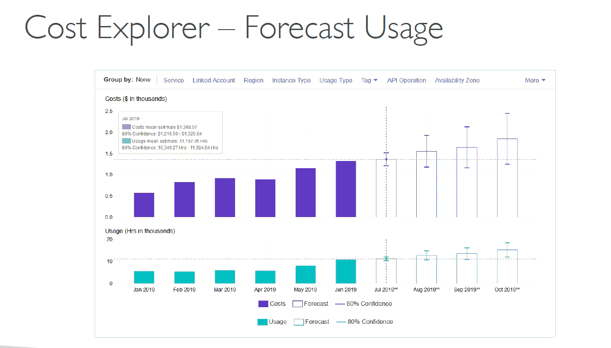

# 💸 AWS Cost Explorer – Visualize, Analyze, Forecast Your AWS Costs

**AWS Cost Explorer** helps you monitor, analyze, and optimize your cloud spending with interactive visualizations and detailed reports. It's essential for finance teams, DevOps engineers, and system administrators who want to understand **where money is going** and **how to reduce it**.

---

## 📈 What Can You Do with Cost Explorer?

- **Visualize Your Spend:** See monthly, daily, or even hourly cost trends across services.
- **Analyze Usage Deeply:** Break down costs by service, account, region, instance type, tags, or resource ID.
- **Plan with Forecasts:** Predict future usage and spend for up to 12 months.
- **Optimize Costs:** Get recommendations on **Savings Plans** based on your usage patterns.

---

## 🧭 Key Use Cases

### 1. 🧮 Monthly Cost Breakdown

> Track how your costs vary month to month across different instance types or services.

- Useful for identifying **which EC2 instance types** are the most expensive.
- Filter by account, tag, or usage type for multi-team cost accountability.

---

  

---

### 2. ⏱️ Hourly & Resource-Level Insights

> Zoom in to view **hour-by-hour** spending and pinpoint exactly **which EC2 instances or RDS databases** cost the most.

- Use it to detect **spike patterns** or **idle resources**.
- Great for troubleshooting sudden budget overages.

---

  

---

### 3. 💡 Savings Plan Recommendations

> AWS Cost Explorer recommends Savings Plans based on your last 7, 30, or 60 days of usage—providing **potential cost savings** with detailed comparisons.

- Choose between **Compute** or **EC2-specific** plans.
- Flexible terms: 1-year vs 3-year, and upfront vs no-upfront payment options.

---

  

---

### 4. 🔮 Forecasting Future Costs

> Predict usage and costs with **confidence intervals** to anticipate budget requirements over the next 12 months.

- Plan ahead for scaling workloads.
- Forecast based on actual trends, not guesses.

---

  

---

## 🛠️ Filters & Features

| Feature              | Purpose                                                  |
| -------------------- | -------------------------------------------------------- |
| 🎯 Filter by Tag     | View costs by team, environment, or project              |
| 📍 Filter by Region  | Understand cost distribution across deployed regions     |
| 🧱 Filter by Service | Identify top contributors (e.g., EC2, S3, Lambda, RDS)   |
| 🧩 Group By Options  | Group data by service, instance type, usage type, or tag |
| ⏳ Time Granularity  | View costs monthly, daily, or hourly for deeper insights |

---

## 📤 Export & Share

- Download CSV reports
- Share visual charts with finance or engineering teams
- Automate cost tracking via **Cost and Usage Reports (CUR)** for integration with Athena, QuickSight, or external BI tools

---

## ✅ Best Practices

- Enable **Cost Allocation Tags** for accurate tagging and reporting
- Use **Linked Accounts** in AWS Organizations to break down spending per business unit
- Combine Cost Explorer with **Budgets** for proactive cost controls

---

## 📌 Summary

| Strength             | Details                                                 |
| -------------------- | ------------------------------------------------------- |
| 📊 Visualization     | Beautiful charts by service, tag, or instance type      |
| 💡 Optimization      | Savings Plans insights for up to 40% cost reduction     |
| 🔮 Forecasting       | Up to 12 months of predictive billing                   |
| 🛠️ Granular Analysis | From overall cost down to a single resource             |
| 📤 Reporting         | Easy CSV export & integration with other AWS cost tools |
