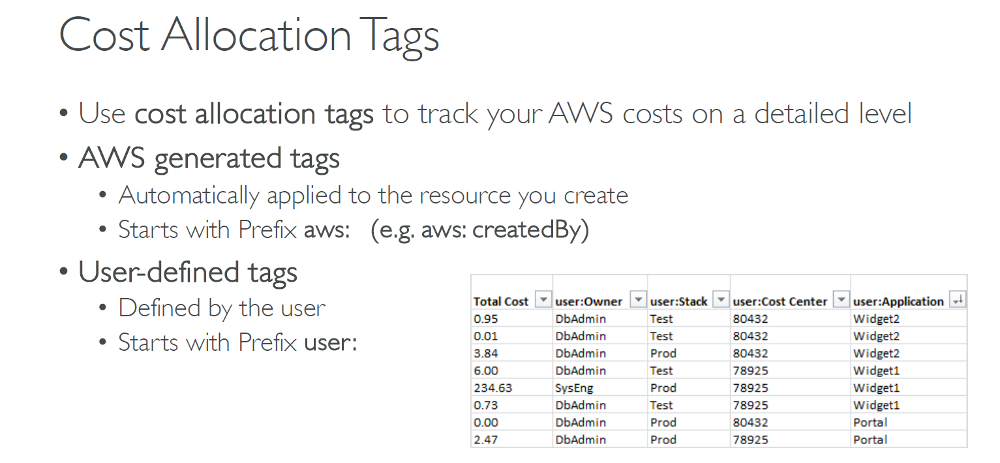
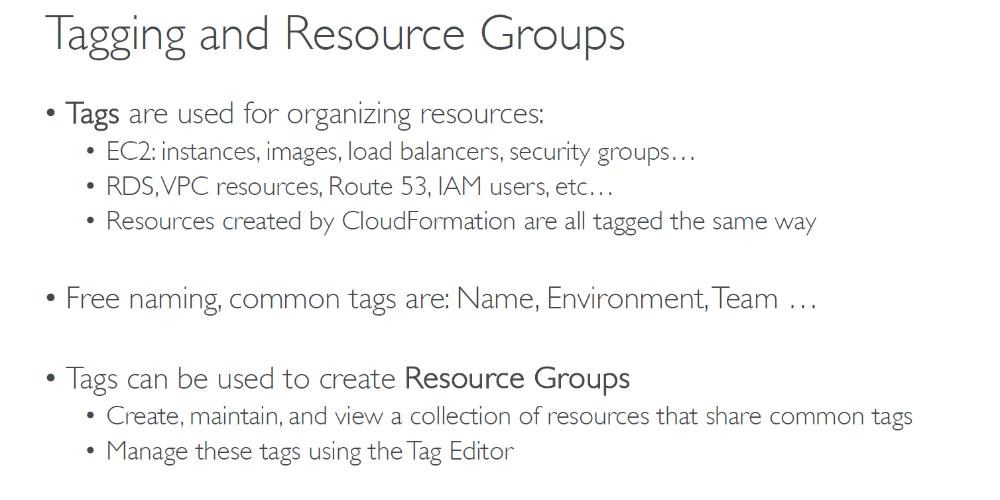

---
tags:
  - aws
  - aws/daily
  - aws/topic/aws-pricing
aliases:
  - "Cost allocation tags"
  - "Cost Allocation Tags"
---

# 📌 **Cost allocation tags**

    

---

    

---

## Related Notes
- [[aws-daily/aws-pricing/4.2.free-tier-dashboard|Free Tier Dashboard]] - previous lesson
- [[aws-daily/aws-pricing/5.2.cost-usage-report|Cost usage report]] - next lesson

---
