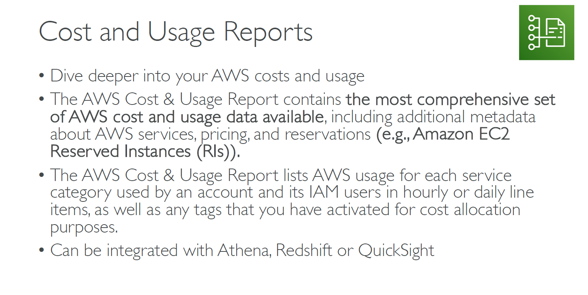
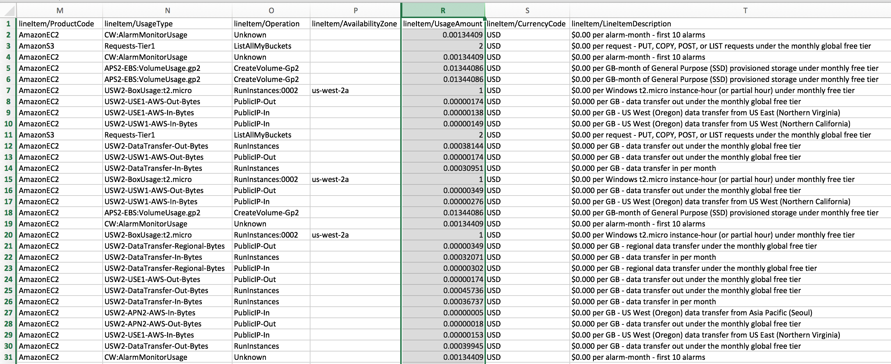

---
tags:
  - aws
  - aws/daily
  - aws/topic/aws-pricing
aliases:
  - "Cost usage report"
  - "Cost Usage Report"
---

# 📌 **Cost usage report**

---

## Related Notes
- [[aws-daily/aws-pricing/5.1.cost-allocation-tags|Cost allocation tags]] - previous lesson
- [[aws-daily/aws-pricing/6.1.budget|AWS Budgets Track Alert and Optimize Your AWS Spending]] - next lesson

---
