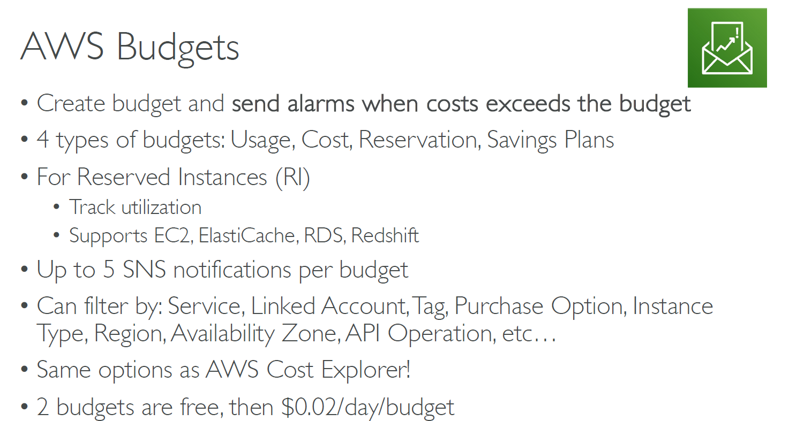

# 💰 **AWS Budgets – Track, Alert, and Optimize Your AWS Spending**

**AWS Budgets** allows you to set **custom cost and usage thresholds**, so you can **proactively manage** your cloud expenses and resource utilization.

Whether you're managing a single account or multiple teams across AWS Organizations, AWS Budgets ensures you never get surprised by unexpected charges.

---

    

---

## 📌 Why Use AWS Budgets?

- 🚨 **Set alerts** when your AWS spending or usage exceeds your defined limits
- 📈 **Track utilization** of Reserved Instances (RI) or Savings Plans
- 🧠 Make **informed decisions** with the same filters as **Cost Explorer**

---

## 🎯 Budget Types

| Type                  | What It Tracks                                            |
| --------------------- | --------------------------------------------------------- |
| 💸 **Cost Budget**    | Total cost across all AWS services or filtered dimensions |
| ⚙️ **Usage Budget**   | Usage quantities (e.g., GB of storage, vCPU hours)        |
| 📉 **RI Utilization** | Are you using enough of your Reserved Instances?          |
| 💡 **Savings Plans**  | Are your Savings Plans being fully utilized?              |

> ✅ Great for keeping tabs on both **what you spend** and **how efficiently you’re using discounts**.

---

## 📬 Notifications

- Set up to **5 Amazon SNS notifications** per budget
- Choose thresholds like **80%, 100%, 120%** of your budget
- Notify billing teams, DevOps engineers, or project leads

---

## 🛠️ Budget Filters

Just like **Cost Explorer**, you can filter budgets by:

- Specific **AWS Service**
- **Linked Account** (in Organizations)
- **Tag** (e.g., `Project = AI`)
- **Purchase Option** (On-Demand, Reserved)
- **Instance Type** (e.g., `t3.medium`)
- **Region** or **Availability Zone**
- **API Operation**

> 🎯 This makes it perfect for tracking per-project, per-team, or per-region costs.

---

## 📊 Example Use Cases

### 🧪 **Project Budget**

> Monitor how much your dev team spends on training workloads

- Filter: Tag = `Environment:Dev`
- Budget = \$500/month
- Alert at 80% and 100%

### 🏷️ **EC2 Reserved Instance Utilization**

> Ensure your RIs are actually used

- Budget Type: RI Utilization
- Filter: Service = EC2
- Alert if utilization drops below 90%

### 🌍 **Regional Monitoring**

> Track costs for us-east-1 vs eu-west-1 to detect unexpected spending

- Filter: Region
- Create separate budgets for each

---

## 💵 Pricing

| Tier                | Cost                             |
| ------------------- | -------------------------------- |
| First **2 budgets** | ✅ **Free**                      |
| Additional budgets  | 💲 **\$0.02 per day per budget** |

> That’s just **\$0.60/month** per extra budget — a small cost to avoid big surprises.

---

## 🧠 Best Practices

- 💡 Use **tags** to categorize workloads for better cost tracking
- 🔗 Integrate with **AWS Organizations** to manage multiple accounts
- 📊 Combine with **Cost Explorer** for full financial visibility
- 📥 Send budget alerts to **Slack or Teams** via SNS + Lambda for real-time chat ops

---

## ✅ Summary

| Feature                 | Benefit                                         |
| ----------------------- | ----------------------------------------------- |
| 🔔 Budget Alerts        | Get notified before bills grow too big          |
| 📉 Utilization Tracking | See how well you're using RIs & Savings Plans   |
| 🎯 Granular Filters     | Slice and dice budgets by team, project, region |
| 💵 Cost-Efficient       | Free for 2 budgets, very affordable after       |
