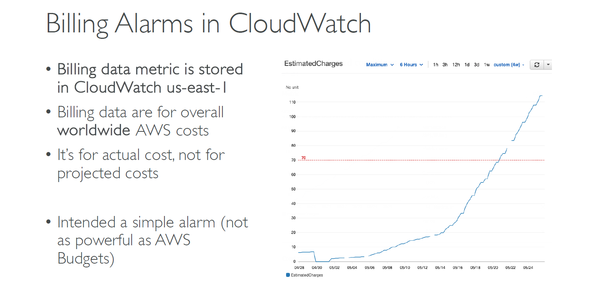

# 📌 Billing Alarms in CloudWatch

> ⏰ Billing data metric is stored in CloudWatch us-east-1  
> 🌍 Billing data are for overall worldwide AWS costs  
> ✅ It’s for actual cost, not for project costs

    

