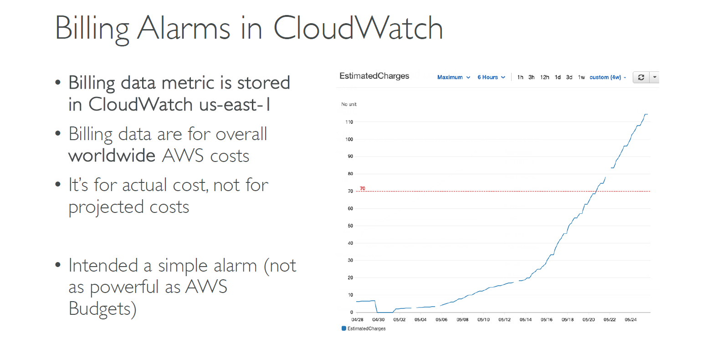

---
tags:
  - aws
  - aws/daily
  - aws/topic/aws-pricing
aliases:
  - "Billing Alarms in CloudWatch"
  - "Billing Alarms"
---

# 📌 Billing Alarms in CloudWatch

> ⏰ Billing data metric is stored in CloudWatch us-east-1  
> 🌍 Billing data are for overall worldwide AWS costs  
> ✅ It’s for actual cost, not for project costs

    

---

## Related Notes
- [[aws-daily/aws-pricing/6.1.budget|AWS Budgets Track Alert and Optimize Your AWS Spending]] - previous lesson
- [[aws-daily/aws-pricing/6.3.budget-vs-billing|AWS Budgets vs. Billing Alarms CloudWatch Billing Alarm]] - next lesson

---
