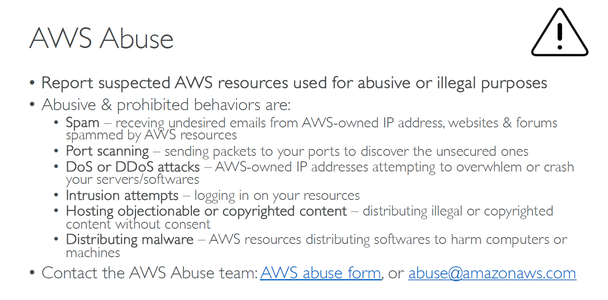

# 🚨 What Is **AWS Abuse**?

**AWS abuse** refers to **any activity on AWS infrastructure that violates AWS’s Acceptable Use Policy (AUP)** — especially when it:

- Harms other AWS customers
- Violates laws or regulations
- Abuses AWS resources or services
- Impacts the integrity, availability, or security of AWS or others

---

  

---

## 🧨 **Common Examples of AWS Abuse**

| ⚠️ Type                             | 💥 Description                                                            |
| ----------------------------------- | ------------------------------------------------------------------------- |
| **DDoS / DoS Attacks**              | Using AWS to flood systems (yours or others) with traffic                 |
| **Port/Protocol Flooding**          | Scanning or flooding ports in a disruptive way                            |
| **Sending Spam**                    | Using AWS to send bulk unsolicited emails                                 |
| **Hosting Malware / Phishing**      | Hosting malicious software or fake login pages                            |
| **Brute Force Attacks**             | Using EC2 to try cracking passwords on other systems                      |
| **Crypto Mining (on Free Tier)**    | Running mining bots violating usage policies                              |
| **Illegal Content Hosting**         | Sharing pirated or restricted content                                     |
| **Phishing / Identity Theft**       | Using AWS to impersonate individuals or organizations                     |
| **Testing AWS Services Themselves** | Like trying to break AWS infrastructure or shared services (not allowed!) |

---

## 🛡️ **Where This Matters Most**

Even if you’re doing **security testing**, AWS considers certain behavior **abuse** if:

- You **attack shared services or IPs** used by other customers
- You **don’t own** the resources you’re testing
- You **simulate attacks** like DDoS or port flooding — even in dev environments

---

## 📞 What Happens If AWS Detects Abuse?

- You may get an **abuse report** or **account warning**
- In serious cases, AWS may:
  - **Throttle** your resources
  - **Suspend** the affected instance or service
  - **Temporarily or permanently disable** your AWS account

---

## ✅ What You Should Do Instead

1. **Only test services you own**
2. **Avoid disruptive behaviors** like DoS simulations or traffic floods
3. **Use AWS-approved pentesting services**
4. **Tag your resources** and notify your team if doing simulations

---

## 📬 Reporting Abuse to AWS

If you **receive abuse** (e.g., attacks from AWS IPs), or want to report a customer violating AWS rules:

📨 Email: **<abuse@amazonaws.com>**  
📄 Docs: [AWS Abuse Reporting](https://aws.amazon.com/premiumsupport/knowledge-center/report-aws-abuse/)

---

## 🧠 Summary

| ✅ Allowed                   | ❌ Considered Abuse            |
| ---------------------------- | ------------------------------ |
| Testing your EC2 instance    | DoS, DDoS attacks              |
| Scanning your own S3 buckets | Phishing, malware hosting      |
| Using Lambda in normal ways  | Crypto mining or brute-force   |
| Running legal workloads      | Port flooding or spam emailing |

---

Would you like a **visual flowchart of what’s allowed vs. abuse** in AWS testing environments?
