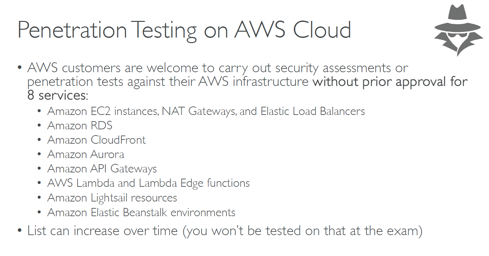
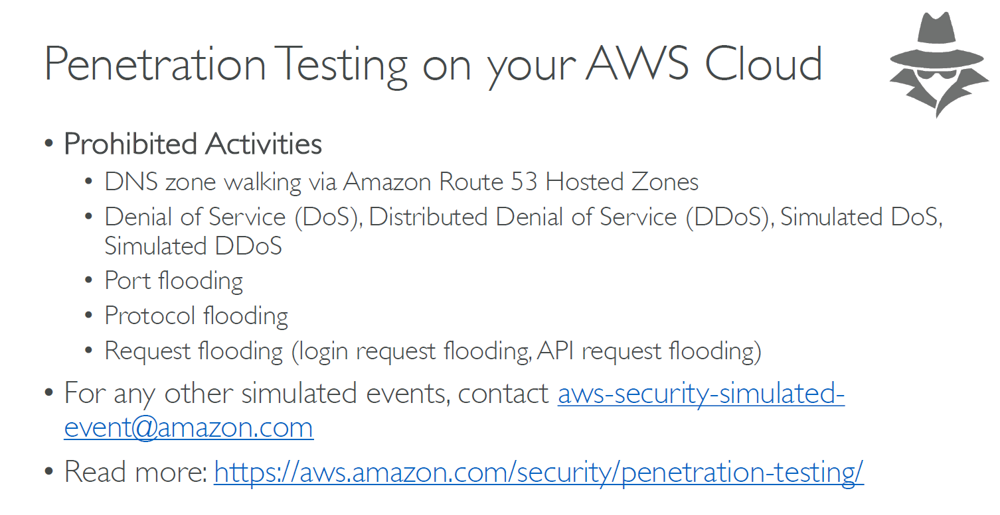

# 🛡️🔍 **Penetration Testing on AWS Cloud: What You Can & Can't Do**

Penetration testing ("pentesting") on AWS helps identify vulnerabilities in your applications and cloud infrastructure **before attackers do**. But when working in AWS, **you can’t just test anything** — there are strict policies to follow.

---

    

---

    

---

## 📌 What Is Penetration Testing?

**Penetration Testing** is the act of simulating cyberattacks to:

- ✅ Discover vulnerabilities
- ✅ Test security configurations
- ✅ Evaluate how systems respond to unauthorized access attempts

---

## 🚨 AWS Policy on Penetration Testing

In the past, AWS **required prior approval** for pentesting.  
👉 **As of March 2021**, AWS **no longer requires approval** for testing **a specific list of services** — as long as **you own the resources**.

> 💡 AWS calls this "**Permitted Services for Simulated Events**" — meaning **pre-approved testing** is allowed within limits.

📄 [Official AWS Penetration Testing Policy](https://aws.amazon.com/security/penetration-testing/)

---

## ✅ **Allowed AWS Services for Pentesting (No Prior Approval Needed)**

You can perform pentests **without contacting AWS** for the following services:

| Service                | Description                                            |
| ---------------------- | ------------------------------------------------------ |
| **Amazon EC2**         | Including NAT Gateways, ELB, and related networking    |
| **Amazon RDS**         | As long as the DB is self-managed or via RDS instances |
| **Amazon CloudFront**  | Edge-based attacks (e.g., header injection)            |
| **Amazon Aurora**      | Managed RDS-compatible service                         |
| **Amazon API Gateway** | Test API security and endpoint hardening               |
| **AWS Lambda**         | Endpoint and execution vulnerabilities                 |
| **Amazon Lightsail**   | VM-based apps running on Lightsail                     |
| **Elastic Beanstalk**  | Web apps hosted on Beanstalk platforms                 |

> 🧠 **Important**: You must **own and operate** all targeted resources (e.g., EC2 instances). You **cannot test other tenants' data or shared infrastructure**.

---

## ❌ **Prohibited Activities (Even On Your Own Resources)**

These are **never allowed**, even if the system is yours:

| 🚫 Action                              | Reason                                    |
| -------------------------------------- | ----------------------------------------- |
| Denial of Service (DoS / DDoS) attacks | Could impact shared infrastructure        |
| Port flooding or protocol abuse        | Affects other tenants on shared services  |
| Request flooding of APIs               | May throttle AWS APIs or harm other users |
| DNS zone walking in Route 53           | Considered abusive                        |
| Network packet sniffing                | May violate shared tenant boundaries      |

> 🛑 **Launching DoS simulations will likely get your account suspended**.

---

## 📜 Best Practices for AWS Pentesting

### 🔐 1. **Use a Staging or Testing Environment**

- Never test in production
- Use **isolated VPCs** and **temporary IAM users/roles**

### 🧰 2. **Define Clear Scope**

- Test only **your assets** in **approved services**
- Use **tags** to mark resources being tested

### 🕵️ 3. **Simulate Real-World Scenarios**

- Focus on **application-layer flaws**, like:
  - SQL Injection
  - Cross-Site Scripting (XSS)
  - Improper authentication
  - SSRF / misconfigured metadata endpoints in EC2

### 📝 4. **Document and Log Everything**

- Use **CloudTrail**, **VPC Flow Logs**, and **GuardDuty**
- Monitor activity and use findings for compliance reports

---

## 🧪 Common Tools Used for Pentesting on AWS

| Tool               | Purpose                                    |
| ------------------ | ------------------------------------------ |
| **Burp Suite**     | Web application testing (e.g., APIs, auth) |
| **Nmap**           | Scanning ports and network reconnaissance  |
| **Metasploit**     | Exploiting known vulnerabilities           |
| **Nikto**          | Web server vulnerability scanner           |
| **AWS ScoutSuite** | Security auditing of AWS configurations    |
| **Pacu**           | AWS exploitation framework (Red Team)      |

---

## 🔐 Bonus: Pentesting IAM, S3, and Metadata Services

### 🧩 IAM Testing

- Check for **overly permissive roles**
- Use tools like **Pacu** to escalate privileges
- Look for IAM policy misconfigurations

### 📂 S3 Bucket Testing

- Test for **public buckets**, unsecured objects
- Scan for **bucket enumeration** via `aws s3 ls` or third-party tools

### 🧠 EC2 Metadata Service

- Try SSRF attacks to access `http://169.254.169.254`
- **Protect EC2 instances** using **IMDSv2** only!

---

## ✅ What Should You Do Before Testing?

1. **Read AWS Pentesting Policy**

   - [aws.amazon.com/security/penetration-testing](https://aws.amazon.com/security/penetration-testing/)

2. **Notify Your Team**

   - Log all test activities
   - Tag resources as "TESTING"

3. **Use Cloud-native Monitoring**

   - Enable **AWS Config**, **GuardDuty**, **CloudTrail**, and **Security Hub**

4. **Consider AWS Partner Services**
   - AWS Marketplace offers tools like:
     - Qualys
     - Tenable Nessus
     - Rapid7 InsightVM
     - Prisma Cloud

---

## 📊 Summary Table

| ✅ Do This                   | ❌ Don't Do This               |
| ---------------------------- | ------------------------------ |
| Pentest approved services    | DoS, DDoS, port flooding       |
| Use your own resources       | Test AWS-managed/shared infra  |
| Tag and isolate environments | Test in production             |
| Log and monitor everything   | Ignore compliance requirements |

---

## 🏁 Conclusion

Penetration testing on AWS is **permitted, powerful, and safe** — **if done responsibly**.  
Stick to **allowed services**, avoid abuse (like DoS), and follow **best practices** to secure your apps, APIs, and cloud infrastructure.
