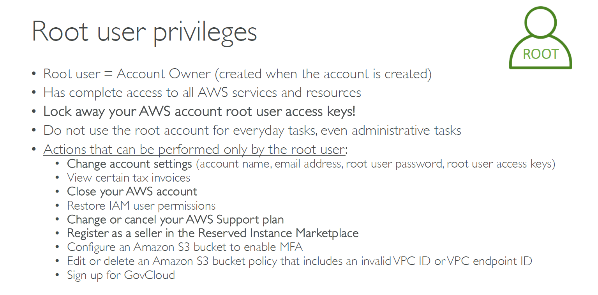

# 👑 What Is the **AWS Root User**?

The **root user** in AWS is the **original account owner** — the person who created the AWS account using an email address and password.  
It is **not** an IAM user and has **full, unrestricted access** to all AWS services and resources.

---

    

---

## 🧠 Key Concepts

| 🔐 Feature          | 📝 Description                                                                  |
| ------------------- | ------------------------------------------------------------------------------- |
| **Root user**       | The **email/password account owner** — created when you first signed up for AWS |
| **Privileges**      | Has **complete access** to everything in the account                            |
| **Not an IAM user** | IAM users are created under the account — the root user exists outside IAM      |

---

## ⚠️ AWS Best Practices

### 🔒 **DO NOT use the root user** for daily tasks

- ✔️ Use it only when absolutely necessary
- ❌ Don’t assign it for developers, admins, or automation

### 🔐 **Secure the root account**

- Enable **MFA (Multi-Factor Authentication)**
- Never create **access keys** unless required (and delete them immediately after use)
- Store root credentials **offline** in a secure password vault

---

## 🔑 **Things ONLY the Root User Can Do**

| ✅ Task                                     | 🔧 Why?                               |
| ------------------------------------------- | ------------------------------------- |
| Change AWS account name, email, or password | Root is the only "owner"              |
| Manage root access keys                     | Self-managed credentials              |
| View some tax invoices                      | Restricted to legal owner             |
| Close the AWS account                       | Permanent, owner-only action          |
| Restore permissions for IAM users           | Critical recovery action              |
| Change/cancel AWS Support plans             | Impacts billing/account level         |
| Register for Reserved Instance Marketplace  | Seller identity check                 |
| Enable MFA on Amazon S3 bucket              | Requires root-level verification      |
| Modify S3 bucket policies with invalid VPCs | Some edits can bypass IAM             |
| Sign up for GovCloud accounts               | Legal compliance and ownership needed |

---

## 🛡️ Why Is This Important?

Using the root user casually is **very risky**. If compromised, attackers can:

- Shut down or delete your AWS account
- Steal data
- Change billing info
- Create backdoors (like admin IAM users)
- Incur unexpected charges

---

## ✅ What You Should Do

| Action                        | Recommendation                            |
| ----------------------------- | ----------------------------------------- |
| 🔐 Enable MFA                 | Immediately after account creation        |
| 🗝️ Don't use root access keys | If created, delete or rotate them         |
| 🧑 Create IAM users           | For all admins/devs/automation roles      |
| 📋 Follow least privilege     | Give only needed permissions to IAM roles |
| 🔐 Lock away credentials      | Use a secure password manager             |

---

## 🧠 Quick Summary

- 👑 The **root user is the AWS account owner**
- 🛑 Use it **only** for sensitive account-level tasks
- 🔐 Always protect it with **MFA**
- ✅ For daily use: create **IAM users** and **roles**

---

Would you like a **visual flowchart or checklist** for securing the root user and creating proper IAM roles afterward?
