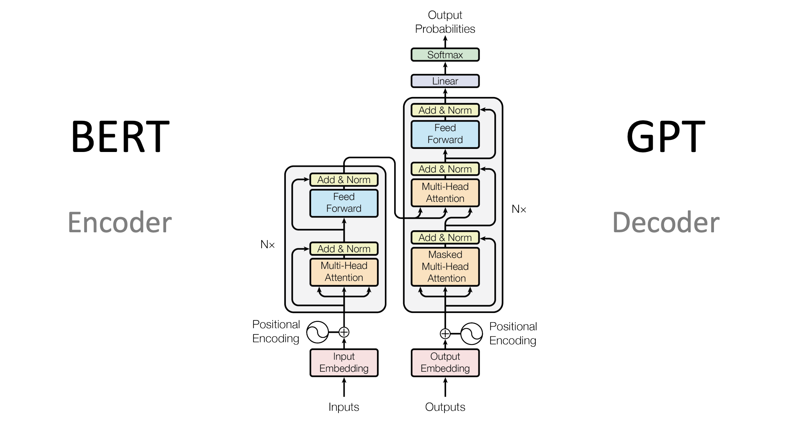
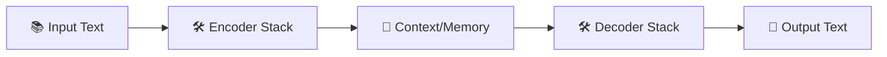
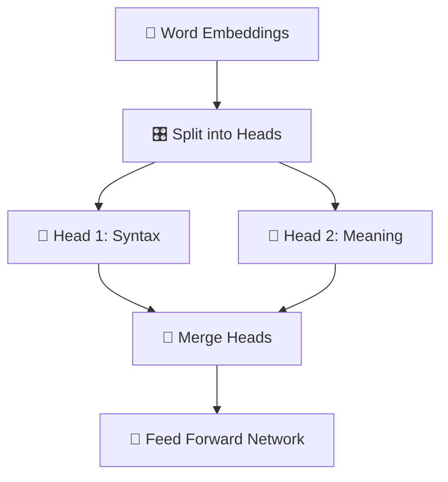
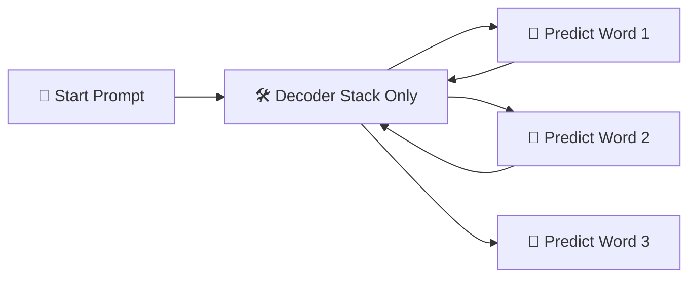

---
tags:
  - aws
  - aws/exam
  - aws/cert/aws-aif
  - aws/cert/ai-ml-dp-genai-basics
aliases:
  - "Transformer Model"
  - "What Is Transformer Model"
---

# 🤖 Transformer Model

## 🌟 Part 1: What is a Transformer Model?

> **Official Definition:**  
> A **Transformer** is a **deep learning architecture** introduced by **Google in 2017** (paper: _Attention is All You Need_) that uses a special mechanism called **self-attention** to **process entire input sequences at once**, rather than word-by-word like old models.

💡 **Simple Intuition**:  
Imagine reading a sentence not word-by-word, but **seeing the whole sentence at once**, and **focusing on the important words automatically**! 🔥

🔑 **Key Breakthroughs**:

- Processes input **in parallel** (fast! ⚡).
- Understands **relationships between all words** at the same time (smart! 🧠).
- No need for RNNs (recurrent networks) or CNNs (convolutions).

---

## 🧠 Part 2: The Big Picture — How Transformers Work

<div style="text-align: center">


---


```mermaid
flowchart LR
    InputText[📚 Input Text] --> EncoderStack[🛠️ Encoder Stack]
    EncoderStack --> Memory[🧠 Context/Memory]
    DecoderStack[🛠️ Decoder Stack] --> OutputText[📝 Output Text]
    Memory --> DecoderStack
```

</div>

---

✅ **A Transformer model has two main parts**:

<div align="center" >

| Part    | Purpose                                              |
| :------ | :--------------------------------------------------- |
| Encoder | Understand the input (build memory/context)          |
| Decoder | Generate output (based on memory + previous outputs) |

</div>

✅ **For Large Language Models (LLMs)** like GPT, **only the Decoder part** is used (we'll see why soon!).

---

## 🏛️ Part 3: Transformer Internal Components

Now let's break down **what’s inside**:

<div align="center" >

| Component                   | What It Does                     |
| :-------------------------- | :------------------------------- |
| 1. Embedding Layer          | Convert words to vectors         |
| 2. Positional Encoding      | Add order information            |
| 3. Self-Attention Mechanism | Focus on relevant words          |
| 4. Feed Forward Network     | Process features deeper          |
| 5. Add & Norm               | Make things stable and efficient |
| 6. Output Layers            | Final predictions                |

</div>

✅ **Let's go layer by layer like opening a secret machine!** 🔥

---

## 🧩 Part 4: Step-by-Step Deep Dive

### 1. 🔠 Embedding Layer

✅ Words (like "cat", "dog") are first converted to **word embeddings**:

- Each word becomes a **vector** — a list of numbers 📈.

✅ **Example**:

- "Cat" → [0.2, 0.7, -1.5, ...]

---

### 2. 📍 Positional Encoding

✅ Transformers don’t know **word order** by default.  
So we add **Positional Encoding**:

- We mix a pattern (sine/cosine waves) into the embeddings to tell the model "this word is first," "this word is second," etc.

✅ **Simple analogy**:  
Like giving seat numbers 🪑 to people at a concert 🎶.

---

### 3. 👀 Self-Attention

✅ The **heart** of the Transformer ❤️.

> **Self-Attention** means:  
> Each word looks at **every other word** (including itself) and decides **who to pay attention to**.

✅ **Real Example**:  
Sentence: "**The cat sat on the mat.**"  
When processing "sat", the model will focus more on "cat" (subject) than "the" or "on".

✅ **Self-Attention Steps**:

1. **Create Query (Q)**, **Key (K)**, and **Value (V)** vectors for each word.
2. **Match Queries to Keys** → Calculate "attention scores" (how much attention to pay).
3. **Weighted Sum of Values** → Final representation!

---

✅ **Formula Behind It** (don’t worry, I'll explain intuitively!):

```math
Attention(Q, K, V) = softmax(Q × Kᵀ / √dₖ) × V
```

| Symbol  | Meaning                                    |
| :------ | :----------------------------------------- |
| Q       | What I'm looking for                       |
| K       | What others offer                          |
| V       | What others carry                          |
| √dₖ     | Normalization term (prevent giant numbers) |
| Softmax | Converts scores into percentages           |

✅ **Simple analogy**:  
At a party 🎉,

- **Query** = "Who’s good at telling jokes?" 🤡
- **Keys** = Each guest’s skills (joking, cooking, singing)
- **Values** = What they offer (jokes, food, songs)
- You **focus** on people good at jokes!

---

### 4. 🎛️ Multi-Head Attention

✅ Instead of one attention calculation → **do many in parallel!** (called **heads**).

✅ Why?  
Each head can focus on **different things**:

- One head might focus on **syntax** (word structure).
- Another head on **semantics** (meaning).

✅ **Diagram**:

<div align="center" >


```mermaid
flowchart TD
    Embedding[🔡 Word Embeddings] --> SplitHeads[🎛️ Split into Heads]
    SplitHeads --> Attention1[👀 Head 1: Syntax]
    SplitHeads --> Attention2[🧠 Head 2: Meaning]
    Attention1 --> Merge[🔗 Merge Heads]
    Attention2 --> Merge
    Merge --> FFN[🔁 Feed Forward Network]
```

</div>

---

### 5. 🛠️ Feed Forward Network (FFN)

✅ After self-attention, each word vector goes through a **small neural network**:

- Linear Layer → Activation (ReLU) → Linear Layer.

✅ Purpose:

- Add **more depth** to the model.
- Help it learn **complex combinations**.

---

### 6. 🧽 Add & Normalize

✅ To make learning stable:

- **Add** (skip connections): input + output of attention/feedforward.
- **Normalize** (LayerNorm): ensure data stays nicely distributed (not exploding/vanishing).

✅ **Simple analogy**:  
Think of adding stabilizers to a bicycle 🚲 for smooth riding!

---

## 📈 Part 5: Special Tricks for Training

✅ To make Transformers efficient and powerful:

| Trick                | Why It’s Important                                            |
| :------------------- | :------------------------------------------------------------ |
| Masking              | Prevent cheating during training (no peeking at future words) |
| Dropout              | Prevent overfitting                                           |
| Learning Rate Warmup | Start training slowly, then speed up                          |
| Label Smoothing      | Help model generalize better                                  |

---

## 📚 Part 6: Why LLMs Like GPT Use Only Decoder?

✅ In LLMs like GPT:

- We only **generate text** — one word at a time.
- So we **don’t need the Encoder** (no need to understand full input separately).

✅ **Diagram: LLM Text Generation**

<div align="center" >


```mermaid
flowchart LR
    StartPrompt[📝 Start Prompt] --> DecoderOnly[🛠️ Decoder Stack Only]
    DecoderOnly --> Word1[📝 Predict Word 1]
    Word1 --> DecoderOnly
    DecoderOnly --> Word2[📝 Predict Word 2]
    Word2 --> DecoderOnly
    DecoderOnly --> Word3[📝 Predict Word 3]
```

</div>

✅ **Idea**:  
Generate **word-by-word**, using **previously generated words** as **new input**!

---

## 🎯 Part 7: Mini Recap — Transformers in a Nutshell

| Step                    | What Happens                |
| :---------------------- | :-------------------------- |
| 1. Embed words          | Turn words into numbers     |
| 2. Add position info    | Understand order            |
| 3. Self-Attention       | See who to focus on         |
| 4. Multi-head Attention | Look at multiple patterns   |
| 5. Feed Forward         | Process deeper              |
| 6. Output predictions   | Generate next word/sentence |

---

## 🛣️ What's Next?

👉 If you want, we can continue to an even **deeper topic**, like:  
🔜 **"Self-Attention Variants and Advanced Tricks in Transformers (Sparse Attention, FlashAttention, Rotary Embeddings, etc.)"**

🔥 It will explain how **GPT-4o** and future models **optimize Transformers** to be faster and smarter!
---

## Related Notes
- [[aws-exams/aws-aif/1.ai-ml-dp-genai-basics/|Index]] - folder map
- [[aws-exams/aws-aif/1.ai-ml-dp-genai-basics/1.4.3.genai-context-window|Context Window in Generative AI Full Clear Guide]] - previous lesson
- [[aws-exams/aws-aif/1.ai-ml-dp-genai-basics/1.4.5.genai-embeddings|Embeddings in Generative AI Meaning in Numbers]] - next lesson

---
