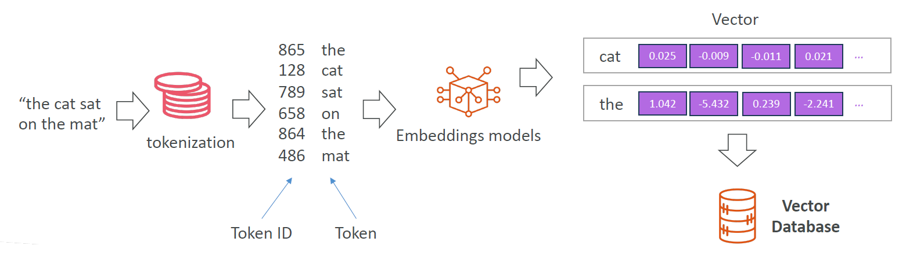
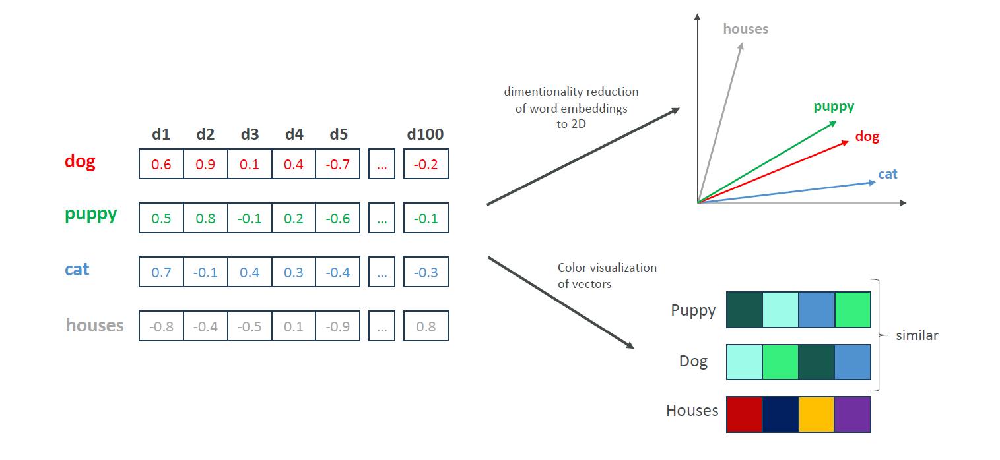

# 🧠 Embeddings in Generative AI: Meaning in Numbers

## 📌 What Are Embeddings?

> **Embeddings** are how AI models convert text, audio, or images into **vectors**—lists of numbers—that capture their **meaning** and **context**.

---

    

---

✅ Simply put:

- **Words, sentences, images** ➡️ **Vectors**
- These vectors represent **semantic relationships**, **syntax**, **sentiment**, and more.

---

## 🧩 Why Do We Use Embeddings?

| Purpose                        | Description                                                |
| ------------------------------ | ---------------------------------------------------------- |
| 🧠 **Capture meaning**         | Embeddings store the "idea" of a word, sentence, or image. |
| 🔍 **Search smarter**          | Find things based on meaning, not keywords.                |
| 🧾 **Power recommendations**   | Suggest similar content by comparing embeddings.           |
| 📚 **Feed into GenAI systems** | Used in RAG, chatbots, search, and summarization engines.  |

---

## ✨ From Tokens to Vectors

Let’s break it down visually:

### 📝 Sentence

> “The cat sat on the mat”

### ➡️ Tokenization

| Token | ID  |
| ----- | --- |
| the   | 865 |
| cat   | 128 |
| sat   | 789 |
| on    | 658 |
| the   | 864 |
| mat   | 486 |

### ➡️ Embeddings (Example Values)

| Token | Embedding Vector (shortened)      |
| ----- | --------------------------------- |
| the   | [1.042, -5.432, 0.239, -2.241, …] |
| cat   | [0.025, -0.009, -0.011, 0.021, …] |

➡ These embeddings can be stored in a **Vector Database** for searching or querying based on meaning.

---

## 🧭 What Do Embeddings Capture?

| Feature                 | Example                   |
| ----------------------- | ------------------------- |
| 🔤 **Semantic meaning** | "cat" is similar to "dog" |
| 🧱 **Syntactic role**   | Noun, verb, adjective…    |
| 😊 **Sentiment**        | Happy, sad, angry         |

---

## 📏 Semantic Relationships = Close Vectors

> Words or phrases that mean similar things will have **similar embeddings**  
> 🧠 Like “cat” and “kitten” will have vector values that are **close** together

✅ Example:

| Word   | Vector (Simplified)      |
| ------ | ------------------------ |
| Cat    | [0.12, -0.84, 0.33, ...] |
| Dog    | [0.14, -0.80, 0.31, ...] |
| Banana | [0.91, 0.12, -0.45, ...] |

🎯 **"Cat" ≈ "Dog"**, not **"Banana"**

---

## 🎨 How Do We Visualize High-Dimensional Vectors?

Embeddings are often **384–1536 dimensions**, but we can’t "see" that. So we reduce it to 2D or 3D using techniques like **PCA** or **t-SNE**.

- 📉 1. Dimensionality Reduction

  > Compresses vectors into 2D space to make them easier to **visualize** while preserving their **meaningful relationships**.

- 🌈 2. Color Visualization

  > Color can represent vector **density, direction**, or **semantic clusters** when plotted.

---

    

---

## 🔄 Embeddings vs Tokenization

| Concept         | Purpose                                                          |
| --------------- | ---------------------------------------------------------------- |
| 🧩 Tokenization | Break input into tokens (words, subwords, etc.)                  |
| 🧠 Embeddings   | Represent each token with a **vector** capturing its **meaning** |

---

## 💼 Where Are Embeddings Used?

| Use Case                         | Purpose                                          |
| -------------------------------- | ------------------------------------------------ |
| 🔍 **Semantic Search**           | "Find docs about cats" ➜ returns cat/dog/rabbit  |
| 🧠 **RAG (GenAI + Retrieval)**   | Find relevant chunks to include in model context |
| 💬 **Similarity Detection**      | "Are these two texts asking the same question?"  |
| 🛒 **Recommendations**           | Suggest similar items, articles, or queries      |
| 📚 **Clustering/Classification** | Organize documents by meaning                    |

---

## 🧠 Smart Tips to Remember

- Embeddings = **meaning as numbers**
- Close vectors = **related concepts**
- Used everywhere in GenAI from **chatbots** to **document search**

📌 **Think of it like this**:

> "**Embeddings are the brain's mental map — in numbers!**" 🧠➡️📈
