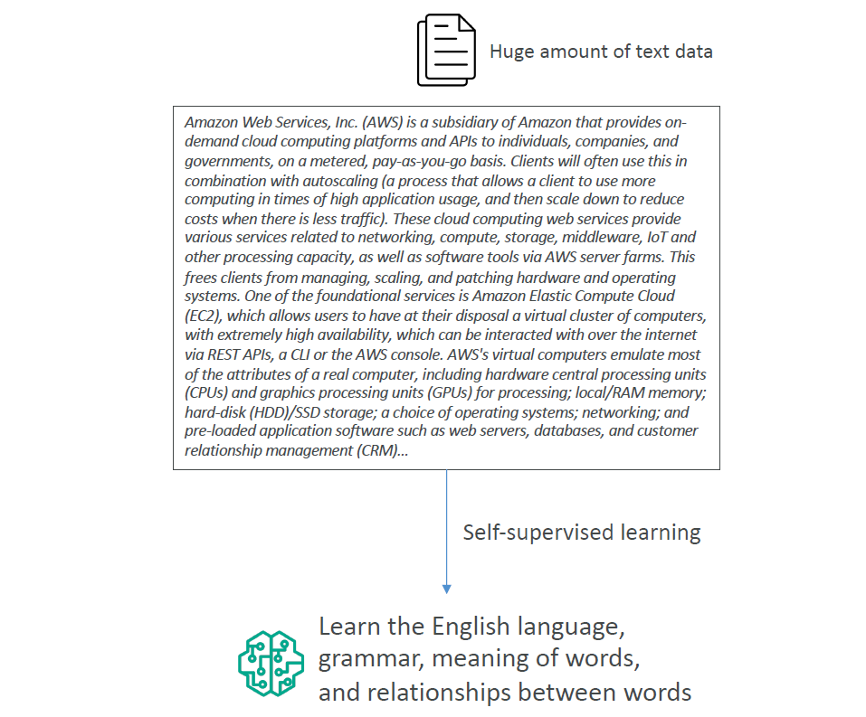
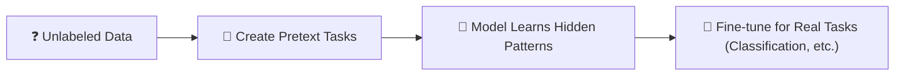
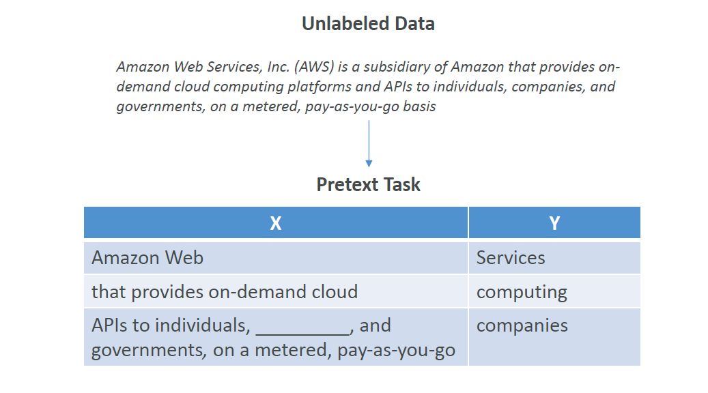

# 📚 Self-Supervised Learning — The Secret Behind Modern AI

## 🧠 What is Self-Supervised Learning?

> **Official Definition**:  
> **Self-Supervised Learning** is a Machine Learning technique where a model **creates its own labels** (pseudo-labels) from **unlabeled data** and uses them to learn representations that can be used for solving downstream tasks traditionally handled by Supervised Learning.

---

<div style="text-align: center;">
    
</div>

---

📌 **In simpler words**:  
Self-Supervised Learning = **Teaching yourself** 🧑‍🎓✍️  
The machine **labels parts of its own data**, solves made-up tasks, and **learns useful patterns** —  
**without needing humans** to label anything!

📌 **Simple Idea**:

- **No labels?** No problem!
- The model **creates puzzles** out of the data and **learns by solving them**.

📌 **Result**:  
The model becomes **good enough** to later solve **real tasks** (classification, translation, etc.)!

---

## 🌟 Why Do We Need Self-Supervised Learning?

📌 **Because**:

- Labeling large datasets is **very expensive** 🤑.
- Unlabeled data (text, images, audio) is **everywhere** 🌎.
- Learning **representations automatically** makes training **cheaper**, **faster**, and **scalable** 🚀.

📌 **Used heavily in**:

- **NLP** (language models like BERT, GPT) 🧠.
- **Computer Vision** (image classification without labeled images) 👁️.

---

## 🏗️ How Self-Supervised Learning Works

📌 **General Steps**:

<div style="text-align: center;">



</div>

---

📌 **Three Stages**:

1. **Create Pretext Tasks**:  
   Build fake but clever tasks to force the model to learn patterns.
2. **Train on Pretext Tasks**:  
   Model solves the puzzles using only unlabeled data.
3. **Transfer to Downstream Tasks**:  
   Use the learned knowledge to solve real-world tasks like classification or translation.

---

## 🧩 What are Pretext Tasks?

<div style="text-align: center;">
    
</div>

---

📌 **Pretext Tasks** = "Mini-challenges" created from the data itself.

📌 **Examples**:

| Pretext Task                        | What Happens                              |
| :---------------------------------- | :---------------------------------------- |
| Predict missing words               | Fill-in-the-blank in sentences 📚         |
| Predict next frame                  | Guess future frames in video 🎥           |
| Predict masked parts of an image    | Guess missing image pieces 🧩             |
| Predict context from a partial view | Understand relations without full data 🕵️ |

📌 **Real Example (Text)**:
Given:

```text
Amazon Web Services provides ____ to individuals and companies.
```

The model learns to predict:

```text
cloud computing
```

---

## ✍️ Real-world Example: Huge Text Dataset (like Amazon AWS Description)

📌 **Given text** (millions of sentences like AWS documentation):

> "Amazon Web Services, Inc. (AWS) is a subsidiary of Amazon that provides on-demand cloud computing platforms and APIs to individuals, companies, and governments..."

📌 **Pretext Task**:

- Mask random words 📝.
- Model tries to **predict the missing words**.

📌 **Learning Outcome**:

- Understand English grammar 📚.
- Understand meaning of words (AWS, subsidiary, cloud computing).
- Learn relationships between words (subsidiary → company → services).

📌 **Result**:

- A model that **understands English** deeply without any human manually tagging it.

---

## 🔥 Applications of Self-Supervised Learning

📌 **Natural Language Processing (NLP)**:

- **BERT**: Learns by predicting masked words.
- **GPT**: Learns by predicting the next word.

📌 **Computer Vision**:

- **SimCLR**: Learns image features without labels.
- **MoCo**: Momentum contrast for unsupervised visual representation learning.

📌 **Speech Recognition**:

- **wav2vec**: Learns features from raw audio without manual labels.

---

## 📈 Advantages of Self-Supervised Learning

| Advantage                   | Why It Matters                                      |
| :-------------------------- | :-------------------------------------------------- |
| No human labeling needed    | Saves massive costs 💵                              |
| Scalable to huge datasets   | Learn from millions of documents, images, videos 📦 |
| Builds rich representations | Boosts performance on multiple tasks 🧠             |

---

## ⚡ Challenges of Self-Supervised Learning

| Challenge             | Why It’s Hard                                             |
| :-------------------- | :-------------------------------------------------------- |
| Pretext tasks design  | Must be clever enough to force useful learning 🔧         |
| Training can be heavy | Needs big compute (GPUs, TPUs) for very large datasets ⚡ |
| Noisy pseudo-labels   | Sometimes model learns wrong shortcuts 🛑                 |

---

## 🎯 Self-Supervised Learning vs Semi-Supervised Learning

| Aspect         | Self-Supervised              | Semi-Supervised                               |
| :------------- | :--------------------------- | :-------------------------------------------- |
| Labels         | No human labels at all ❌    | Few human labels ✅                           |
| First step     | Create fake tasks internally | Train on small labeled + large unlabeled data |
| Famous example | BERT, GPT                    | Pseudo-labeling for image classification      |

---

## ✍️ Mini Smart Recap

✅ **Self-Supervised Learning** = Machine teaches itself using clever fake tasks 🤓.  
✅ **Pretext Tasks** = Small puzzles like missing word prediction 🧩.  
✅ **Downstream Tasks** = Real-world tasks solved smarter after self-learning 🎯.  
✅ **Core of today's AI giants** (BERT, GPT, DALL-E, wav2vec) 🚀.
