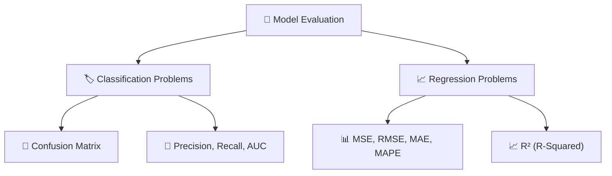
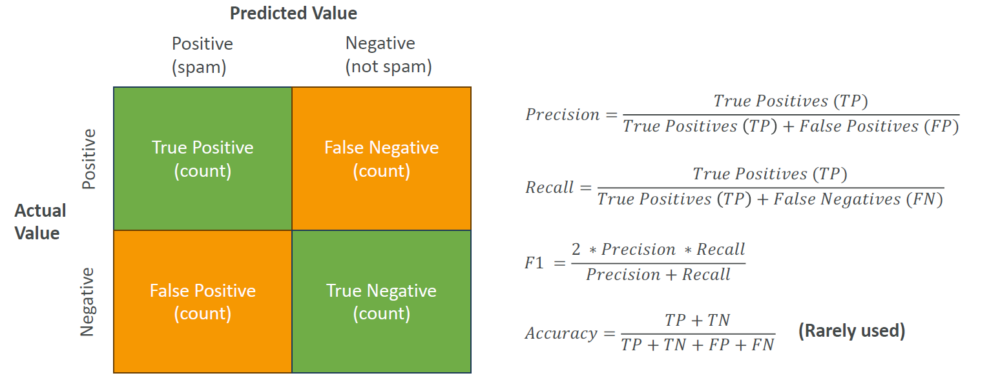
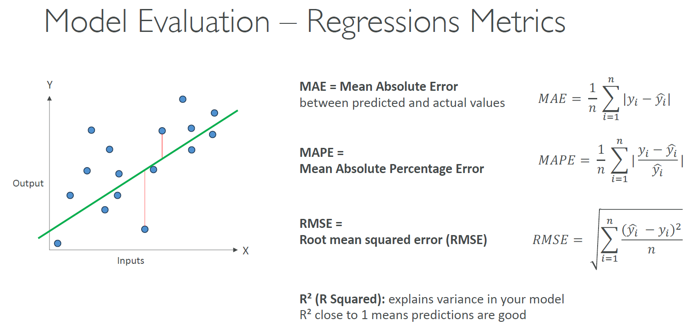

---
tags:
  - aws
  - aws/exam
  - aws/cert/aws-aif
  - aws/cert/ai-ml-dp-genai-basics
aliases:
  - "Model Evaluation"
---

# 📚 Model Evaluation

## 🧠 **What is Model Evaluation?**

> **Definition**:  
> **Model Evaluation** measures **how good** or **bad** a machine learning model is at solving the intended problem,  
> using the right metrics depending on whether the task is **Classification** or **Regression**.

👉 **Simply**:

- For predicting **categories** → use **classification metrics** 🏷️.
- For predicting **numbers** → use **regression metrics** 📈.

---

## 🏛️ **Evaluation Branches**

---

## 🏷️ **Classification Evaluation**

> **Classification** = Predict **which category** the data belongs to.

---

    

---

✅ **Examples**:

- Spam vs Not Spam 📧.
- Dog vs Cat 🐶🐱.

---

### 🧩 1. **Confusion Matrix**

--

✅ A table showing **correct vs incorrect predictions**:

| Actual \ Predicted | Positive               | Negative               |
| :----------------- | :--------------------- | :--------------------- |
| Positive           | True Positive (TP) ✅  | False Negative (FN) ❌ |
| Negative           | False Positive (FP) ❌ | True Negative (TN) ✅  |

✅ **Meaning**:

- **TP (True Positive)**: Predicted positive correctly.
- **TN (True Negative)**: Predicted negative correctly.
- **FP (False Positive)**: Wrongly predicted positive.
- **FN (False Negative)**: Missed predicting a positive case.

---

### 🎯 2. **Precision, Recall, F1 Score, AUC**

✅ **Metrics and Formulas**:

| Metric                     | Formula                                                                                                     | Best Used When                                   |
| :------------------------- | :---------------------------------------------------------------------------------------------------------- | :----------------------------------------------- |
| Precision                  | $\text{Precision} = \frac{TP}{TP + FP}$                                                                     | Costly false positives (e.g., fraud detection)   |
| Recall (Sensitivity)       | $\text{Recall} = \frac{TP}{TP + FN}$                                                                        | Costly false negatives (e.g., medical diagnosis) |
| F1 Score                   | $\text{F1 Score} = 2 \times \frac{\text{Precision} \times \text{Recall}}{\text{Precision} + \text{Recall}}$ | Need balance between precision and recall        |
| AUC (Area Under ROC Curve) | Computed from ROC Curve                                                                                     | Overall model discrimination ability             |

✅ **Quick Hints**:

- **Precision**: How many predicted positives are correct.
- **Recall**: How many actual positives were caught.
- **F1 Score**: Good if classes are imbalanced.
- **AUC**: Good for comparing models across thresholds.

✅ **Simple Comparison**:

| Metric    | Focus                                 |
| :-------- | :------------------------------------ |
| Precision | Accuracy of positives predicted       |
| Recall    | Ability to find positives             |
| F1 Score  | Tradeoff between Precision and Recall |
| AUC       | Overall separation between classes    |

---

## 📈 **Regression Evaluation**

> **Regression** = Predict a **continuous value** (number).

---

    

---

✅ **Examples**:

- Predicting house prices 🏠.
- Predicting temperatures 🌡️.

---

### 📊 1. **MSE, RMSE, MAE, MAPE**

✅ **Metrics and Formulas**:

| Metric                                | Formula                                                                                       | Interpretation                |
| :------------------------------------ | :-------------------------------------------------------------------------------------------- | :---------------------------- |
| MAE (Mean Absolute Error)             | $$ \text{MAE} = \frac{1}{n} \sum_{i=1}^{n} y_i - \hat{y}_i $$                                 | Average absolute error        |
| MAPE (Mean Absolute Percentage Error) | $$ \text{MAPE} = \frac{100}{n} \sum_{i=1}^{n} \left\| \frac{y_i - \hat{y}_i}{y_i} \right\| $$ | Average percentage error      |
| MSE (Mean Squared Error)              | $$ \text{MSE} = \frac{1}{n} \sum_{i=1}^{n} (y_i - \hat{y}_i)^2 $$                             | Average squared error         |
| RMSE (Root Mean Squared Error)        | $$ \text{RMSE} = \sqrt{\frac{1}{n} \sum_{i=1}^{n} (y_i - \hat{y}_i)^2} $$                     | Root of average squared error |

✅ **Quick Hints**:

- **MAE** → Direct, easy-to-interpret average error (unit = same as output).
- **MAPE** → Tells you percentage error — very useful for comparing across different scales.
- **MSE / RMSE** → Punishes larger errors more (important if big mistakes are very costly).

✅ **Simple Comparison**:

| Metric | Focus                                 |
| :----- | :------------------------------------ |
| MAE    | Average simple mistake                |
| MAPE   | How wrong you are in percentage terms |
| MSE    | Emphasizes bigger mistakes            |
| RMSE   | Bigger mistakes, same unit as output  |

---

### 📈 2. **R² (R-Squared)**

✅ **What It Measures**:

- How much of the **variance** in the target variable is **explained** by the model.

✅ **Formula**:

$$
R^2 = 1 - \frac{\sum (y_i - \hat{y}\_i)^2}{\sum (y_i - \bar{y})^2}
$$

Where:

- ( $ \hat{y}\_i $ ) = predicted value
- ( $y_i $) = actual value
- ( $ \bar{y} $ ) = mean of actual values

✅ **Ranges**:

| R² Value | Meaning                       |
| :------- | :---------------------------- |
| 1.0      | Perfect prediction ✅         |
| 0.0      | No predictive power ❌        |
| Negative | Worse than random guessing 😱 |

✅ **Quick Example**:

- R² = 0.85 ➔ 85% of variations in house prices explained by model features.

✅ **Quick Hint**:

- High R² is good, but **be careful**:  
  Sometimes a high R² can come from **overfitting** if too many irrelevant features are added!

---

## ✍️ **Mini Smart Recap**

| Branch            | Key Metrics                                  | Meaning                                  |
| :---------------- | :------------------------------------------- | :--------------------------------------- |
| 🏷️ Classification | Confusion Matrix, Precision, Recall, F1, AUC | Catching categories correctly            |
| 📈 Regression     | MAE, MSE, RMSE, MAPE, R²                     | Predicting continuous numbers accurately |

✅ **Simple Tip**:

- Predicting a label? ➡️ Classification metrics 🏷️.
- Predicting a number? ➡️ Regression metrics 📈.

✅ **Choosing Between Metrics**:

| Problem Focus          | Best Metric |
| :--------------------- | :---------- |
| Costly False Positives | Precision   |
| Costly False Negatives | Recall      |
| Need Balance           | F1 Score    |
| Big Errors Hurt        | RMSE        |
| Easy Interpretation    | MAE, MAPE   |
| Variance Explained     | R²          |
---

## Related Notes
- [[aws-exams/aws-aif/1.ai-ml-dp-genai-basics/|Index]] - folder map
- [[aws-exams/aws-aif/1.ai-ml-dp-genai-basics/3.1.model_fit-Bias-variance|Model Fit Bias and Variance]] - previous lesson
- [[aws-exams/aws-aif/1.ai-ml-dp-genai-basics/3.3.model-inferencing|Machine Learning Inferencing]] - next lesson

---
