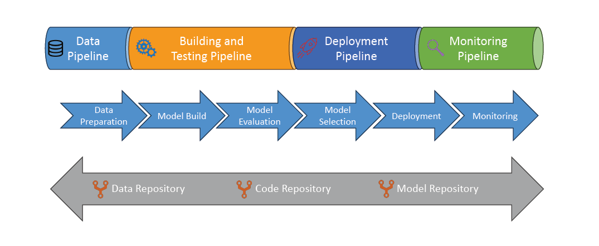

# 🚀 MLOps: Quick and Smart Summary

## 🧠 What is MLOps?

> **Definition**:  
> **MLOps** = "**Machine Learning Operations**" —  
> it applies **DevOps principles** to **Machine Learning** to **build, deploy, monitor, and improve models** continuously.

✅ **Simply**:

- Not just building ML models — **running them reliably forever** 🏃‍♂️💨!

---

## 🎯 Why MLOps?

| Reason               | Quick Meaning                                  |
| :------------------- | :--------------------------------------------- |
| Productionize Models | Get models out of notebooks and into real apps |
| Automate Workflows   | Save time, avoid manual errors                 |
| Version Everything   | Data, code, and models — easy rollback         |
| Monitor and Improve  | Catch drifts, failures, performance drops      |
| Scale                | Handle more models, more teams, more users     |

✅ **Simple Rule**:

> "**No Ops, No ML impact.**" 🛠️

---

## 🛠️ Core MLOps Principles

| Principle                   | Quick Meaning                         |
| :-------------------------- | :------------------------------------ |
| Version Control             | Data, code, models — rollback anytime |
| Automation                  | Automate all stages (build → deploy)  |
| Continuous Integration (CI) | Test models often and early           |
| Continuous Delivery (CD)    | Push models to production easily      |
| Continuous Retraining       | Update models with fresh data         |
| Continuous Monitoring       | Watch model behavior over time        |

✅ **Simple Rule**:

> "**MLOps = Continuous Everything.**" 🔄

---

## 🏗️ MLOps Pipelines Overview

✅ **4 Key Pipelines**:

| Pipeline                | What It Does                             |
| :---------------------- | :--------------------------------------- |
| Data Pipeline           | Ingest and prepare fresh data            |
| Build and Test Pipeline | Train and evaluate models                |
| Deployment Pipeline     | Push the best model to production        |
| Monitoring Pipeline     | Track model accuracy, drift, performance |

✅ **Memory Tip**:

> "**Data → Build → Deploy → Monitor.**" 🔁

---

## 📚 Where Repositories Come In

| Repository       | What It Stores               |
| :--------------- | :--------------------------- |
| Data Repository  | Datasets (input/output)      |
| Code Repository  | ML training code and scripts |
| Model Repository | Trained model versions       |

✅ **Simple Rule**:

> "**Repositories = Brain of the MLOps system.**" 🧠

---

## 🖼️ MLOps Workflow Example

    

---

## ✍️ Mini Smart Recap

| Concept        | Key Point                                             |
| :------------- | :---------------------------------------------------- |
| MLOps          | DevOps for ML models                                  |
| Key Principles | Versioning, Automation, CI/CD, Retraining, Monitoring |
| Pipelines      | Data, Build, Deploy, Monitor                          |
| Repositories   | Track data, code, models                              |

✅ **Simple Rule**:

> "**MLOps = Build. Deploy. Monitor. Repeat.**" 🚀
