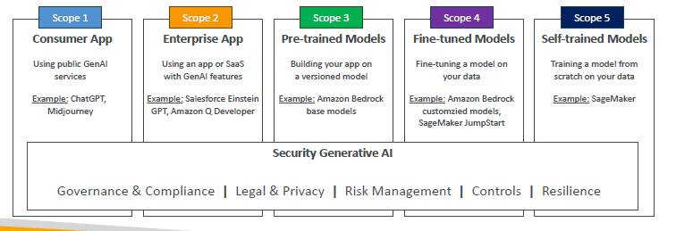

# 🛡️ AI Security: Quick and Easy Summary

## 🧠 What is AI Security?

> **Definition**:  
> **AI Security** protects **AI systems**, **data**, and **infrastructure** from **attacks**, **privacy leaks**, and **failures**.

✅ **Simply**:

- Keep AI **safe**, **private**, and **resilient**. 🧠🔒

---

## 🔥 Main AI Security Areas

| Area                      | Quick Meaning                            |
| :------------------------ | :--------------------------------------- |
| Threat Detection          | Catch fake content, hacked data, attacks |
| Vulnerability Management  | Find bugs, fix weak points               |
| Infrastructure Protection | Secure servers, networks, and devices    |
| Prompt Injection Defense  | Block malicious input prompts            |
| Data Encryption           | Encrypt at rest and in transit           |

✅ **Simple Rule**:

> "**Protect AI inside and out.**" 🛡️

---

## 📈 Monitoring AI Systems

| Metric                | What It Checks                            |
| :-------------------- | :---------------------------------------- |
| Model Accuracy        | Correct predictions overall               |
| Precision             | How many positives are correct            |
| Recall                | How many true positives are found         |
| F1 Score              | Good balance between precision and recall |
| Latency               | Speed of predictions                      |
| Infrastructure Health | CPU, GPU, network, storage status         |

✅ **Also Monitor**:

- Bias, fairness, responsible AI compliance ✅

✅ **Simple Rule**:

> "**Monitor model quality and system health continuously.**" 📊

---

## 🏗️ AWS Shared Responsibility Model

| Party    | Responsibility                                                         |
| :------- | :--------------------------------------------------------------------- |
| AWS      | Security **of** the Cloud (hardware, services like SageMaker, Bedrock) |
| Customer | Security **in** the Cloud (data, access, encryption, guardrails)       |

✅ **Simple Rule**:

> "**AWS protects the platform, you protect your data.**" 🔐

---

## 🔎 Secure Data Engineering Best Practices

| Practice             | Why It Matters                                 |
| :------------------- | :--------------------------------------------- |
| Data Quality Check   | Data must be clean, diverse, current           |
| Privacy Enhancements | Masking, obfuscation, encryption, tokenization |
| Access Control       | Use roles, least privilege, MFA                |
| Data Integrity       | Maintain audit trails, backup plans            |

✅ **Simple Rule**:

> "**Good data = Good AI security.**" 📈

---

## 🛠️ Generative AI Security Scoping Matrix

✅ **Classify GenAI apps into 5 scopes based on ownership**:

  

---

✅ **Simple Rule**:

> "**More control = More responsibility = Higher security risks.**" 🚨

---

## ✍️ Mini Smart Recap

| Area                  | Key Point                                               |
| :-------------------- | :------------------------------------------------------ |
| AI Security           | Protect data, models, and infrastructure                |
| Monitoring            | Track model health, bias, system failures               |
| Shared Responsibility | AWS secures platform; you secure data                   |
| Data Best Practices   | Secure, clean, controlled access                        |
| GenAI Risk Scoping    | 5 levels: From using public models to training your own |

✅ **Simple Rule**:

> "**Secure AI = Safer Data + Stronger Trust.**" 🛡️✅
