# Exam Summary

## ❌ Q4

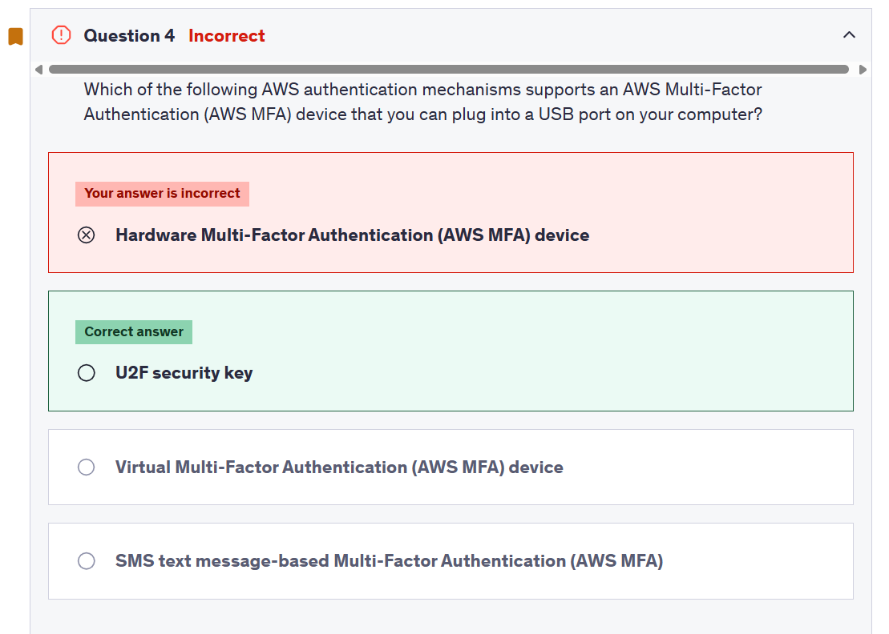

```md
U2F security key

Universal 2nd Factor (U2F) Security Key is a device that you can plug into a USB port on your computer. U2F is an open authentication standard hosted by the FIDO Alliance. When you enable a U2F security key, you sign in by entering your credentials and then tapping the device instead of manually entering a code.

How to enable the U2F Security Key for your own IAM user:
```

## ❌ Q8

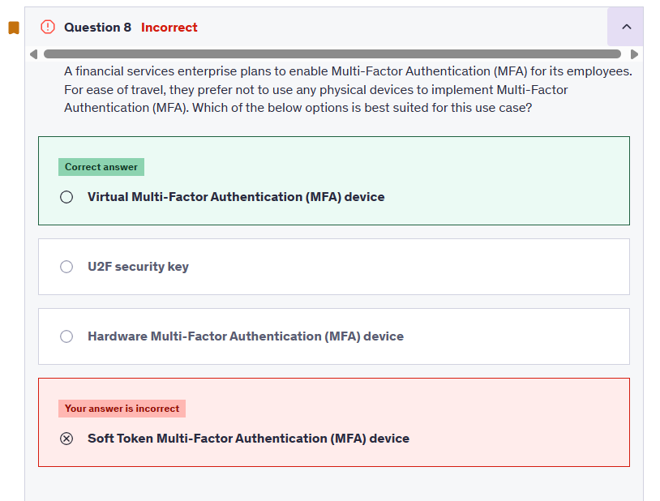

## ❌ Q13

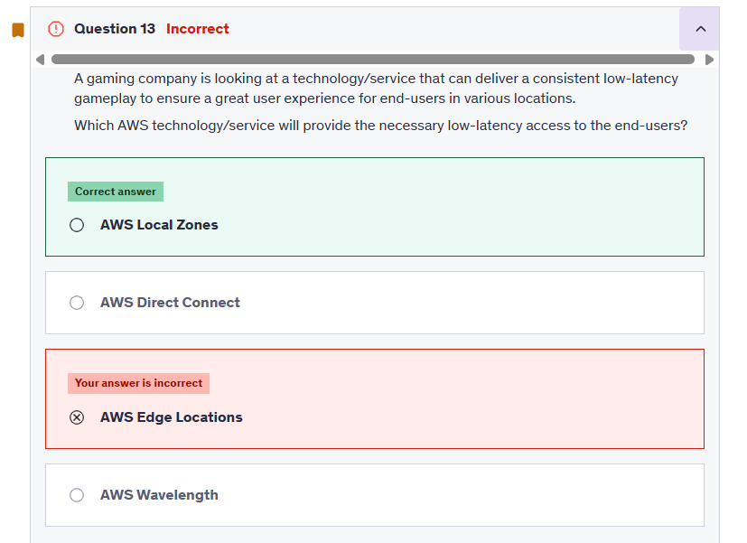

## ❌ Q14

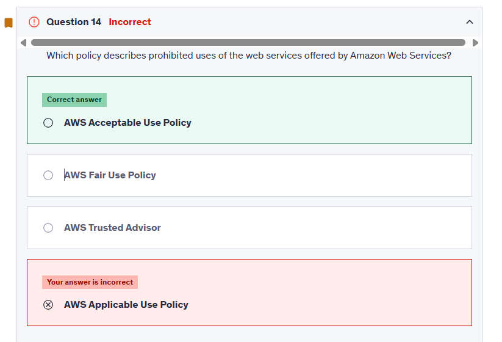

```md
The Acceptable Use Policy describes prohibited uses of the web services offered by Amazon Web Services, Inc. and its affiliates (the “Services”) and the website located at http://aws.amazon.com (the “AWS Site”). This policy is present at https://aws.amazon.com/aup/ and is updated on a need basis by AWS.
```

## ❌ Q17

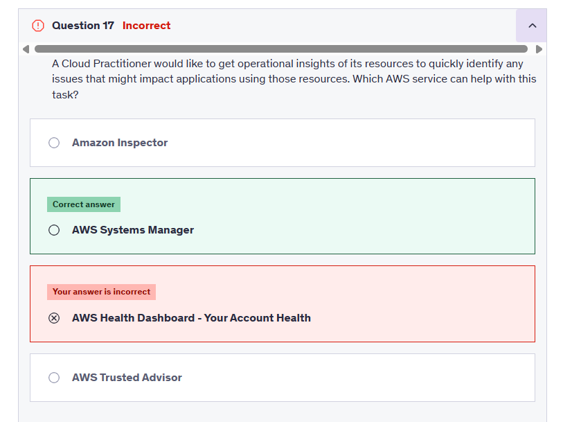

## ❌ Q19

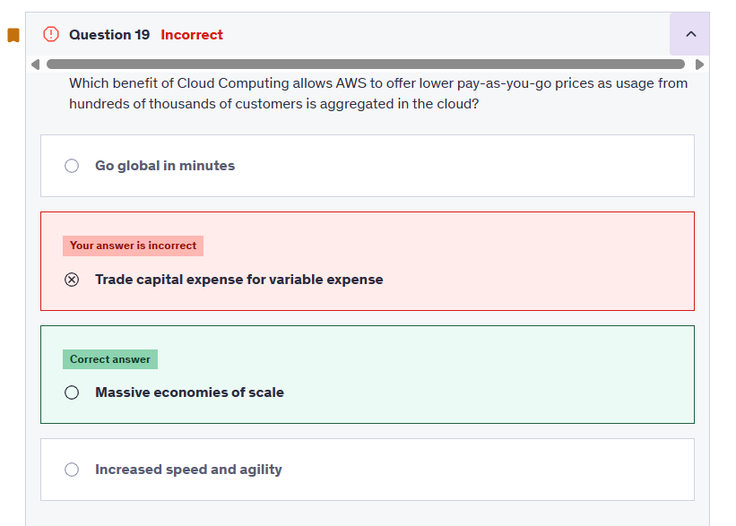

## ❌ Q20

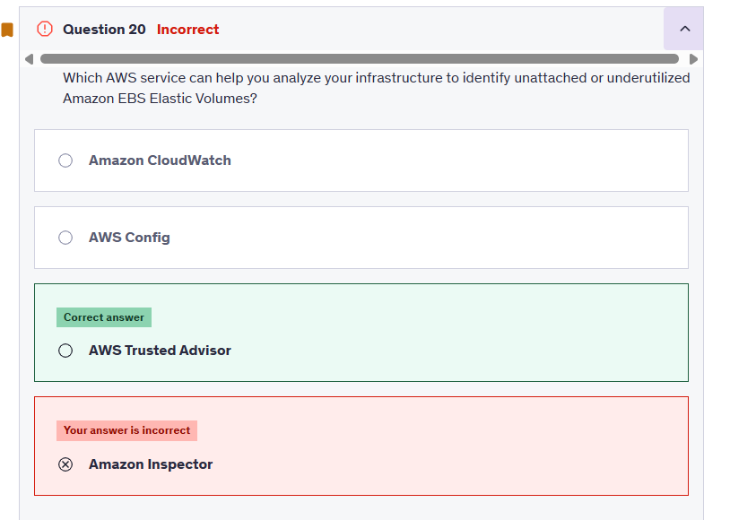

## ❌ Q22

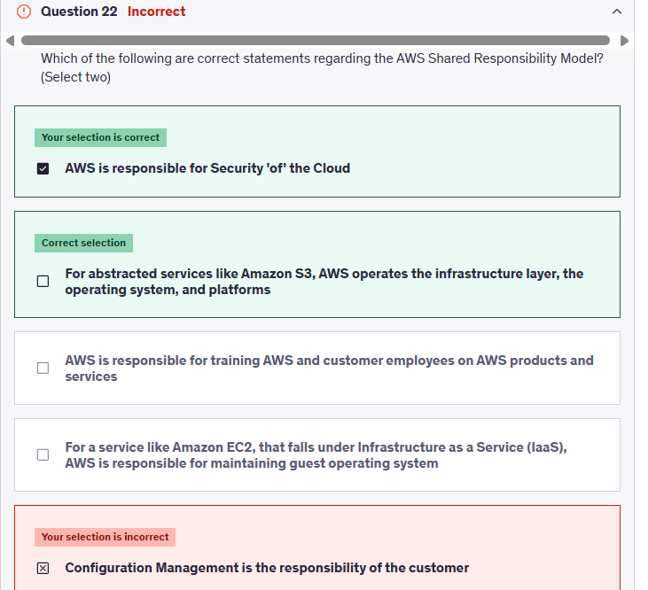

```md
Configuration Management is the responsibility of the customer - Configuration management is a shared responsibility. AWS maintains the configuration of its infrastructure devices, but a customer is responsible for configuring their own guest operating systems, databases, and applications
```

## ❌ Q24

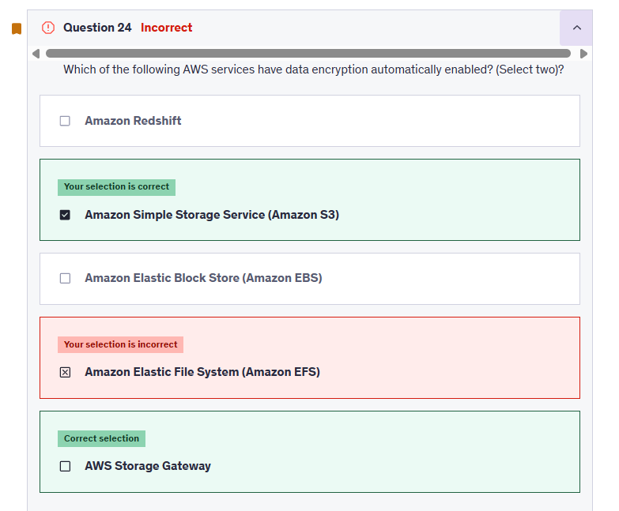

## ❌ Q25

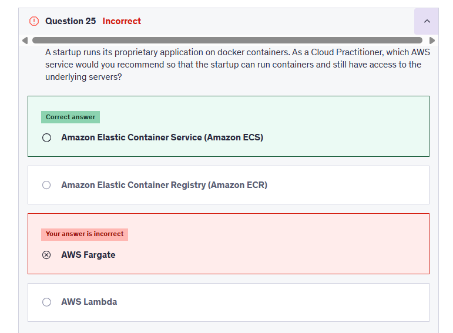

## ❌ Q26

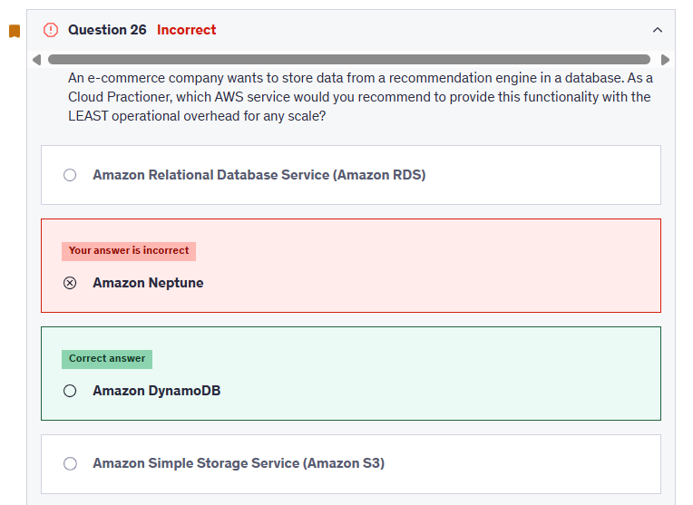

## ✅ Q33

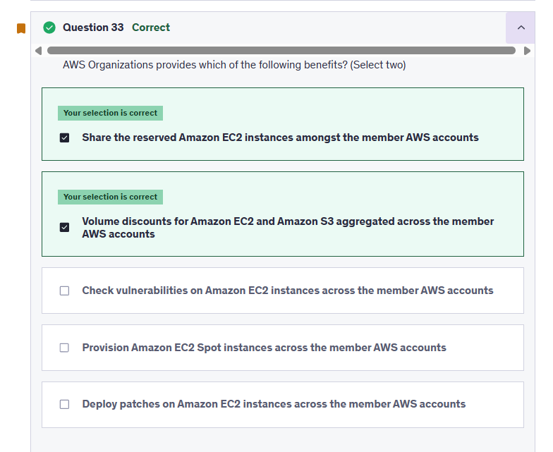

## ❌ Q34

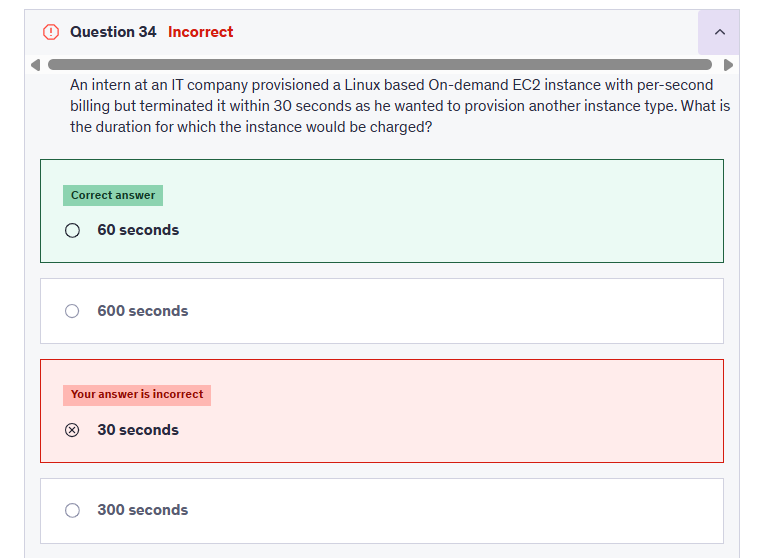

```md
There is a one-minute minimum charge for Linux based EC2 instances, so this is the correct option.
```

## ❌ Q35

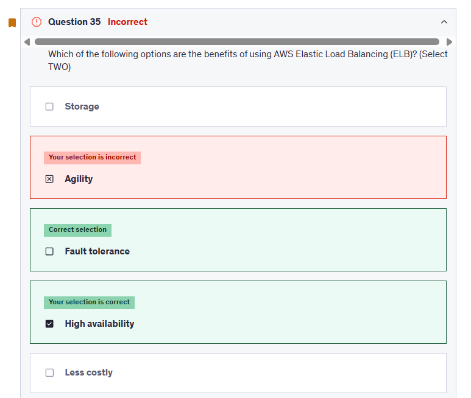

## ❌ Q39

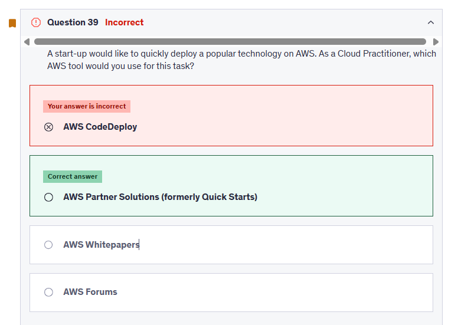

## ❌ Q43

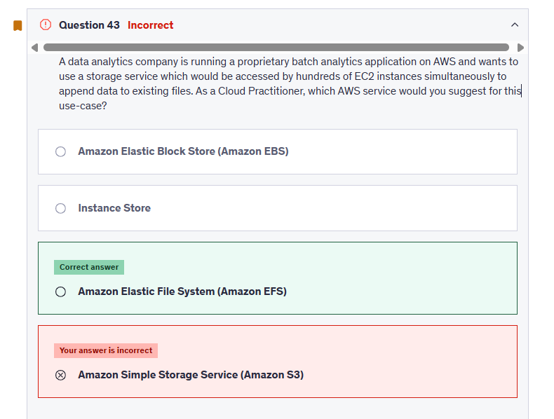

```md
S3 is object storage and it does not support file append operations, so this option is incorrect.
```

## ❌ Q47

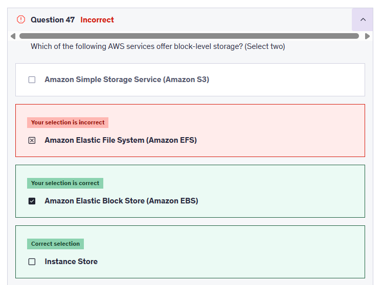

## ❌ Q54

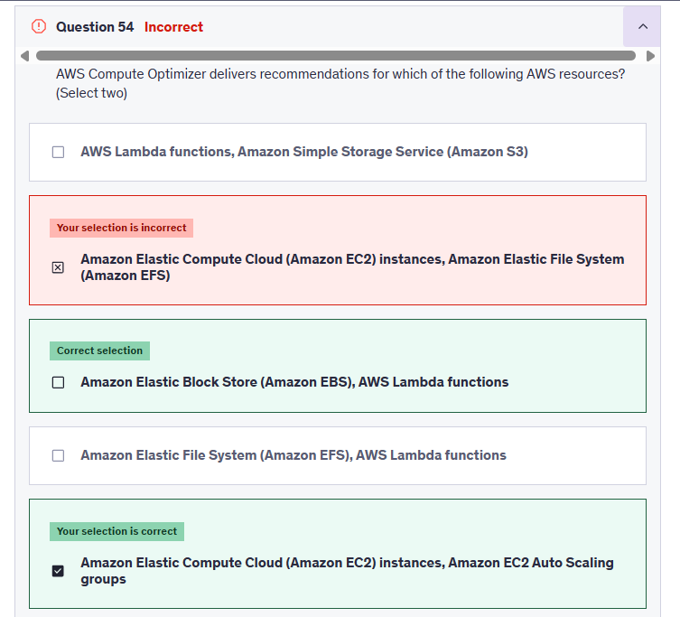

## ❌ Q59

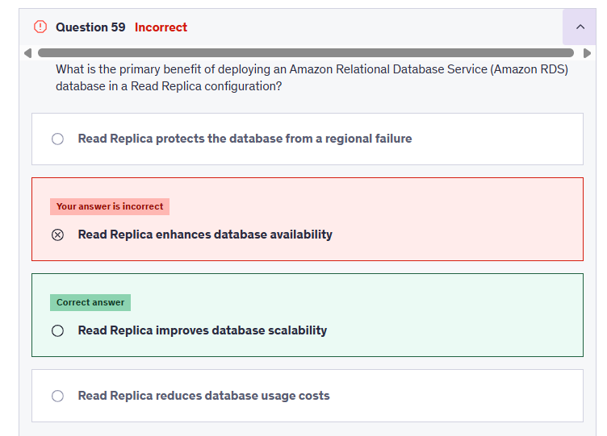

## ❌ Q64

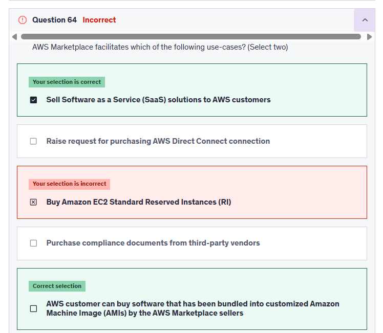
