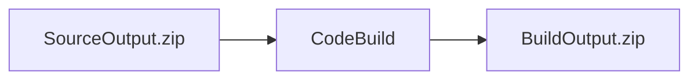
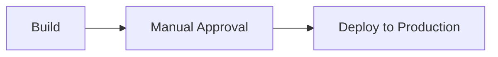
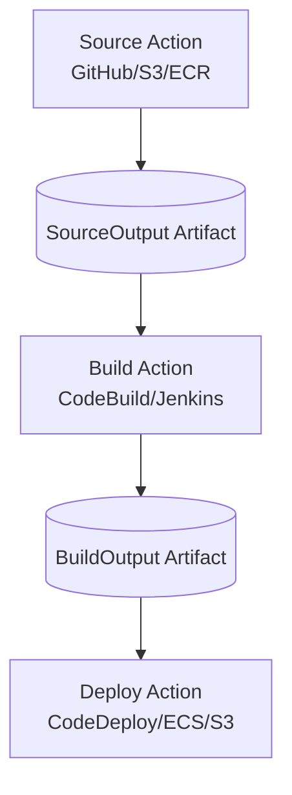
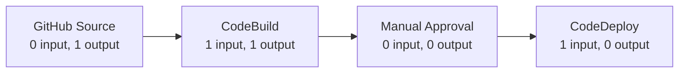

# Code Pipeline

This slide is explaining **AWS CodePipeline action types** and **how many artifacts each action can receive or produce**.

![[README-1778930304669.webp]]

An **artifact** is the packaged file/folder that CodePipeline passes between stages. Usually it is a `.zip` stored internally in the pipeline artifact S3 bucket.

Example:

```text
GitHub source code
    ↓
Source artifact: SourceOutput
    ↓
CodeBuild compiles it
    ↓
Build artifact: BuildOutput
    ↓
CodeDeploy / ECS / CloudFormation deploys it
```

---

## 1. Owner

In CodePipeline, every action has an **owner**. The owner tells CodePipeline who provides this action.

AWS officially supports these owner values: `AWS`, `ThirdParty`, and `Custom`. ([AWS Documentation](https://docs.aws.amazon.com/codepipeline/latest/userguide/action-requirements.html?utm_source=chatgpt.com 'Action declaration - AWS CodePipeline'))

### AWS Owner

This means the action is provided by AWS.

Examples:

```text
S3
CodeCommit
ECR
CodeBuild
CodeDeploy
CloudFormation
ECS
Lambda
Step Functions
```

Example:

```yaml
ActionTypeId:
  Category: Build
  Owner: AWS
  Provider: CodeBuild
  Version: '1'
```

Meaning:

> This is an AWS-managed build action using CodeBuild.

---

### ThirdParty Owner

This means the action is provided by an external provider integrated with CodePipeline.

In older slides, you may see:

```text
GitHub
Alexa Skills Kit
```

In current AWS documentation, GitHub source integration is commonly represented through **CodeStarSourceConnection** as a third-party source provider. ([AWS Documentation](https://docs.aws.amazon.com/codepipeline/latest/userguide/reference-action-artifacts.html?utm_source=chatgpt.com 'Valid input and output artifacts for each action type'))

Example idea:

```text
GitHub repo → CodePipeline Source stage
```

---

### Custom Owner

This means you created your own custom action integration.

Example:

```text
Jenkins build action
Custom security scanner
Internal deployment tool
Company-specific approval system
```

This is used when the normal AWS/third-party providers do not fit your workflow.

---

## 2. Action Type / Category

The **Action Type** means what this pipeline step does.

AWS calls this the action `category`. Current valid categories include:

```text
Source
Build
Test
Approval
Deploy
Invoke
Compute
```

([AWS Documentation](https://docs.aws.amazon.com/AWSCloudFormation/latest/TemplateReference/aws-properties-codepipeline-pipeline-actiontypeid.html?utm_source=chatgpt.com 'CodePipeline::Pipeline ActionTypeId - AWS CloudFormation'))

Your slide shows the common classic categories:

---

### Source

The source action fetches the starting code or image.

Examples:

```text
S3
CodeCommit
ECR
GitHub
```

Source actions usually have:

```text
Input artifacts: 0
Output artifacts: 1
```

Why?

Because the source action is the beginning of the pipeline. It does not receive an artifact from a previous stage. It creates the first artifact.

Example:

```text
GitHub repo → SourceOutput.zip
```

---

### Build

The build action compiles, packages, or prepares the application.

Examples:

```text
CodeBuild
Jenkins
```

Build actions usually have:

```text
Input artifacts: 1 to 5
Output artifacts: 0 to 5
```

([AWS Documentation](https://docs.aws.amazon.com/codepipeline/latest/userguide/reference-action-artifacts.html?utm_source=chatgpt.com 'Valid input and output artifacts for each action type'))

Example:

```text
Input: SourceOutput
CodeBuild runs:
  - npm install
  - npm run build
  - docker build
  - unit tests
Output: BuildOutput
```

Story:



---

### Test

The test action validates the build.

Examples:

```text
CodeBuild
Device Farm
Jenkins
```

CodeBuild test actions can receive `1 to 5` input artifacts and produce `0 to 5` output artifacts. Device Farm receives `1` input artifact and produces `0` output artifacts according to the artifact constraints table. ([AWS Documentation](https://docs.aws.amazon.com/codepipeline/latest/userguide/reference-action-artifacts.html?utm_source=chatgpt.com 'Valid input and output artifacts for each action type'))

Example:

```text
Input: BuildOutput
Run:
  - unit tests
  - integration tests
  - security scan
Output: TestReportOutput, optional
```

---

### Approval

Approval is a manual gate.

Example:

```text
Manager clicks Approve before production deployment
```

It has:

```text
Input artifacts: 0
Output artifacts: 0
```

Why?

Because approval does not transform files. It only pauses the pipeline.



---

### Deploy

Deploy actions take an artifact and deploy it somewhere.

Examples:

```text
S3
CloudFormation
CodeDeploy
Elastic Beanstalk
ECS
Service Catalog
```

Usually deploy actions consume artifacts but do not create new artifacts.

Example:

```text
Input: BuildOutput
Deploy to: ECS / EC2 / Lambda / S3 / CloudFormation
Output: usually none
```

---

### Invoke

Invoke actions call another service to perform logic.

Examples:

```text
Lambda
Step Functions
```

This is useful when your pipeline needs custom logic.

Example:

```text
After deployment:
  Invoke Lambda
  Lambda checks health endpoint
  Lambda sends Slack notification
```

Lambda invoke actions can have `0 to 5` input artifacts and `0 to 5` output artifacts. Step Functions invoke actions can have `0 to 1` input artifact and `0 to 1` output artifact. ([AWS Documentation](https://docs.aws.amazon.com/codepipeline/latest/userguide/reference-action-artifacts.html?utm_source=chatgpt.com 'Valid input and output artifacts for each action type'))

---

## 3. What are Input Artifacts and Output Artifacts?

This is the most important part of the slide.

### Output Artifact

An **output artifact** is what an action produces.

Example:

```text
Source stage produces: SourceOutput
Build stage produces: BuildOutput
```

### Input Artifact

An **input artifact** is what an action consumes.

Example:

```text
Build stage consumes: SourceOutput
Deploy stage consumes: BuildOutput
```

AWS requires that an input artifact name must exactly match an output artifact from an earlier action. ([AWS Documentation](https://docs.aws.amazon.com/codepipeline/latest/APIReference/API_InputArtifact.html?utm_source=chatgpt.com 'InputArtifact - CodePipeline'))

Example:

```yaml
Source:
  OutputArtifacts:
    - Name: SourceOutput

Build:
  InputArtifacts:
    - Name: SourceOutput
  OutputArtifacts:
    - Name: BuildOutput

Deploy:
  InputArtifacts:
    - Name: BuildOutput
```

Simple flow:



---

## 4. How to Read the Table

The table says:

```text
Owner | Action Type | Provider | Valid Input Artifacts | Valid Output Artifacts
```

Example row:

```text
AWS | Source | S3 | 0 | 1
```

Meaning:

> An AWS-owned S3 source action receives no artifact and produces one artifact.

Because S3 is the starting point.

---

Example row:

```text
AWS | Build | CodeBuild | 1 to 5 | 0 to 5
```

Meaning:

> CodeBuild can receive between 1 and 5 artifacts and can produce between 0 and 5 artifacts.

Example:

```text
Inputs:
  - BackendSource
  - FrontendSource

Outputs:
  - BackendBuild
  - FrontendBuild
```

---

Example row:

```text
AWS | Approval | Manual | 0 | 0
```

Meaning:

> Manual approval does not need files and does not produce files.

It is only a human decision point.

---

Example row:

```text
AWS | Deploy | CodeDeploy | 1 | 0
```

Meaning:

> CodeDeploy needs one deployment package, but it does not produce another artifact.

Example:

```text
BuildOutput.zip → CodeDeploy → EC2/Auto Scaling Group
```

---

## 5. Practical Example: Web App Pipeline

Imagine you have a .NET or Java app.



Artifacts:

```text
GitHub Source
  Output: SourceOutput

CodeBuild
  Input: SourceOutput
  Output: BuildOutput

Manual Approval
  No input/output artifact

CodeDeploy
  Input: BuildOutput
  Output: none
```

---

## 6. Why These Limits Matter

These constraints matter because CodePipeline will fail validation if you configure the wrong number of artifacts.

For example, this is wrong:

```text
Manual Approval with input artifact = invalid
```

Because manual approval accepts `0` input artifacts.

This is also wrong:

```text
CodeDeploy with 2 input artifacts = invalid
```

Because CodeDeploy expects `1` input artifact.

This is valid:

```text
Source → Build → Deploy
```

Because:

```text
Source produces 1 artifact
Build consumes 1 and produces 1
Deploy consumes 1
```

---

## 7. Easy Memory Rule

Remember it like this:

```text
Source  = creates the first package
Build   = transforms package
Test    = validates package
Approval = human gate, no package
Deploy  = consumes package
Invoke  = calls Lambda/Step Functions, optional package
```

Very simple pipeline story:

```text
Source says: “Here is the code.”
Build says: “I made it deployable.”
Test says: “It works.”
Approval says: “Boss, can we deploy?”
Deploy says: “I pushed it to production.”
Invoke says: “Let me run custom logic.”
```
