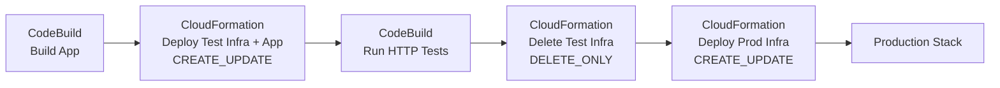
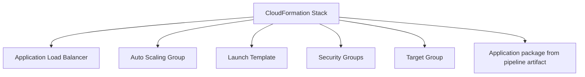
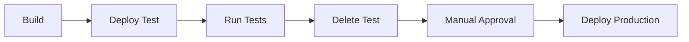
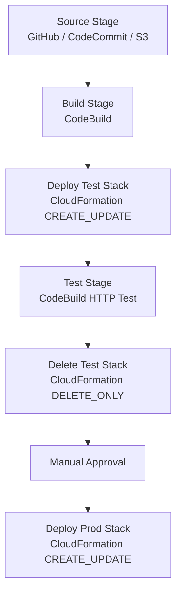

# CodePipeline + CloudFormation Integration

This slide shows a pipeline that uses **CloudFormation as the deployment engine**, not CodeDeploy.

Meaning:

> CodePipeline controls the flow.  
> CodeBuild builds/tests the app.  
> CloudFormation creates, updates, or deletes the AWS infrastructure stack.

![[CodePipeline – CloudFormation Integration-1778939039680.webp]]

AWS CodePipeline CloudFormation actions support modes like `CREATE_UPDATE` and `DELETE_ONLY`. `CREATE_UPDATE` creates the stack if it does not exist, or updates it if it already exists. `DELETE_ONLY` deletes the stack if it exists. ([AWS Documentation](https://docs.aws.amazon.com/codepipeline/latest/userguide/action-reference-CloudFormation.html?utm_source=chatgpt.com 'CloudFormation deploy action reference'))

---

## 1. What the diagram is doing



The pipeline story is:

```text
1. Build the application package.
2. Create/update temporary test infrastructure using CloudFormation.
3. Run HTTP tests against the deployed test app.
4. Delete the temporary test stack.
5. Deploy the same app/infrastructure to production.
```

---

# 2. Key CloudFormation Action Modes

## `CREATE_UPDATE`

Used when you want CloudFormation to make sure the stack exists.

```text
If stack does not exist → create stack
If stack exists         → update stack
```

Example use cases:

```text
Deploy test environment
Deploy staging environment
Deploy production environment
```

In the slide:

```text
CloudFormation Deploy Infra & app      → CREATE_UPDATE
CloudFormation Deploy Prod Infra       → CREATE_UPDATE
```

---

## `DELETE_ONLY`

Used when you want CloudFormation to remove a stack.

```text
If stack exists     → delete stack
If stack not exists → no stack to delete
```

Example use cases:

```text
Delete temporary test environment
Delete preview environment
Delete feature branch stack
```

In the slide:

```text
CloudFormation Delete Test Infra → DELETE_ONLY
```

This is useful because test infrastructure costs money. So after the test finishes, the pipeline cleans it up.

---

# 3. Why use CloudFormation inside CodePipeline?

Because your pipeline can deploy both:

```text
Application code
+
Infrastructure
```

Example stack:



So instead of manually creating ALB, EC2, Auto Scaling Group, security groups, and deployment config, CloudFormation does it repeatably.

---

# 4. Implementation Steps

## Step 1 — Repository structure

Example repo:

```text
my-app/
├── src/
│   └── app files
├── buildspec.yml
├── template.yml
└── test/
    └── http-tests.sh
```

Where:

```text
buildspec.yml  → CodeBuild instructions
template.yml   → CloudFormation infrastructure template
http-tests.sh  → HTTP test script
```

---

# 5. Step 2 — CloudFormation template

This is a simplified template. Real production would include VPC, subnets, IAM roles, security groups, launch template, target group, listener, and Auto Scaling Group.

```yaml
AWSTemplateFormatVersion: '2010-09-09'
Description: Simple ALB + ASG application stack

Parameters:
  EnvironmentName:
    Type: String
    AllowedValues:
      - test
      - prod

  AppArtifactBucket:
    Type: String

  AppArtifactKey:
    Type: String

Resources:
  AppSecurityGroup:
    Type: AWS::EC2::SecurityGroup
    Properties:
      GroupDescription: Allow HTTP
      VpcId: vpc-xxxxxxxx
      SecurityGroupIngress:
        - IpProtocol: tcp
          FromPort: 80
          ToPort: 80
          CidrIp: 0.0.0.0/0

  AppLaunchTemplate:
    Type: AWS::EC2::LaunchTemplate
    Properties:
      LaunchTemplateData:
        ImageId: ami-xxxxxxxx
        InstanceType: t3.micro
        SecurityGroupIds:
          - !Ref AppSecurityGroup
        UserData:
          Fn::Base64: !Sub |
            #!/bin/bash
            yum install -y httpd awscli
            systemctl enable httpd
            systemctl start httpd

            aws s3 cp s3://${AppArtifactBucket}/${AppArtifactKey} /tmp/app.zip
            unzip /tmp/app.zip -d /var/www/html

  AppTargetGroup:
    Type: AWS::ElasticLoadBalancingV2::TargetGroup
    Properties:
      VpcId: vpc-xxxxxxxx
      Port: 80
      Protocol: HTTP
      TargetType: instance
      HealthCheckPath: /

  AppALB:
    Type: AWS::ElasticLoadBalancingV2::LoadBalancer
    Properties:
      Subnets:
        - subnet-xxxxxxxx
        - subnet-yyyyyyyy
      SecurityGroups:
        - !Ref AppSecurityGroup

  AppListener:
    Type: AWS::ElasticLoadBalancingV2::Listener
    Properties:
      LoadBalancerArn: !Ref AppALB
      Port: 80
      Protocol: HTTP
      DefaultActions:
        - Type: forward
          TargetGroupArn: !Ref AppTargetGroup

  AppAutoScalingGroup:
    Type: AWS::AutoScaling::AutoScalingGroup
    Properties:
      MinSize: 1
      MaxSize: 2
      DesiredCapacity: 1
      VPCZoneIdentifier:
        - subnet-xxxxxxxx
        - subnet-yyyyyyyy
      TargetGroupARNs:
        - !Ref AppTargetGroup
      LaunchTemplate:
        LaunchTemplateId: !Ref AppLaunchTemplate
        Version: !GetAtt AppLaunchTemplate.LatestVersionNumber

Outputs:
  LoadBalancerURL:
    Value: !Sub "http://${AppALB.DNSName}"
```

Important idea:

```text
The CloudFormation stack creates the infrastructure.
The pipeline artifact provides the application package.
```

CloudFormation actions in CodePipeline can use a template file and/or a template configuration file as artifacts. ([AWS Documentation](https://docs.aws.amazon.com/AWSCloudFormation/latest/UserGuide/continuous-delivery-codepipeline-cfn-artifacts.html?utm_source=chatgpt.com 'CloudFormation artifacts'))

---

# 6. Step 3 — Build the app using CodeBuild

Example `buildspec.yml`:

```yaml
version: 0.2

phases:
  install:
    commands:
      - echo "Installing dependencies..."

  build:
    commands:
      - echo "Building application..."
      - mkdir -p dist
      - echo "<h1>Hello from CodePipeline + CloudFormation</h1>" > dist/index.html

  post_build:
    commands:
      - echo "Build completed"

artifacts:
  files:
    - '**/*'
  base-directory: dist
```

This produces a build artifact like:

```text
BuildOutput.zip
```

Then CloudFormation can use that artifact during stack creation/update.

---

# 7. Step 4 — Add CloudFormation action for test environment

In CodePipeline, create a deploy action:

```yaml
ActionTypeId:
  Category: Deploy
  Owner: AWS
  Provider: CloudFormation
  Version: '1'
Configuration:
  ActionMode: CREATE_UPDATE
  StackName: my-app-test
  TemplatePath: SourceOutput::template.yml
  Capabilities: CAPABILITY_NAMED_IAM
  RoleArn: arn:aws:iam::<account-id>:role/CloudFormationDeploymentRole
InputArtifacts:
  - Name: SourceOutput
  - Name: BuildOutput
RunOrder: 1
```

Meaning:

```text
Create/update stack called my-app-test.
Use template.yml from source artifact.
Use build output as the application package.
```

For CloudFormation deploy actions, configuration properties such as action mode, stack name, template path, role ARN, capabilities, and template configuration are defined in the action configuration. ([AWS Documentation](https://docs.aws.amazon.com/AWSCloudFormation/latest/UserGuide/continuous-delivery-codepipeline-action-reference.html?utm_source=chatgpt.com 'CloudFormation configuration properties reference'))

---

# 8. Step 5 — Run HTTP test using CodeBuild

After the test stack is created, run another CodeBuild action.

Example `buildspec-test.yml`:

```yaml
version: 0.2

phases:
  build:
    commands:
      - echo "Running HTTP test..."
      - curl -f http://my-test-alb-url/
      - echo "HTTP test passed"
```

Better version: read the ALB URL from CloudFormation output.

```bash
ALB_URL=$(aws cloudformation describe-stacks \
  --stack-name my-app-test \
  --query "Stacks[0].Outputs[?OutputKey=='LoadBalancerURL'].OutputValue" \
  --output text)

curl -f "$ALB_URL"
```

Story:

```text
CloudFormation creates ALB
CloudFormation outputs ALB URL
CodeBuild reads ALB URL
CodeBuild runs HTTP test
```

---

# 9. Step 6 — Delete test infrastructure

Now add another CloudFormation deploy action:

```yaml
ActionTypeId:
  Category: Deploy
  Owner: AWS
  Provider: CloudFormation
  Version: '1'
Configuration:
  ActionMode: DELETE_ONLY
  StackName: my-app-test
  RoleArn: arn:aws:iam::<account-id>:role/CloudFormationDeploymentRole
RunOrder: 1
```

Meaning:

```text
Delete the temporary test stack after tests finish.
```

This saves cost and keeps the AWS account clean.

---

# 10. Step 7 — Deploy production infrastructure

Final CloudFormation action:

```yaml
ActionTypeId:
  Category: Deploy
  Owner: AWS
  Provider: CloudFormation
  Version: '1'
Configuration:
  ActionMode: CREATE_UPDATE
  StackName: my-app-prod
  TemplatePath: SourceOutput::template.yml
  Capabilities: CAPABILITY_NAMED_IAM
  RoleArn: arn:aws:iam::<account-id>:role/CloudFormationDeploymentRole
InputArtifacts:
  - Name: SourceOutput
  - Name: BuildOutput
RunOrder: 1
```

Meaning:

```text
Create/update the production stack after test succeeds.
```

In real life, add a **Manual Approval** before production:



---

# 11. Full Practical Pipeline Design



Artifacts:

```text
SourceOutput:
  template.yml
  buildspec.yml
  scripts/

BuildOutput:
  compiled app
  static files
  zip package
```

---

# 12. IAM Roles Required

You usually need two roles.

## CodePipeline service role

Allows CodePipeline to call CodeBuild, CloudFormation, and access artifacts in S3.

Needs permissions like:

```text
codebuild:StartBuild
codebuild:BatchGetBuilds
cloudformation:CreateStack
cloudformation:UpdateStack
cloudformation:DeleteStack
cloudformation:DescribeStacks
iam:PassRole
s3:GetObject
s3:PutObject
```

## CloudFormation deployment role

This is the role CloudFormation assumes to create AWS resources.

Needs permissions for whatever the stack creates:

```text
ec2:*
elasticloadbalancing:*
autoscaling:*
iam:*
s3:GetObject
cloudwatch:*
```

In production, do not use `*`. Start broad in lab, then reduce permissions.

---

# 13. Important Notes

## CloudFormation does not “deploy code” alone

CloudFormation creates infrastructure. But it can point EC2/Lambda/ECS resources to an application artifact.

Example:

```text
Lambda → S3 bucket/key for function zip
EC2 → UserData downloads app artifact
ECS → Task definition uses Docker image
```

---

## For Lambda/serverless apps, use package step

If the template references local files, use:

```bash
aws cloudformation package \
  --template-file template.yml \
  --s3-bucket my-artifact-bucket \
  --output-template-file packaged-template.yml
```

The `aws cloudformation package` command uploads local artifacts to S3 and rewrites local references in the template to S3 locations. ([AWS Documentation](https://docs.aws.amazon.com/cli/latest/reference/cloudformation/package.html?utm_source=chatgpt.com 'package — AWS CLI 2.34.46 Command Reference'))

Then CodePipeline deploys:

```text
packaged-template.yml
```

---

## For production, prefer Change Sets

Instead of direct `CREATE_UPDATE`, safer production flow is:

```text
CHANGE_SET_REPLACE
→ Manual Approval
→ CHANGE_SET_EXECUTE
```

That allows you to review what CloudFormation will change before applying it.

---

# 14. Final Mental Model

```text
CodePipeline = Orchestrator
CodeBuild    = Builder / Tester
CloudFormation = Infrastructure deployer
Artifacts    = Files passed between actions
Stack        = Real AWS resources created from template
```

The slide is basically saying:

```text
Build app
Deploy temporary test stack
Test it
Delete test stack
Deploy production stack
```

And the two most important CloudFormation modes are:

```text
CREATE_UPDATE → make sure stack exists and is updated
DELETE_ONLY   → clean up stack
```
