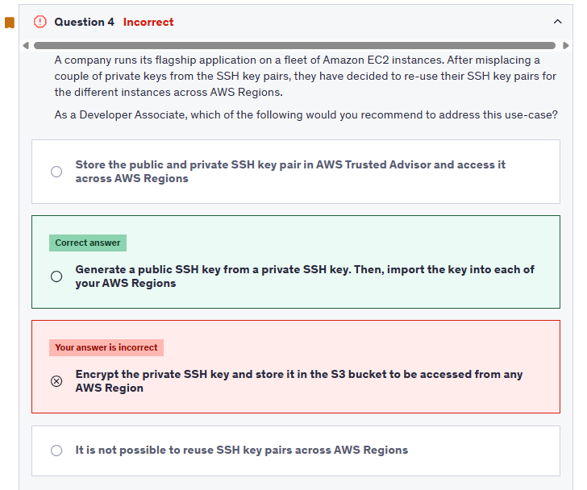
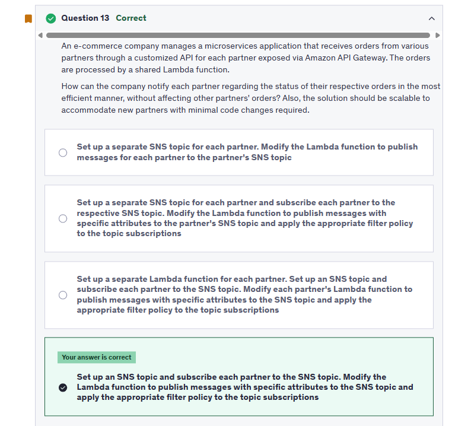
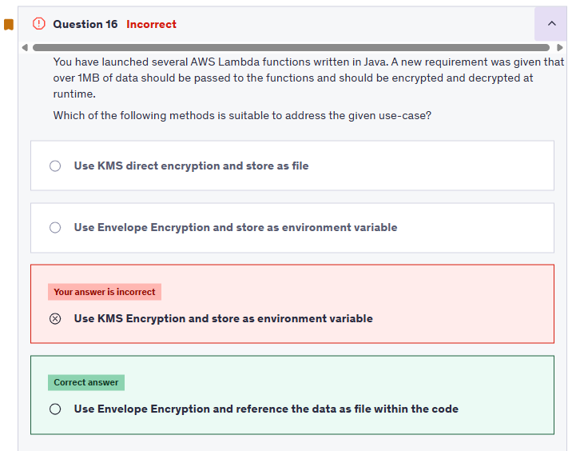
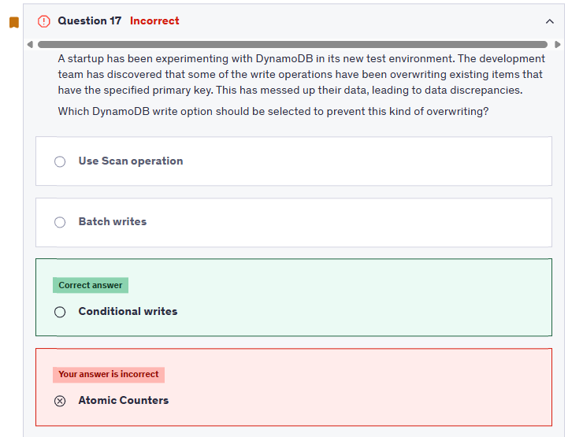
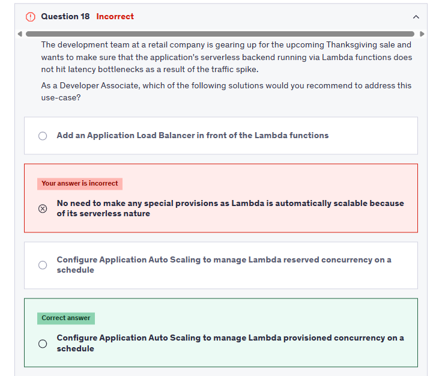

# Exam 1

## **📌 Q4 ❌**

<div style="text-align: center;">
    
</div>

### ❓Why is this the correct approach?

- **EC2 key pairs are region-specific.** Even if you use the **same key material**, you must **import the public key into each region** where you want to use it.
- You can reuse the same **private key**, but AWS requires the **public part to be imported in every region** individually.

### 🛠️ Recommended Steps

1. **Generate your key pair** once using `ssh-keygen`:

   ```bash
   ssh-keygen -t rsa -b 4096 -f my-key
   ```

   - This will give you:

     - `my-key` → private key
     - `my-key.pub` → public key

2. **Import the public key in each AWS Region**:

   - Go to **EC2 Console → Key Pairs**
   - Choose **"Import Key Pair"**
   - Provide a name and paste the contents of `my-key.pub`

3. **Use the private key (`my-key`)** to SSH into instances regardless of the region (as long as the public key is registered in that region's key pairs).

---

## **📌 Q12 ❌**

<div style="text-align: center;">
    
</div>

---

## **📌 Q13 ✅**

<div style="text-align: center;">
    
</div>

---

## **📌 Q16 ❌**

<div style="text-align: center;">
    
</div>

---

### 🧠 **Explanation**

#### 📌 The core problem

> You need to pass **over 1MB of encrypted data** to AWS Lambda **written in Java**, and decrypt it **at runtime**.

This brings up **two key limitations and requirements**:

1. 🔒 **You must encrypt and decrypt the data securely**
2. 📦 **You must handle data larger than 1 MB**, which **exceeds the max size for Lambda environment variables (`4 KB` soft limit for safe secrets)**

---

### ❌ Why Other Options Are Incorrect

| Option                                                        | Why it's NOT suitable                                                                                                                |
| ------------------------------------------------------------- | ------------------------------------------------------------------------------------------------------------------------------------ |
| **Use KMS direct encryption and store as file**               | ❌ KMS is designed for encrypting **small data only (<= 4 KB)**. It **cannot directly encrypt or decrypt large payloads like 1 MB**. |
| **Use Envelope Encryption and store as environment variable** | ❌ Even if you use envelope encryption, **Lambda env vars are not meant for large secrets** — 4 KB total size limit per function.    |
| **Use KMS Encryption and store as environment variable**      | ❌ Same issue — **KMS alone can’t handle >4 KB** and environment variables aren’t meant for large binary or encrypted blobs.         |

---

### ✅ Why This Option Is Correct

> 🔐 **Use Envelope Encryption and reference the data as file within the code**

### What does this mean?

- You use **Envelope Encryption**:

  - Encrypt the large payload using a **Data Encryption Key (DEK)** with **AES-256** (symmetric)
  - Encrypt the DEK using **AWS KMS CMK** (asymmetric or symmetric, secure)

- You **store the encrypted payload as a file** (e.g., in S3 or bundled into deployment package)

- Inside the Lambda function:

  - You read the **encrypted file**
  - You **decrypt the DEK using KMS**
  - Then you **decrypt the payload with the DEK**

---

## **📌 Q17 ❌**

<div style="text-align: center;">
    
</div>

---

### 🧠 What is the question asking?

It wants to know:

> **How can you prevent accidental overwrites of existing items with the same key?**

In other words, **what DynamoDB feature lets you say:
"Only write this item if it does not already exist"?**

---

### 📌 Explanation of the Options:

| Option                       | Meaning & Why it's Correct/Incorrect                                                                                                                                      |
| ---------------------------- | ------------------------------------------------------------------------------------------------------------------------------------------------------------------------- |
| **Scan operation** ❌        | Reads all items in a table — **not related** to writing or preventing overwrites.                                                                                         |
| **Batch writes** ❌          | Writes multiple items at once. Still uses `PutItem`, so it can also **overwrite** existing records unless conditionals are added per item (not supported in basic batch). |
| **✅ Conditional writes** ✅ | You can say: "Only insert this item **if it does not already exist**". Prevents overwriting by adding a condition like `attribute_not_exists(PK)`.                        |
| **Atomic counters** ❌       | These are used to **increment numeric attributes** without race conditions — unrelated to preventing overwrites.                                                          |

---

### ✅ Example: Conditional Write

```python
dynamodb.put_item(
    TableName='Users',
    Item={ 'UserId': {'S': '123'}, 'Name': {'S': 'John'} },
    ConditionExpression='attribute_not_exists(UserId)'
)
```

🔐 This tells DynamoDB:

> Only insert the item if `UserId` **does not already exist**

If it **does exist**, the write will **fail**, preventing overwrite.

---

## **📌 Q18 ❌**

<div style="text-align: center;">
    
</div>

---

✅ **Correct Answer: _Configure Application Auto Scaling to manage Lambda provisioned concurrency on a schedule_**

---

### 🧠 **Explanation of the Question**

The retail company's backend is powered by **AWS Lambda**, and they are expecting a **huge traffic spike** (Thanksgiving sale). The concern is about:

- **Latency bottlenecks** 🔁
- **Cold starts under heavy load** ❄️
- Maintaining **fast and predictable performance**

So, even though Lambda **scales automatically**, there's a need to **optimize startup latency** for better user experience during high demand.

---

### ❌ Why the Other Options Are Incorrect

| Option                                                                | Why It’s Wrong                                                                                                                                                                |
| --------------------------------------------------------------------- | ----------------------------------------------------------------------------------------------------------------------------------------------------------------------------- |
| **Add an Application Load Balancer in front of the Lambda functions** | ❌ Technically possible via **ALB → Lambda integration**, but it **won’t reduce cold starts or latency**. ALB just invokes Lambda—it doesn’t preload or scale it.             |
| **No need to make any special provisions**                            | ❌ While Lambda is auto-scalable, **cold starts** can still cause latency spikes when there's a sudden surge. This is a **performance blind spot** if unaddressed.            |
| **Configure Auto Scaling for reserved concurrency**                   | ❌ Reserved concurrency limits the **maximum number of concurrent executions**, but it **doesn’t warm functions up** or reduce cold starts. It prevents overuse, not latency. |

---

### ✅ Why "Provisioned Concurrency with Auto Scaling" Is Best

| 🔍 Feature                               | 🚀 Behavior                                                                            |
| ---------------------------------------- | -------------------------------------------------------------------------------------- |
| **Provisioned Concurrency**              | Keeps Lambda instances **warm and ready to run instantly** — **zero cold starts**      |
| **Application Auto Scaling (scheduled)** | Scales provisioned concurrency **based on time-based events** (like before a big sale) |
| **Result**                               | Pre-warmed Lambda instances handle traffic **with low latency**, even at high scale    |

---

### 📅 Example Scenario

You schedule scaling actions like:

- **At 5 AM on Thanksgiving day**, increase provisioned concurrency to 100
- **At midnight**, scale back down to 5

This ensures the functions are **warm and responsive before traffic spikes**.

---

### 🔧 How to Set It Up (High Level)

1. Enable **provisioned concurrency** for the Lambda alias or version
2. Use **Application Auto Scaling** to create **scheduled actions** or **target tracking policies**

---
