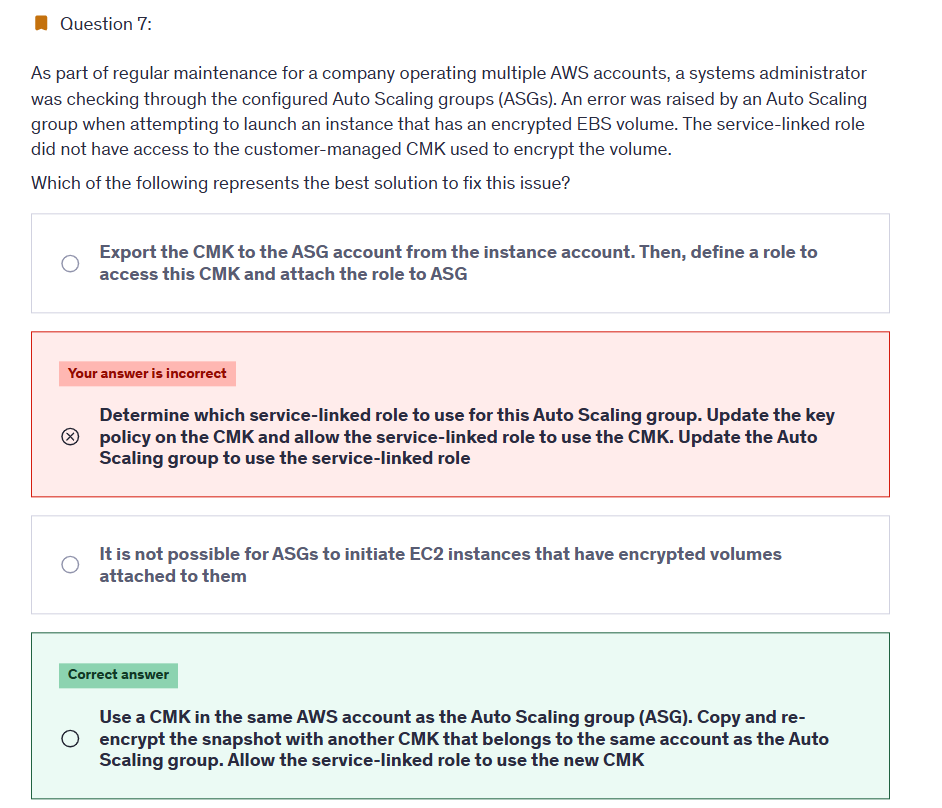
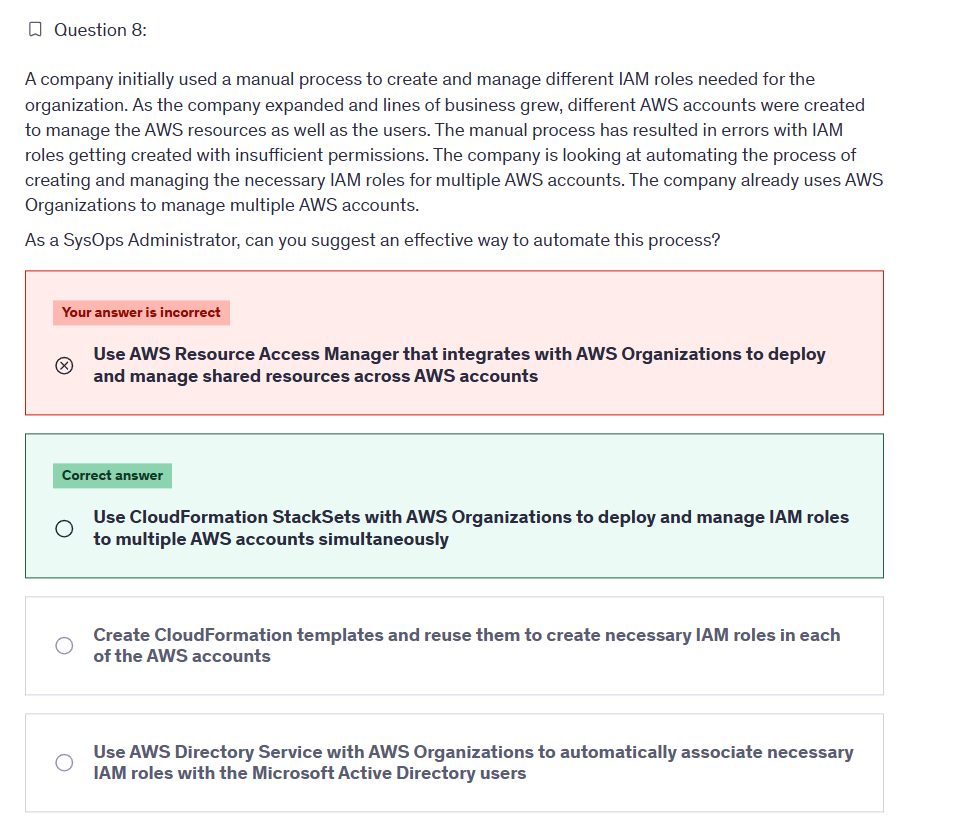
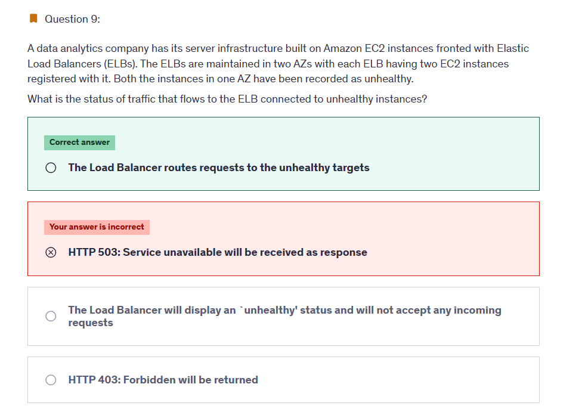
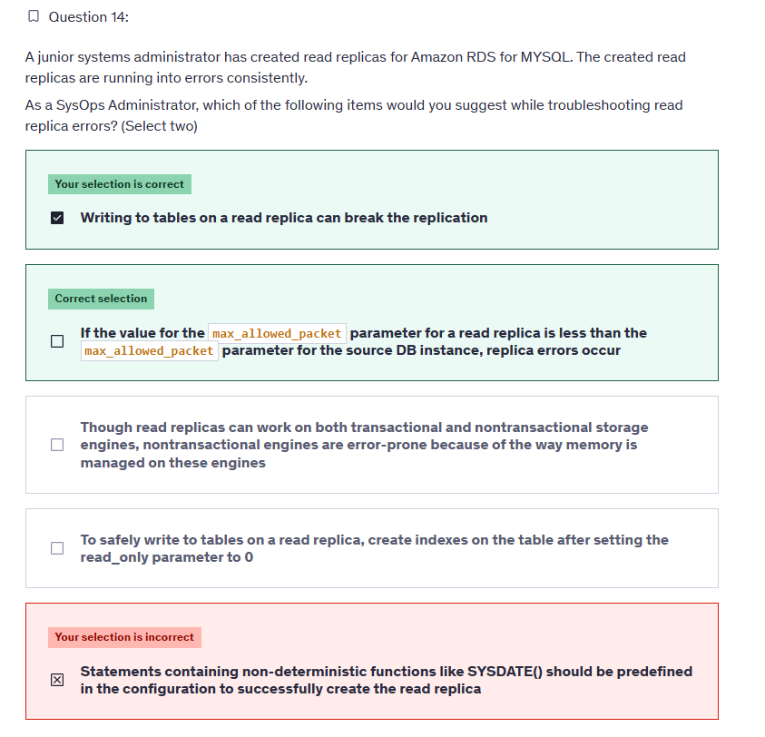

# Exam 1

## 👉 Q7

### ✅ Two Solutions — Both Technically Correct

| Solution                                                       | Description                                                       | Pros                                                | Cons                                                             |
| -------------------------------------------------------------- | ----------------------------------------------------------------- | --------------------------------------------------- | ---------------------------------------------------------------- |
| 🛠️ **Update the CMK policy** (original best answer)            | Grant the ASG service role access to the CMK in the other account | Easier and less manual work                         | Requires modifying cross-account CMK policy (may not be allowed) |
| 🔁 **Copy and re-encrypt AMI** with a new CMK in ASG's account | Create a copy of the AMI, use a CMK local to ASG account          | Full control over CMK, no cross-account permissions | Extra manual work, snapshot copy time, ongoing maintenance       |

### 🎯 So Which One Should You Choose?

- If **you control both accounts** or are allowed to update CMK policies ⇒ **Update the key policy** (less work).
- If you're **blocked from editing the CMK policy in the source account** ⇒ **Copy and re-encrypt** in your local account (the instructor's choice).

---

## ❌ Q8

---

**✅ The Answer:**
**Use CloudFormation StackSets with AWS Organizations to deploy and manage IAM roles to multiple AWS accounts simultaneously**

---

**🤔 Why This Is the Best Answer:**
CloudFormation **StackSets** allow you to centrally manage and automate the **creation, update, and deletion of CloudFormation stacks** (like IAM roles) across **multiple AWS accounts and Regions**. When integrated with **AWS Organizations**, StackSets can target **Organizational Units (OUs)** or the entire organization, making it ideal for **scaling IAM role deployment** efficiently, securely, and consistently across your company’s accounts. This eliminates the need to manually set up roles per account and ensures policy compliance across all environments.

---

**❌ Why Other Options Are Wrong:**

- ❌ **Use AWS Resource Access Manager that integrates with AWS Organizations to deploy and manage shared resources across AWS accounts**
  AWS RAM is used to **share resources** (e.g., VPCs, subnets, Transit Gateways), **not for deploying IAM roles** or managing permissions.

- ❌ **Create CloudFormation templates and reuse them to create necessary IAM roles in each of the AWS accounts**
  This approach is **manual and error-prone**. You'd have to log into each account and deploy stacks individually. StackSets automates this centrally.

- ❌ **Use AWS Directory Service with AWS Organizations to automatically associate necessary IAM roles with the Microsoft Active Directory users**
  AWS Directory Service is for **federated identity management** and **Microsoft AD integration**, not for **creating or distributing IAM roles** across accounts.

---

## ❌ Q9

---

**✅ The Answer:**
**The Load Balancer routes requests to the unhealthy targets**

---

**🤔 Why This Is the Best Answer:**
Elastic Load Balancers (ELBs), specifically **Classic Load Balancer (CLB)** and **Application Load Balancer (ALB)**, by default **continue routing traffic to all registered targets**, even if they are marked as **unhealthy**, **unless** there are **healthy targets in another Availability Zone (AZ)**.

In the scenario:

- You have ELBs in **two AZs**
- One AZ has **two unhealthy instances**
- The **ELB still exists and is functional**, and **the other AZ has healthy instances**

→ In this case, the **ELB will still try to route traffic**, and:

- If **cross-zone load balancing** is enabled, it routes to **healthy instances in the other AZ**
- If cross-zone balancing is **not enabled**, it may **still send traffic to unhealthy instances** if it's forced to keep AZ traffic local

The key AWS behavior is: **unhealthy instances still receive traffic** **if** there are **no healthy targets** or **cross-zone routing is not set up properly**.

---

**❌ Why Other Options Are Wrong:**

- ❌ **HTTP 503: Service unavailable will be received as response**
  This can happen **only if all registered targets are unhealthy**, but in this case, **another AZ still has healthy instances**, so ELB won’t return 503 yet.

- ❌ **The Load Balancer will display an 'unhealthy' status and will not accept any incoming requests**
  ELB itself is still healthy. It doesn't stop accepting traffic just because some instances are unhealthy — it tries to route to healthy ones if possible.

- ❌ **HTTP 403: Forbidden will be returned**
  A **403 Forbidden** is related to **permissions** (e.g., IAM or WAF blocks), **not health status** of backend instances.

---

## ❌ Q14

---

**✅ The Answer:**

- **Writing to tables on a read replica can break the replication**
- **If the value for the `max_allowed_packet` parameter for a read replica is less than the `max_allowed_packet` parameter for the source DB instance, replica errors occur**

---

**🤔 Why These Are the Best Answers:**

- ✅ **Writing to tables on a read replica can break the replication**
  Read replicas in Amazon RDS for MySQL are **meant to be read-only**. If someone **manually writes data to the replica**, it can **cause replication errors** and break binary log consistency with the source DB.

- ✅ **If `max_allowed_packet` is smaller on the replica than on the source, replication errors can occur**
  MySQL replication can fail if a **larger packet from the source DB** exceeds the **allowed packet size on the replica**, causing the replica to **reject the update** and throw replication errors.

---

**❌ Why Other Options Are Wrong:**

- ❌ **Though read replicas can work on both transactional and nontransactional storage engines...**
  RDS read replicas **only support InnoDB**, the transactional engine. Non-transactional engines like MyISAM are **not supported** for read replicas in Amazon RDS. So this statement is irrelevant to RDS read replica troubleshooting.

- ❌ **To safely write to tables on a read replica... set `read_only=0` and create indexes**
  Disabling `read_only` to write to the replica **defeats the purpose** of a read replica and is **strongly discouraged**. Writing to replicas breaks replication and is not safe—even if it's just for indexes.

- ❌ **Statements with non-deterministic functions like `SYSDATE()` should be predefined...**
  While it's true that **non-deterministic functions** can cause replication issues in general MySQL, **Amazon RDS automatically handles most of this** by setting the `binlog_format` to `ROW`, which avoids the problem. Also, **these aren't related to replica creation errors**, but runtime replication behavior.

---

## ❌ Q15
