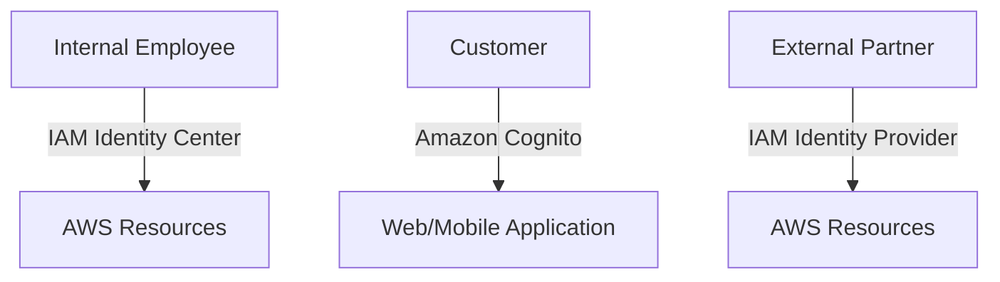

# 🔐 **AWS IAM Identity Providers vs. IAM Identity Center vs. Amazon Cognito**

_Confused about AWS identity services? Let's break down the differences and use cases for each._

---

## 🧠 **Quick Comparison**

| **Use Case**                                 | **Recommended Service**    |
| -------------------------------------------- | -------------------------- |
| Internal employees accessing AWS resources   | **IAM Identity Center**    |
| Customers signing up for your web/mobile app | **Amazon Cognito**         |
| External users accessing AWS via SSO         | **IAM Identity Providers** |

---

## 🧭 **Real-World Analogies**

| **Service**                | **Analogy**                                                                  |
| -------------------------- | ---------------------------------------------------------------------------- |
| **IAM Identity Center**    | A company's **employee badge system** granting access to various departments |
| **Amazon Cognito**         | The **signup/login form** on your website for customers                      |
| **IAM Identity Providers** | A **guest pass** allowing visitors temporary access to specific areas        |

---

## 📊 **Detailed Comparison**

| **Feature**                           | **IAM Identity Center**                                       | **Amazon Cognito**                                     | **IAM Identity Providers**                      |
| ------------------------------------- | ------------------------------------------------------------- | ------------------------------------------------------ | ----------------------------------------------- |
| **Primary Audience**                  | Internal employees and teams                                  | External app users (customers)                         | External users with existing identities         |
| **Purpose**                           | Centralized SSO and access management                         | User authentication and authorization for applications | Federated access to AWS resources               |
| **User Management**                   | Centralized via AWS or external IdP                           | Built-in user directory or external IdP                | Managed by external IdP                         |
| **SSO Support**                       | Yes (SAML, OIDC)                                              | Yes (social logins, SAML, OIDC)                        | Yes (SAML, OIDC)                                |
| **AWS Resource Access**               | Yes                                                           | Indirectly via Identity Pools                          | Yes                                             |
| **Multi-Factor Authentication (MFA)** | Yes                                                           | Yes                                                    | Depends on external IdP                         |
| **Integration with External IdPs**    | Yes (e.g., Microsoft Entra ID, Okta)                          | Yes (e.g., Google, Facebook)                           | Yes                                             |
| **Best For**                          | Managing access across multiple AWS accounts and applications | Adding authentication to web/mobile apps               | Granting temporary AWS access to external users |

---

## 🚀 **When to Use Each Service**

### **IAM Identity Center**

> **Ideal for:** Organizations needing centralized access management for employees across multiple AWS accounts and applications.

- **Use Cases:**
  - Providing employees with SSO to AWS Management Console and third-party applications.
  - Managing permissions across AWS Organizations.
  - Integrating with corporate directories like Microsoft Entra ID or Okta.

### **Amazon Cognito**

> **Ideal for:** Developers needing to add user sign-up, sign-in, and access control to their web and mobile applications.

- **Use Cases:**
  - Implementing user authentication for customer-facing applications.
  - Supporting social logins (e.g., Google, Facebook).
  - Managing user sessions and profiles.

### **IAM Identity Providers**

> **Ideal for:** Allowing users from external identity systems to access AWS resources without creating IAM users.

- **Use Cases:**
  - Granting temporary AWS access to partners or contractors.
  - Implementing SSO for external users via SAML or OIDC.

---

## 🔗 **Can They Work Together?**

Absolutely! These services can complement each other:

- **IAM Identity Center** can manage internal employee access.
- **Amazon Cognito** handles customer authentication for your applications.
- **IAM Identity Providers** allow external partners to access specific AWS resources securely.

---

## 🧠 **Visual Overview**

---

## 📌 **Summary Table**

| **Scenario**                                   | **Recommended Service** |
| ---------------------------------------------- | ----------------------- |
| Employee needs access to AWS Console           | IAM Identity Center     |
| Customer signs up for your web application     | Amazon Cognito          |
| External partner requires temporary AWS access | IAM Identity Providers  |

---

## 🎯 **Final Thoughts**

Choosing the right AWS identity service depends on your specific use case:

- **Use IAM Identity Center** for centralized access management of internal users across AWS accounts and applications.
- **Use Amazon Cognito** to add user authentication and authorization to your customer-facing applications.
- **Use IAM Identity Providers** to grant external users temporary access to AWS resources without creating IAM users.

If you have further questions or need assistance with implementation, feel free to ask!
