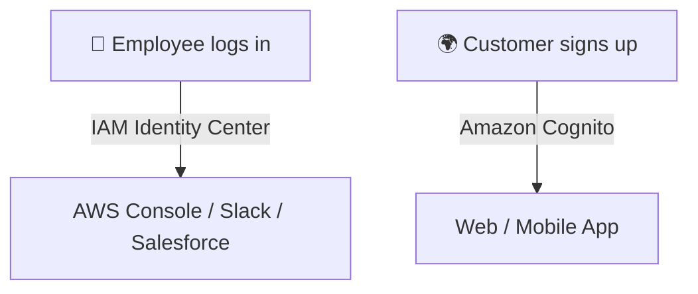

# 🔐 IAM Identity Center vs. Amazon Cognito

_🤯 What’s the difference and when to use each one?_ Let's break it down like pros.

---

## 🧠 TL;DR Summary

| Use Case                               | ✅ Use This             |
| -------------------------------------- | ----------------------- |
| 🔐 Internal employees logging into AWS | **IAM Identity Center** |
| 🌐 Customers signing up for your app   | **Amazon Cognito**      |

---

## 🧭 Real-World Analogy

| Service                 | Imagine This...                                                                         |
| ----------------------- | --------------------------------------------------------------------------------------- |
| **IAM Identity Center** | Your company’s **keycard system** 🛂 for staff to open office doors and access software |
| **Amazon Cognito**      | The **signup/login form** 📝 for users visiting your app or website                     |

---

## 📊 Side-by-Side Comparison

| Feature / Area               | **IAM Identity Center** 👨‍💼 (SSO for AWS & SaaS) | **Amazon Cognito** 🌍 (Login for App Users) |
| ---------------------------- | ----------------------------------------------- | ------------------------------------------- |
| 👥 **Audience**              | Employees / Dev teams / Admins                  | App users / Customers                       |
| 🎯 **Purpose**               | Secure internal SSO across AWS & SaaS apps      | Add secure user authentication to your app  |
| 🔐 **Manages AWS Access**    | ✅ Yes (assign roles & permissions)             | ❌ No (for apps, not AWS Console)           |
| 🔄 **SSO / Federation**      | ✅ SAML, OIDC, Entra ID, Okta, Google           | ✅ Google, Facebook, SAML, OIDC             |
| 📱 **Frontend SDKs**         | ❌ No                                           | ✅ Yes (iOS, Android, JS)                   |
| 🛠️ **Admin Setup**           | Admin assigns users to AWS accounts/groups      | Users self-register, reset password, etc.   |
| 📦 **Backend Use Case**      | Login to AWS, Slack, Salesforce, etc.           | Login to custom-built apps (web/mobile)     |
| 🎯 **Use with AWS Console?** | ✅ Yes                                          | ❌ No                                       |
| 📦 **Directory Integration** | ✅ Entra ID / AD / LDAP                         | ✅ Entra ID, Google, social login           |

---

## 🚀 IAM Identity Center: When & Why?

> **Think: Internal access control + AWS SSO**

| ✅ Great For:                                 | ❌ Not For:                            |
| --------------------------------------------- | -------------------------------------- |
| Giving AWS Console access to developers       | Letting customers register to your app |
| Managing roles across AWS org (multi-account) | Embedding sign-in forms in web apps    |
| Granting SSO to Slack, Salesforce, etc.       | Creating user pools & social login     |

💡 **Real Example:**  
Your finance team logs in to AWS Console + Salesforce with one sign-in using your company’s Google Workspace.

---

## 🌐 Amazon Cognito: When & Why?

> **Think: Your app’s user login system**

| ✅ Great For:                             | ❌ Not For:               |
| ----------------------------------------- | ------------------------- |
| Web/mobile app signup/login               | Managing AWS IAM roles    |
| Social login (Google, Facebook, etc.)     | Internal corporate access |
| Password reset, user pools, MFA, sessions | Enterprise SaaS access    |

💡 **Real Example:**  
You’re building a React-based e-commerce app and need users to **sign up, sign in, reset password**, and login using Google — Cognito does that out of the box.

---

## 💡 Can I Use Both?

Yes! And many do:

- 🔒 Use **IAM Identity Center** for internal staff (admin dashboards, AWS Console, etc.)
- 🌐 Use **Amazon Cognito** for external-facing apps (customers, partners)

---

## 🧠 Smart Visual Reminder

---

## 📌 Recap Table

| Category               | IAM Identity Center       | Amazon Cognito                     |
| ---------------------- | ------------------------- | ---------------------------------- |
| 🎯 Purpose             | AWS access for employees  | App authentication for customers   |
| 👥 Users               | Internal (staff)          | External (app users)               |
| 🧩 SDKs                | ❌ (no frontend SDKs)     | ✅ Web, iOS, Android SDKs          |
| 🌐 SSO / Federation    | ✅ Azure AD, Okta, Google | ✅ Facebook, SAML, Google          |
| 🔐 Manages AWS access? | ✅ Yes                    | ❌ No                              |
| 📈 Example             | Login to AWS Console      | Login to your app with social auth |

---

## 🎯 Final Takeaway

| 🧩 If your goal is...                            | Use...                  |
| ------------------------------------------------ | ----------------------- |
| Secure **SSO for employees** across AWS & SaaS   | **IAM Identity Center** |
| Add **login/signup** to your customer-facing app | **Amazon Cognito**      |
