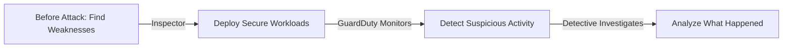

# 🧠💥 **AWS GuardDuty vs Inspector vs Detective**

> _Think of them as the **Security Trio**:  
> Each one has a different job: **Detect Threats**, **Scan for Vulnerabilities**, or **Investigate Incidents**._

---

## 🌟 **Simple Definitions First**

| Service                | Simple Definition                                                                                     |
| :--------------------- | :---------------------------------------------------------------------------------------------------- |
| 🤖🫸 **AWS GuardDuty**  | _Threat Detector_ — Watches behavior to **detect live attacks** in real-time.                         |
| ⛳🔎 **AWS Inspector** | _Vulnerability Scanner_ — Scans your resources to **find weak spots before attacks** happen.          |
| 👮‍♂️🔎 **AWS Detective** | _Investigation Tool_ — Helps you **analyze incidents** and **find out what happened** after an alert. |

✅ Each service works **at a different security stage**:

- Detect active threats (GuardDuty)
- Prevent problems (Inspector)
- Investigate incidents (Detective)

---

## 🧠 **Deeper Understanding (In One Smart Table)**

| Feature           | GuardDuty                                       | Inspector                                                | Detective                                                                 |
| :---------------- | :---------------------------------------------- | :------------------------------------------------------- | ------------------------------------------------------------------------- |
| 🎯 Purpose        | Detect threats happening right now              | Find known vulnerabilities before attackers exploit them | Investigate and analyze what happened during a security incident          |
| 🔎 How it works   | Monitors VPC Flow Logs, DNS Logs, CloudTrail    | Scans EC2, ECR, Lambda, Fargate for CVEs                 | Builds behavior graphs from CloudTrail, GuardDuty findings, VPC Flow Logs |
| 🚨 Focus          | Behavior anomalies, malicious activities        | Software vulnerabilities, misconfigurations              | Root cause analysis and timeline reconstruction                           |
| 🔔 Typical Alert  | "EC2 talking to malware server"                 | "Your EC2 runs outdated OpenSSL with CVE-2022-1234"      | "IAM role misuse investigation showing lateral movement"                  |
| ⚙️ Example Action | Trigger incident response                       | Patch vulnerable packages                                | Investigate attacker path and impact                                      |
| 🛠️ Setup          | Simple (Enable and go)                          | Simple (Enable + agent for EC2 if needed)                | Simple (Enable; data comes from GuardDuty, CloudTrail)                    |
| 🧹 Data it uses   | Flow logs, DNS logs, CloudTrail, EKS Audit Logs | EC2 metadata, OS packages, containers, Lambda code       | GuardDuty findings, CloudTrail logs, VPC logs                             |

- **🤖🫸 GuardDuty = Real-time threat detection** (live/active monitoring)
- **⛳🔎 Inspector = Find vulnerabilities** (before/proactive attack)
- **👮‍♂️🔎 Detective = Investigate incidents** (after attack)

---

## 📚 **Very Easy Real-World Analogy**

| GuardDuty                                                      | Inspector                                                                    | Detective                                                   |
| :------------------------------------------------------------- | :--------------------------------------------------------------------------- | :---------------------------------------------------------- |
| 🛡️ **Security Guard** watching cameras for suspicious behavior | 🛠️ **Building Inspector** checking if walls are cracked before an earthquake | 🕵️‍♂️ **Police Detective** investigating after a crime happens |

---

## 📈 **When Each Service is Used**

| Scenario                                                                                  | What to Use  |
| :---------------------------------------------------------------------------------------- | :----------- |
| You want to know if someone tries to hack your AWS account                                | 🛡️ GuardDuty |
| You want to check if your EC2/Linux/Container has known vulnerabilities before deploying  | 🔎 Inspector |
| You detected a threat and want to deeply understand how it happened and what was affected | 🕵️‍♂️ Detective |

---

## 📊 **Visual Summary Chart**

- **Inspector** = Pre-attack **prevention**
- **GuardDuty** = Real-time **detection**
- **Detective** = Post-attack **investigation**

---

## 🏆 **Final Smart Pro Tip**

> 🧠 **Use all three together in a smart flow:**

- **AWS Inspector** → _Find and fix vulnerabilities before attackers find them._
- **AWS GuardDuty** → _Catch attackers if they try something suspicious._
- **AWS Detective** → _Analyze deeply if anything bad happens and respond properly._

✅ **Prevention + Detection + Investigation = Full AWS Cloud Security Coverage**

---

## 📢 **One-Sentence Memory Trick**

| Service          | Easy Memory Tip                               |
| :--------------- | :-------------------------------------------- |
| 🔎 **Inspector** | _Find the cracks before attackers find them._ |
| 🛡️ **GuardDuty** | _Catch attackers trying to break in live._    |
| 🕵️‍♂️ **Detective** | _Understand everything if they ever get in._  |
