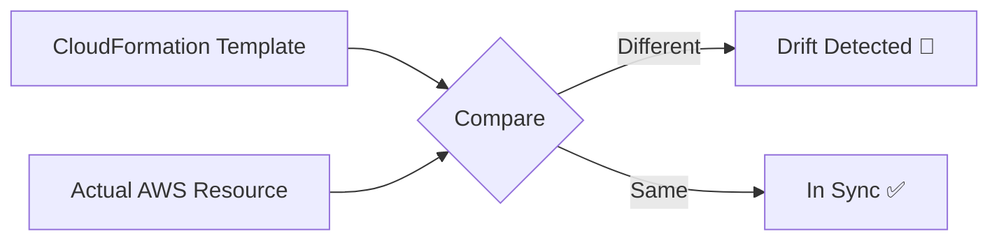

# 🔄 What is Stack Drift in AWS CloudFormation?

Imagine this:

You told AWS CloudFormation:

> “Bro, create me ONE EC2 instance with 8GB RAM.”

CloudFormation writes this in its “official plan” 📜.

---

Then later…

You log into AWS Console manually like this:

> “Hmm… let me quickly change the instance type 😈”

So you change it from:

```yaml
t3.large
```

to

```yaml
t3.xlarge
```

WITHOUT updating the CloudFormation template.

---

Now AWS CloudFormation is like:

> “WAIT A MINUTE 🤨  
> That’s not what I deployed!”

That mismatch is called: 🚨 STACK DRIFT

---

## 🧠 Simple Definition

Stack Drift means:

> Your real AWS resources are no longer matching the CloudFormation template/state.

---

## 🏗️ Example

### 📜 CloudFormation Template

```yaml
Resources:
  MyEC2:
    Type: AWS::EC2::Instance
    Properties:
      InstanceType: t3.micro
```

CloudFormation expects:

```text
EC2 = t3.micro
```

---

### 😈 Someone Changes It Manually

From AWS Console:

```text
t3.micro → t3.large
```

Now:

| Source                  | Value    |
| ----------------------- | -------- |
| CloudFormation Template | t3.micro |
| Actual AWS Resource     | t3.large |

---

## 🚨 DRIFT DETECTED

### 🔍 How AWS Detects Drift

CloudFormation compares:

```text
Template Definition
VS
Actual Live Resource
```

Like this:



---

## 📌 Common Reasons for Drift

### 1️⃣ Manual Console Changes

Most common.

Example:

- Change EC2 type
- Edit Security Group
- Modify S3 bucket policy

---

### 2️⃣ CLI / SDK Changes

Someone runs:

```bash
aws ec2 modify-instance-attribute
```

outside CloudFormation.

---

### 3️⃣ Auto Scaling / External Systems

Some services change resources automatically.

Example:

- ECS updates target groups
- Lambda updates permissions
- RDS auto changes minor versions

---

### 4️⃣ DevOps Engineer at 2AM

```text
"just quick fix bro"
```

💀

---

## 🔍 How to Check Drift

### AWS Console

CloudFormation → Stack → Detect Drift

---

### AWS CLI

```bash
aws cloudformation detect-stack-drift \
    --stack-name MyStack
```

Then check status:

```bash
aws cloudformation describe-stack-drift-detection-status \
    --stack-drift-detection-id <id>
```

---

## 📊 Drift Status Types

| Status        | Meaning                |
| ------------- | ---------------------- |
| `IN_SYNC`     | Everything matches ✅  |
| `DRIFTED`     | Differences found 🚨   |
| `NOT_CHECKED` | Drift not checked yet  |
| `UNKNOWN`     | AWS couldn’t determine |

---

## 🔥 Why Drift is Dangerous

Because CloudFormation thinks:

```text
Reality = Template
```

But reality changed manually.

So future deployments may:

- overwrite manual fixes
- fail unexpectedly
- recreate resources
- cause downtime

---

## 😨 Real DevOps Disaster Example

Engineer manually opens:

```text
Port 22 SSH to 0.0.0.0/0
```

in Security Group.

CloudFormation still thinks:

```text
Only port 443 allowed
```

Later deployment happens.

CloudFormation:

```text
Removing unexpected rule...
```

SSH dies 💀

Engineer locked out.

---

## ✅ Best Practices

### ✅ Never modify resources manually

Treat CloudFormation as: 🧠 SINGLE SOURCE OF TRUTH

---

### ✅ Update the template instead

Correct flow:

```text
Edit YAML/JSON
→ Deploy Stack Update
→ CloudFormation changes resources
```

NOT:

```text
Console ClickOps 😈
```

---

### ✅ Run Drift Detection regularly

Especially in production.

---

### ✅ Use IAM restrictions

Prevent engineers from manually editing managed resources.

---

## 🔥 Drift vs Change Set

People confuse these A LOT.

| Feature                   | Drift                     | Change Set               |
| ------------------------- | ------------------------- | ------------------------ |
| Purpose                   | Detect unexpected changes | Preview intended changes |
| Happens After Deployment? | ✅ Yes                    | ❌ Before deployment     |
| Detects Manual Changes?   | ✅ Yes                    | ❌ No                    |
| Safe Update Planning?     | ❌                        | ✅                       |

---

## 🎯 Final Meme Summary

```text
CloudFormation:
"I deployed THIS."

AWS:
"Actually… someone changed it manually."

CloudFormation:
"Bro that's drift 💀"
```
