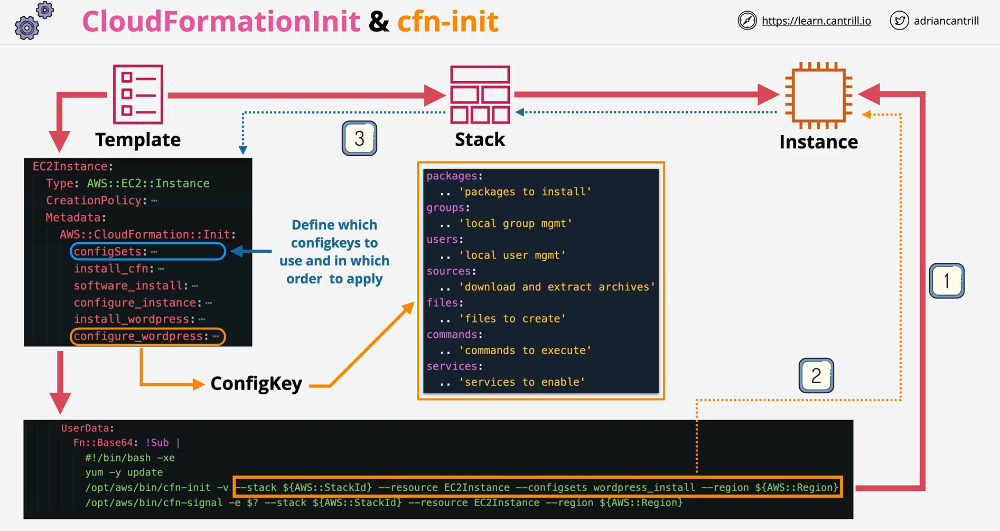
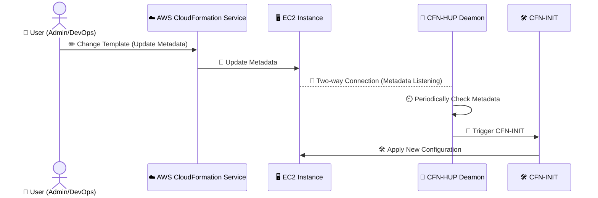
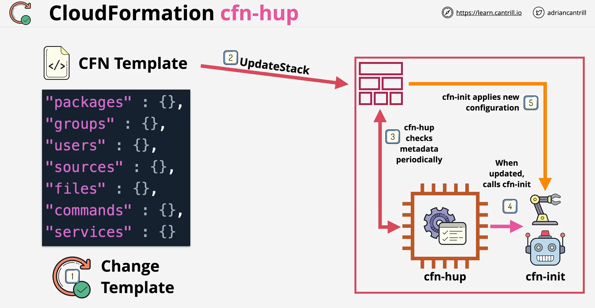
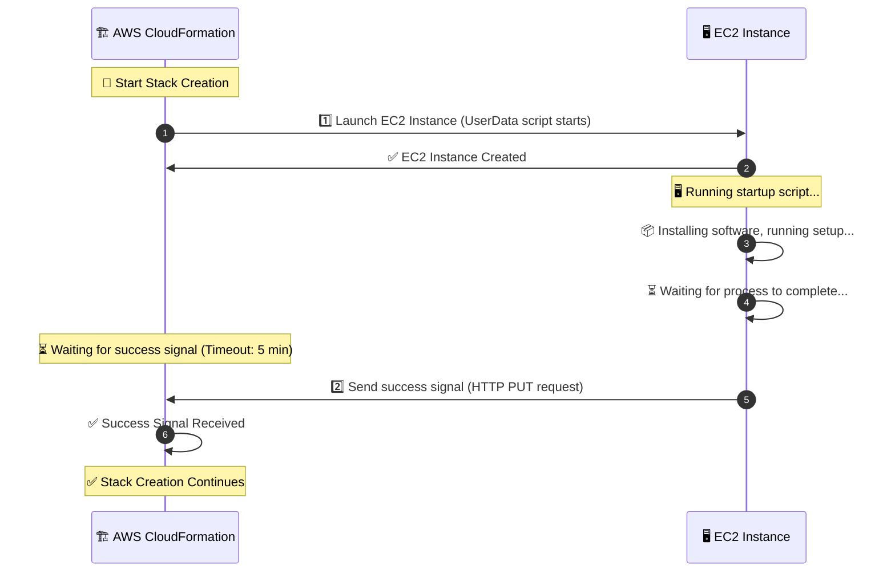

---
tags:
  - aws
  - aws/service
  - aws/domain/management-and-governance
  - aws/topic/cloudformation
aliases:
  - "AWS CloudFormation Helper Scripts Automating EC2 Configuration"
  - "Cfn Helper Scripts"
  - "CloudFormation Helper Scripts"
---

# **🛠️ AWS CloudFormation Helper Scripts: Automating EC2 Configuration**

## **📌 Introduction**

AWS CloudFormation **Helper Scripts** provide automation for **EC2 instance initialization, software installation, service management, and configuration updates** in CloudFormation stacks.

✅ **`cfn-init`** – Reads metadata and applies configurations (software, files, services).  
✅ **`cfn-hup`** – Detects CloudFormation metadata updates and applies changes.  
✅ **`cfn-signal`** – Notifies CloudFormation when an instance is ready.  
✅ **`cfn-get-metadata`** – Fetches metadata dynamically for custom scripts.

These scripts ensure **reliable instance configuration, prevent misconfigurations, and handle stack updates dynamically**.

---

## **1️⃣ `cfn-init` – Configuring an EC2 Instance Dynamically**

<div align="center">
    
</div>

### **🔹 Use Case**

- **Installs software** (e.g., Apache, Nginx, MySQL).
- **Creates and configures files dynamically** (e.g., website content, configuration files).
- **Manages services** (starts services, enables them at boot).

---

### **🛠️ Example: Using `cfn-init` to Install Apache & Configure EC2**

```yaml
Resources:
  MyEC2Instance:
    Type: AWS::EC2::Instance
    Metadata:
      AWS::CloudFormation::Init:
        config:
          packages:
            yum:
              httpd: [] # Installs Apache web server
          files:
            /var/www/html/index.html:
              content: "Hello from CloudFormation!"
              mode: "000644"
              owner: "root"
              group: "root"
          services:
            sysvinit:
              httpd:
                enabled: true
                ensureRunning: true
    Properties:
      ImageId: ami-12345678
      InstanceType: t3.micro
      UserData:
        Fn::Base64: |
          #!/bin/bash
          /opt/aws/bin/cfn-init -v --stack ${AWS::StackName} --resource MyEC2Instance --region ${AWS::Region}
```

### **📝 Explanation**

1️⃣ **Defines metadata under `AWS::CloudFormation::Init`**

- **`packages`** installs Apache (`httpd`).
- **`files`** creates an HTML file (`/var/www/html/index.html`).
- **`services`** ensures Apache starts and is enabled at boot.

2️⃣ **User Data executes `cfn-init`**

- **Reads metadata**, installs software, and configures files/services.

✅ **This ensures Apache is installed, running, and automatically starts on boot.**

---

## **2️⃣ `cfn-hup` – Detecting CloudFormation Updates & Applying Changes**



---

<div style="text-align: center;">
    
</div>

---

**❓ What is `cfn-hup`?**

- A daemon that listens for metadata changes in a CloudFormation stack.
- Automatically applies updates to the EC2 instance using `cfn-init`.

---

**🤔 Why is the `content` block mandatory?**

- Without it, `cfn-hup` cannot know what to monitor or how to act on changes.
- It defines:
  1. **Triggers**: When the hook runs (`post.update`).
  2. **Path**: The metadata to monitor (e.g., `AWS::CloudFormation::Init`).
  3. **Action**: The command to execute on change (`cfn-init`).

---

**🪜 Steps for Automatic Change Tracking:**

1. Add `AWS::CloudFormation::Init` metadata for resource configuration.
2. Define a `cfn-auto-reloader.conf` file with hook details (triggers, path, action).
3. Ensure `cfn-init` and `cfn-hup` are started in the instance `UserData`.

---

**🔹 Use Case:**

- **Detects stack updates and re-applies configurations dynamically.**
- **Automatically restarts services when configurations change.**
- **Ensures long-running instances remain correctly configured.**

---

**🛠️ Example:**

```yaml
Resources:
  MyEC2Instance:
    Type: AWS::EC2::Instance
    Metadata:
      AWS::CloudFormation::Init:
        config:
          packages:
            yum:
              httpd: []
          files:
            /etc/cfn/hooks.d/cfn-auto-reloader.conf:
              content: |
                [cfn-auto-reloader-hook]
                triggers=post.update
                path=Resources.MyEC2Instance.Metadata.AWS::CloudFormation::Init
                action=/opt/aws/bin/cfn-init -v --stack ${AWS::StackName} --resource MyEC2Instance --region ${AWS::Region}
    Properties:
      UserData:
        Fn::Base64: |
          #!/bin/bash
          /opt/aws/bin/cfn-init -v --stack ${AWS::StackName} --resource MyEC2Instance --region ${AWS::Region}
          /opt/aws/bin/cfn-hup || error_exit "Failed to start cfn-hup"
```

---

**📝 Explanation:**

1. **Purpose of `cfn-hup`**:

   - The `cfn-hup` tool monitors metadata changes in the CloudFormation stack and **automatically applies updates** when changes are detected.
   - It triggers `cfn-init` to reapply configurations when metadata is updated.

2. **How It Works**:

   - The configuration sets up a **hook** (`cfn-auto-reloader-hook`) that listens for updates in the metadata path:
     `Resources.MyEC2Instance.Metadata.AWS::CloudFormation::Init`.
   - When changes occur, the specified **action** runs `/opt/aws/bin/cfn-init` to apply the new configuration.

3. **Key Sections**:

   - **`Metadata.AWS::CloudFormation::Init`**:
     - Defines the configuration to be applied to the resource (`MyEC2Instance`), such as installing packages or managing files.
   - **`/etc/cfn/hooks.d/cfn-auto-reloader.conf`**:
     - This is the configuration file for `cfn-hup` that specifies:
       - **Triggers**: `post.update`, meaning the hook will run after a metadata update.
       - **Path**: The specific metadata path to monitor.
       - **Action**: The command to execute (`cfn-init`) when changes are detected.
   - **`UserData`**:
     - Ensures that both `cfn-init` and `cfn-hup` are started when the EC2 instance is created.

4. **Mandatory Configuration for Automatic Tracking**:
   - The `cfn-auto-reloader.conf` file and the hook configuration are **mandatory** for `cfn-hup` to track and apply metadata changes automatically.

---

## **3️⃣ `cfn-signal` – Notifying CloudFormation When an Instance is Ready**



---

**🔹 Use Case:**

- **Prevents CloudFormation from marking an instance as "ready" before it's fully configured.**
- **Ensures dependent resources only deploy when the instance setup completes.**
- **Prevents CloudFormation timeouts.**

---

**🛠️ Example:**

Let’s assume we are launching an **EC2 instance** that runs a setup script, and we want to ensure the script **completes successfully** before moving forward.

```yaml
Resources:
  # 1️⃣ Creates a WaitConditionHandle (generates a pre-signed URL)
  MyWaitHandle:
    Type: AWS::CloudFormation::WaitConditionHandle

  # 2️⃣ Creates the EC2 Instance
  MyEC2Instance:
    Type: AWS::EC2::Instance
    Properties:
      InstanceType: t2.micro
      ImageId: ami-12345678
      UserData:
        Fn::Base64: !Sub |
          #!/bin/bash
          echo "Starting setup..."
          # Simulating a setup process (e.g., installing software)
          sleep 120  # Simulates a long-running process
          # Send success signal to CloudFormation
          /usr/bin/curl "${MyWaitHandle}" -s -X PUT  -H "Content-Type:" --data-binary '{"Status": "SUCCESS", "UniqueId": "MyEC2Setup", "Data": "Setup Complete"}' 

  # 3️⃣ Creates a Wait Condition that waits for a signal
  MyWaitCondition:
    Type: AWS::CloudFormation::WaitCondition
    DependsOn: MyEC2Instance
    Properties:
      Handle: !Ref MyWaitHandle # Uses the pre-signed URL
      Timeout: "300" # Waits for 5 minutes
      Count: 1 # Expects 1 success signal
```

---

**📝 Explanation:**

- The **EC2 instance starts** and runs a setup script using `UserData`.
- The script **pauses execution for 2 minutes** (`sleep 120`), simulating an installation process.
- Once the setup is complete, the script **sends a success signal** (`curl` request) to the `WaitConditionHandle` URL.
- The **Wait Condition** is waiting for **one success signal** within **5 minutes** (`Timeout: 300`).
- If the script **fails** or the signal is not received within the timeout, **CloudFormation will fail the stack creation**.

## **4️⃣ `cfn-get-metadata` – Fetching CloudFormation Metadata for Custom Scripts**

### **🔹 Use Case**

- **Retrieve metadata values dynamically for use in scripts.**
- **Fetch configuration changes without modifying instance scripts.**
- **Provides metadata-driven automation for EC2 instances.**

---

### **🛠️ Example: Using `cfn-get-metadata` to Retrieve Metadata in a Bash Script**

```yaml
Resources:
  MyEC2Instance:
    Type: AWS::EC2::Instance
    Metadata:
      AWS::CloudFormation::Init:
        config:
          properties:
            WelcomeMessage: "Hello from CloudFormation!"
    Properties:
      UserData:
        Fn::Base64: |
          #!/bin/bash
          WELCOME_MSG=$(/opt/aws/bin/cfn-get-metadata --stack ${AWS::StackName} --resource MyEC2Instance --region ${AWS::Region} --key AWS::CloudFormation::Init.config.properties.WelcomeMessage)
          echo $WELCOME_MSG > /var/www/html/index.html
```

### **📝 Explanation**

1️⃣ **CloudFormation stores `WelcomeMessage` metadata** under `AWS::CloudFormation::Init`.  
2️⃣ **`cfn-get-metadata` fetches this value dynamically in the User Data script.**  
3️⃣ **The message is written to `/var/www/html/index.html`.**

✅ **This approach avoids hardcoding values inside User Data scripts.**

---

## **📌 Summary of CloudFormation Helper Scripts**

| **Script**         | **Purpose**                                        | **Common Use Cases**                                |
| ------------------ | -------------------------------------------------- | --------------------------------------------------- |
| `cfn-init`         | Reads metadata and applies configurations          | Install software, configure files, start services   |
| `cfn-signal`       | Signals CloudFormation when an instance is ready   | Ensure stack waits until instance setup is complete |
| `cfn-hup`          | Detects CloudFormation updates and applies changes | Automatically update EC2 configurations             |
| `cfn-get-metadata` | Fetches CloudFormation metadata dynamically        | Retrieve values for use in custom scripts           |

---

## **✅ Conclusion**

CloudFormation Helper Scripts **enhance automation, reliability, and maintainability** in AWS CloudFormation stacks.

💡 **Mastering these helper scripts ensures seamless EC2 configuration and infrastructure automation!** 🚀
---

## Related Notes
- [[aws-services/1.management-governance/1.cloudformation/|Index]] - folder map
- [[aws-services/1.management-governance/1.cloudformation/5.1.cfn-ec2-user-data|EC2 User Data in AWS CloudFormation]] - previous lesson
- [[aws-services/1.management-governance/1.cloudformation/5.3.cfn-wait-stratigies|CloudFormation Wait Strategies The Simple Way]] - next lesson
- [[aws-services/1.management-governance/1.cloudformation/1.6.cfn-metadata|AWS CloudFormation Metadata Section]] - mentions CloudFormation Metadata
- [[aws-services/1.management-governance/1.cloudformation/1.1.cfn|AWS CloudFormation]] - mentions AWS CloudFormation
- [[aws-daily/aws-waf/3.1.reliability|Reliability]] - mentions Reliability

---
