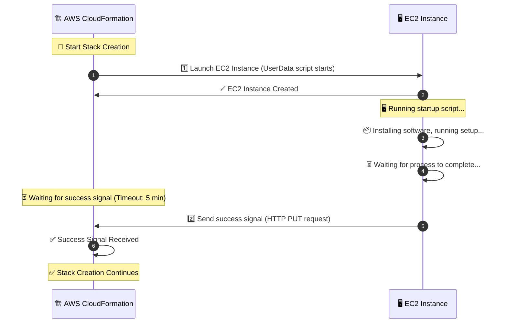

---
tags:
  - aws
  - aws/service
  - aws/domain/management-and-governance
  - aws/topic/cloudformation
aliases:
  - "Mastering AWS CloudFormation Wait Conditions CreationPolicy & Alternatives"
  - "Cfn Signal Creation Policy Vs Wait Condition"
  - "CloudFormation Signal Creation Policy Vs Wait Condition"
---

# **⏳ Mastering AWS CloudFormation Wait Conditions, CreationPolicy & Alternatives**

In AWS CloudFormation, sometimes you need to **pause** stack creation until an **external process completes**, such as:

- **An EC2 instance running a setup script**
- **A database migration finishing**
- **An approval step before proceeding**

🔹 AWS CloudFormation provides **two primary mechanisms** to handle these dependencies:

1. **Wait Conditions**: For generic event-based waits.
2. **CreationPolicy**: Specifically for ensuring readiness of resources like EC2 instances or Auto Scaling groups.

Additionally, there are **modern alternatives** like:

- AWS **Systems Manager (SSM)**
- AWS **Step Functions**
- AWS **Lambda-backed Custom Resources**

---

## 🏗 **Workflow**



---

## 🧩 **Key Differences Between Wait Conditions and CreationPolicy**

| Feature              | `WaitCondition`                                                                                        | `CreationPolicy`                                                                               |
| -------------------- | ------------------------------------------------------------------------------------------------------ | ---------------------------------------------------------------------------------------------- |
| **Purpose**          | Pauses stack creation to wait for signals from **external processes** or **generic events**.           | Ensures CloudFormation waits for **specific resources** to signal readiness before proceeding. |
| **Applies To**       | Generic use case; independent of specific resources.                                                   | Resource-specific (e.g., EC2 instances, Auto Scaling groups).                                  |
| **Signal Mechanism** | Uses a pre-signed URL generated by **`WaitConditionHandle`** to listen for success or failure signals. | Uses **ResourceSignal** configuration to expect readiness signals from the specific resource.  |
| **Timeout**          | Defined in the **`WaitCondition`** property.                                                           | Defined in the **`CreationPolicy`** attribute.                                                 |
| **Best Use Case**    | For **external signals** or **custom workflows** unrelated to a single resource.                       | For **ensuring resource readiness** (e.g., after instance initialization or setup tasks).      |

---

## **🏗 Example 1: Using CreationPolicy**

The following example ensures that an EC2 instance signals CloudFormation when it has completed its initialization. **No WaitConditionHandle** is required here.

```yaml
Resources:
  # Creates an EC2 instance with a CreationPolicy
  MyEC2Instance:
    Type: AWS::EC2::Instance
    Metadata:
      AWS::CloudFormation::Init:
        config:
          packages:
            yum:
              httpd: []
    Properties:
      InstanceType: t2.micro
      ImageId: ami-12345678
      UserData:
        Fn::Base64: !Sub |
          #!/bin/bash
          echo "Starting setup..."

          sleep 120 # Simulates a long-running process
          echo "Setup complete" > /tmp/setup.log

          # Signal success to the WaitConditionHandle using cfn-signal
          /usr/bin/cfn-signal --success true --stack ${AWS::StackName} --resource MyEC2Instance --region ${AWS::Region}
    CreationPolicy:
      ResourceSignal:
        Count: 1 # Wait for 1 success signal
        Timeout: PT5M # Wait for 5 minutes
```

### 🔍 **How It Works**

1. **`CreationPolicy`**:
   - Defines a `ResourceSignal` that expects 1 signal within 5 minutes.
2. **CloudFormation Metadata**:
   - The `AWS::CloudFormation::Init` section specifies tasks to configure the EC2 instance (e.g., installing packages).
3. **Signal Mechanism**:
   - The EC2 instance uses the `cfn-signal` command to notify CloudFormation that it is ready.
4. **Behavior**:
   - Stack creation pauses until the required signal is received or the timeout expires.

---

## **🏗 Example 2: Using Wait Conditions**

Let’s assume we are launching an **EC2 instance** that runs a setup script, and we want to ensure the script **completes successfully** before moving forward.

```yaml
Resources:
  # 1️⃣ Creates a WaitConditionHandle (generates a pre-signed URL)
  MyWaitHandle:
    Type: AWS::CloudFormation::WaitConditionHandle

  # 2️⃣ Creates the EC2 Instance
  MyEC2Instance:
    Type: AWS::EC2::Instance
    Properties:
      InstanceType: t2.micro
      ImageId: ami-12345678
      UserData:
        Fn::Base64: !Sub |
          #!/bin/bash
          echo "Starting setup..."
          # Simulating a setup process (e.g., installing software)
          sleep 120  # Simulates a long-running process

          # Signal success to the WaitConditionHandle using cfn-signal
          /opt/aws/bin/cfn-signal -e 0 --data "Setup complete" --id MyEC2Setup --url "${MyWaitHandle}"

  # 3️⃣ Creates a Wait Condition that waits for a signal
  MyWaitCondition:
    Type: AWS::CloudFormation::WaitCondition
    DependsOn: MyEC2Instance # used to start the timeout after creating MyEC2Instance
    Properties:
      Handle: !Ref MyWaitHandle # Uses the pre-signed URL
      Timeout: "300" # Waits for 5 minutes
      Count: 1 # Expects 1 success signal
```

---

**🔍 Breaking Down the Example:**

```bash
cfn-signal -e <exit-code> --data "<optional-data>" --id <unique-id> --url <WaitHandle-URL>
```

- `-e 0` = Success (any non-zero means failure)
- `--data` = Optional string to describe status
- `--id` = A unique identifier for the signal
- `--url` = The pre-signed URL from the WaitConditionHandle

---

**❌ What Happens If No Signal is Sent?**

If the **EC2 instance fails to send a success signal** (e.g., setup script crashes), the `WaitCondition` times out and **CloudFormation marks the stack as failed**.

**🔍 How It Works:**

1. **CloudFormation creates a `WaitConditionHandle`**, which generates a **pre-signed URL**.
2. **CloudFormation launches an EC2 instance**, which starts running its **UserData script**.
3. **EC2 Instance executes setup tasks** (e.g., installing software, database setup).
4. Once setup **completes successfully**, the **EC2 instance sends a success signal** (HTTP `PUT` request) to the **WaitConditionHandle URL**.
5. **CloudFormation receives the success signal** and checks if the required count of signals is met.
6. If the signal is received **before the timeout expires**, the **stack creation continues**.
7. If no signal is received **within 5 minutes**, CloudFormation **fails the stack** due to a timeout.

---

## **❓ When to Use Each**

| Use Case                                    | Recommended Mechanism | Example                                                    |
| ------------------------------------------- | --------------------- | ---------------------------------------------------------- |
| Waiting for a single resource to initialize | **`CreationPolicy`**  | EC2 instance setup, Auto Scaling Group initialization.     |
| Waiting for multiple or external signals    | **`WaitCondition`**   | Manual approval steps, external workflows, custom scripts. |

---

## **✅ Best Practices**

- Use **`CreationPolicy`** for resource-specific readiness checks (e.g., EC2, Auto Scaling).
- Use **`WaitCondition`** when waiting for external workflows or events unrelated to specific resources.
- Set realistic **timeouts** to prevent unnecessary stack failures.
- Avoid overusing **WaitCondition** as it can complicate stack management.

---

## **🤔 Best Alternatives to Wait Conditions**

If Wait Conditions are not ideal for your use case, here are **three alternatives** that provide better control and reliability.

---

### **1️⃣ AWS Systems Manager (SSM)**

AWS Systems Manager (SSM) is a **better alternative to Wait Conditions** when managing EC2 instances. It allows:

- Remote execution of **setup scripts**.
- Monitoring instance **readiness** before proceeding.
- **Logging and debugging** setup failures.

#### **🚀 How It Works**

1️⃣ Use SSM **Run Command** or **State Manager** to configure the instance.  
2️⃣ Use **SSM Parameter Store** to signal completion.  
3️⃣ CloudFormation queries **SSM Parameter Store** to check if the setup is done.

#### **📝 Example: Using SSM Instead of Wait Conditions**

```yaml
Resources:
  MyEC2Instance:
    Type: AWS::EC2::Instance
    Properties:
      InstanceType: t2.micro
      ImageId: ami-12345678
      IamInstanceProfile: !Ref MySSMRole
      UserData:
        Fn::Base64: !Sub |
          #!/bin/bash
          echo "Starting setup..."
          sleep 120
          echo "Setup complete" | tee /var/log/setup.log
          # Save status in SSM Parameter Store
          /usr/bin/aws ssm put-parameter --name "/setup/status" --value "Success" --type String --overwrite

  MySSMRole:
    Type: AWS::IAM::Role
    Properties:
      AssumeRolePolicyDocument:
        Statement:
          - Effect: Allow
            Principal:
              Service: [ec2.amazonaws.com]
            Action: sts:AssumeRole
      Policies:
        - PolicyName: SSMParameterAccess
          PolicyDocument:
            Statement:
              - Effect: Allow
                Action:
                  - ssm:PutParameter
                  - ssm:GetParameter
                Resource: "*"
```

✅ **No need for a pre-signed URL**  
✅ **Easy monitoring using AWS Systems Manager Console**  
✅ **More reliable than Wait Conditions**

---

### **2️⃣ AWS Step Functions**

AWS **Step Functions** allow you to **orchestrate workflows** with built-in wait steps and error handling.

#### **🚀 How It Works**

1️⃣ Create a Step Function that **triggers the setup script**.  
2️⃣ The Step Function **waits until setup is completed** before proceeding.  
3️⃣ If the script fails, the Step Function can **retry or trigger alerts**.

✅ **Great for complex workflows**  
✅ **Error handling & retries built-in**  
✅ **No CloudFormation timeouts needed**

---

### **3️⃣ Lambda-backed Custom Resources**

AWS Lambda-backed custom resources **replace Wait Conditions** by letting a Lambda function **control when CloudFormation continues**.

#### **🚀 How It Works**

1️⃣ CloudFormation triggers a **Lambda function**.  
2️⃣ The Lambda function **performs setup tasks** (e.g., configuring an instance).  
3️⃣ The Lambda function **sends a success signal** back to CloudFormation.

✅ **More flexibility than Wait Conditions**  
✅ **Can integrate with external services**  
✅ **Useful for complex tasks that require API calls**

---

### **🔄 Comparing Wait Conditions vs. Alternatives**

| Method                     | Best For                   | Pros                             | Cons                           |
| -------------------------- | -------------------------- | -------------------------------- | ------------------------------ |
| **Wait Conditions**        | Simple setup waits         | ✅ Easy to use                   | ❌ Hard to debug, timeout risk |
| **AWS SSM**                | EC2 instance configuration | ✅ No timeout issues, ✅ Logging | ❌ Requires IAM role           |
| **Step Functions**         | Complex workflows          | ✅ Error handling, ✅ Retries    | ❌ More expensive              |
| **Lambda Custom Resource** | Dynamic workflows          | ✅ Integrates with APIs          | ❌ Requires coding             |

---

## **📍 Conclusion**

While **Wait Conditions** are useful, they are often **not the best choice** due to debugging challenges and timeouts.

**The best alternatives:**

- **AWS Systems Manager (SSM)** → Best for EC2 setup.
- **AWS Step Functions** → Best for complex workflows.
- **AWS Lambda-backed Custom Resources** → Best for API-driven processes.
---

## Related Notes
- [[aws-services/1.management-governance/1.cloudformation/|Index]] - folder map
- [[aws-services/1.management-governance/1.cloudformation/5.3.cfn-wait-stratigies|CloudFormation Wait Strategies The Simple Way]] - previous lesson
- [[aws-services/1.management-governance/1.cloudformation/5.5.cfn-wait-stratigies-examples|AWS CloudFormation Wait Conditions & Creation Policies The Ultimate Guide]] - next lesson
- [[aws-services/1.management-governance/1.cloudformation/1.6.cfn-metadata|AWS CloudFormation Metadata Section]] - mentions CloudFormation Metadata
- [[aws-services/1.management-governance/1.cloudformation/1.1.cfn|AWS CloudFormation]] - mentions AWS CloudFormation
- [[aws-services/1.management-governance/4.1.system-manager/3.3.parameter_store|AWS SSM Parameter Store]] - mentions Parameter Store
- [[aws-services/7.application-integration/step-functions/1.step-functions|AWS Step Functions Orchestrate Your Serverless Workflows with Ease]] - mentions Step Functions
- [[aws-services/1.management-governance/4.1.system-manager/2.2.run-command|AWS SSM Run Command]] - mentions Run Command
- [[aws-daily/aws-waf/3.1.reliability|Reliability]] - mentions Reliability
- [[aws-services/2.security/1.1.iam/1.fundmmentals/1.2.iam|AWS Identity and Access Management IAM]] - mentions IAM

---
