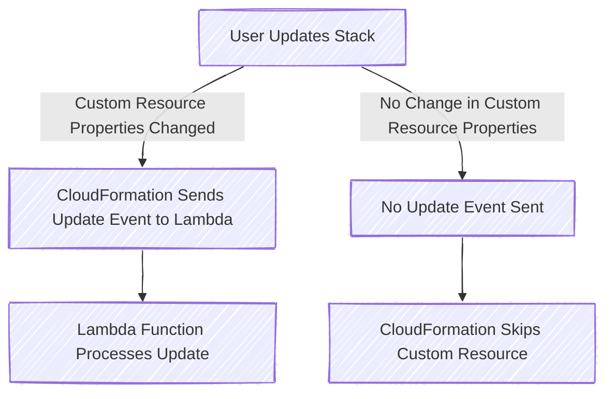

# 🧩 **CloudFormation Custom Resources**

> CloudFormation **Custom Resources** allow you to run **custom logic (via Lambda or SNS)** at stack creation, update, or deletion — perfect when native resources are **unsupported**, or you need to **augment the behavior** (like emptying an S3 bucket before deletion).

---

<div style="text-align: center;">
    
</div>

---

## 📌 What Is a CloudFormation Custom Resource?

A **Custom Resource** is defined using:

| Resource Type                         | Description                                     |
| ------------------------------------- | ----------------------------------------------- |
| `Custom::MyResourceTypeName` ✅       | ✅ **Recommended** naming format — logical type |
| `AWS::CloudFormation::CustomResource` | Legacy format, functionally equivalent          |

---

## 🧠 How It Works

- You define a resource using one of the types above
- You **must specify a `ServiceToken`** — which is the **ARN of a Lambda or SNS**
- CloudFormation invokes the function with an event containing:

  - `RequestType`: Create / Update / Delete
  - `ResponseURL`: A pre-signed URL you **must reply to**
  - `ResourceProperties`: Input parameters

- Your Lambda responds to the URL with `"SUCCESS"` or `"FAILED"` and includes a `PhysicalResourceId`

---

### **🛠 Key Components of a Custom Resource**

- **1️⃣ CloudFormation Stack** – Defines the **Custom Resource** in a CloudFormation template.
- **2️⃣ AWS Lambda Function** – Handles **create, update, and delete** operations.
- **3️⃣ ResponseURL** – A **temporary webhook URL** that CloudFormation generates and expects a response from.
- **4️⃣ PhysicalResourceId** – A unique identifier for the resource, which helps **CloudFormation track whether a resource needs to be updated or replaced**.

### **🔍 Custom Resource Workflow**


---

## 🔐 Why `ServiceToken` Is Mandatory

| Field          | Role                                                                  |
| -------------- | --------------------------------------------------------------------- |
| `ServiceToken` | Tells CloudFormation **where to send events** (Lambda ARN or SNS ARN) |

> ❗ Must be in the **same region** as the CloudFormation stack

---

## 🔥 Use Case – **Empty an S3 Bucket Before Deletion**

> 🧹 By default, CloudFormation **cannot delete a non-empty S3 bucket**  
> ✅ With a custom resource, you can **empty the bucket first**, then allow deletion to continue

---

<div style="text-align: center;">
    
</div>

---

### 📜 **`empty-s3-on-delete.yaml`**

```yaml
AWSTemplateFormatVersion: "2010-09-09"
Description: Empty an S3 bucket before deletion using a custom resource

Resources:
  MyBucket:
    Type: AWS::S3::Bucket
    DeletionPolicy: Delete

  EmptyBucketLambdaRole:
    Type: AWS::IAM::Role
    Properties:
      AssumeRolePolicyDocument:
        Version: "2012-10-17"
        Statement:
          - Effect: Allow
            Principal:
              Service: lambda.amazonaws.com
            Action: sts:AssumeRole
      ManagedPolicyArns:
        - arn:aws:iam::aws:policy/AmazonS3FullAccess
        - arn:aws:iam::aws:policy/service-role/AWSLambdaBasicExecutionRole

  EmptyBucketLambda:
    Type: AWS::Lambda::Function
    Properties:
      Runtime: python3.11
      Handler: index.handler
      Timeout: 60
      Role: !GetAtt EmptyBucketLambdaRole.Arn
      Code:
        ZipFile: |
          import json, boto3, requests

          def handler(event, context):
              s3 = boto3.resource('s3')
              bucket = s3.Bucket(event['ResourceProperties']['BucketName'])

              if event['RequestType'] == 'Delete':
                  for obj in bucket.objects.all():
                      obj.delete()

              response = {
                  "Status": "SUCCESS",
                  "PhysicalResourceId": event.get("PhysicalResourceId", event["LogicalResourceId"]),
                  "StackId": event["StackId"],
                  "RequestId": event["RequestId"],
                  "LogicalResourceId": event["LogicalResourceId"],
                  "Data": {}
              }
              requests.put(event["ResponseURL"], data=json.dumps(response))

  EmptyBucketCustomResource:
    Type: Custom::EmptyBucket
    Properties:
      ServiceToken: !GetAtt EmptyBucketLambda.Arn
      BucketName: !Ref MyBucket
```

---

### 🧪 Resulting Behavior

- During stack **deletion**, the custom Lambda is triggered
- It **empties the bucket**, then responds with `"SUCCESS"`
- CloudFormation then proceeds to delete the now-empty bucket

---

## 🔄 **Creating a Custom Resource Lifecycle**

### 1️⃣ **Creating a Custom Resource Lifecycle**

When a **Custom Resource is created**, CloudFormation invokes Lambda with `RequestType: "Create"`.

**Example Scenario:**

- CloudFormation **triggers Lambda** to **create an S3 bucket**.
- Lambda **creates the bucket** and **returns a success response**.

### 📜 **Example Create Handling in Lambda**

```python
import json
import boto3
import requests

s3 = boto3.client("s3")

def handler(event, context):
    if event["RequestType"] == "Create":
        bucket_name = "my-custom-bucket-" + event["RequestId"]
        s3.create_bucket(Bucket=bucket_name)
        response_data = {"BucketName": bucket_name}
        physical_resource_id = bucket_name  # ✅ CloudFormation tracks this ID

        send_response(event, context, "SUCCESS", response_data, physical_resource_id)

def send_response(event, context, status, response_data, physical_resource_id):
    response_body = {
        "Status": status,
        "PhysicalResourceId": physical_resource_id,
        "StackId": event["StackId"],
        "RequestId": event["RequestId"],
        "LogicalResourceId": event["LogicalResourceId"],
        "Data": response_data,
    }
    requests.put(event["ResponseURL"], data=json.dumps(response_body))
```

> ✅ **CloudFormation will now proceed with the stack creation**.

---

### 2️⃣ **Updating a Custom Resource Lifecycle**

<div align="center">



</div>

---

> CloudFormation **compares** the new stack configuration against the previous stack state.  
> If **no properties of the Custom Resource change**, **CloudFormation does NOT invoke the Lambda function**.  
> If **ANY property of the Custom Resource changes**, CloudFormation **sends an `Update` event** to Lambda.

#### 📜 **Example Update Handling in Lambda**

```python
if event["RequestType"] == "Update":
    old_bucket_name = event["OldResourceProperties"]["BucketName"]
    new_bucket_name = event["ResourceProperties"]["BucketName"]

    if old_bucket_name == new_bucket_name:
        # ✅ No change needed, return the same PhysicalResourceId
        physical_resource_id = old_bucket_name
    else:
        # 🔄 Replacement needed: Create new bucket & delete old one
        s3.create_bucket(Bucket=new_bucket_name)
        s3.delete_bucket(Bucket=old_bucket_name)
        response_data["BucketName"] = new_bucket_name
        physical_resource_id = new_bucket_name  # ✅ CloudFormation sees this as a replacement
```

> ✅ **If the function returns the same `PhysicalResourceId`, CloudFormation updates the resource in place**.  
> ✅ **If the function returns a new `PhysicalResourceId`, CloudFormation assumes a replacement and deletes the old resource**.

---

### 3️⃣ **Deleting a Custom Resource Lifecycle**

When a **CloudFormation stack is deleted**, it invokes Lambda with `RequestType: "Delete"`.

#### 📜 **Example Delete Handling in Lambda**

```python
if event["RequestType"] == "Delete":
    bucket_name = event["ResourceProperties"]["BucketName"]
    s3.delete_bucket(Bucket=bucket_name)
    physical_resource_id = event["PhysicalResourceId"]
```

> ✅ **CloudFormation waits for Lambda to confirm deletion before removing the resource from the stack**.

---

## ✅ Use Cases for SAP-C02

| Scenario                                  | Solution with Custom Resource         |
| ----------------------------------------- | ------------------------------------- |
| **Delete non-empty S3 bucket**            | Lambda clears it first                |
| **Create AWS Org account**                | Call AWS Organizations API via Lambda |
| **Sync configs between regions/accounts** | Lambda pushes cross-region updates    |
| **Call third-party APIs during deploy**   | Lambda calls external service         |
| **Dynamically fetch secrets or data**     | Lambda retrieves data for outputs     |

---

## 📌 Best Practices (for Exam + Production)

| Best Practice                          | Why It Matters                               |
| -------------------------------------- | -------------------------------------------- |
| ✅ Always return `PhysicalResourceId`  | Ensures idempotency and prevents duplication |
| 🧾 Log all events to CloudWatch        | For debugging failed deployments             |
| ❗ Respond to `ResponseURL` **always** | Or stack **hangs indefinitely**              |
| 🔐 Minimize IAM permissions            | Use **least privilege** for Lambda           |
| 🧪 Use `DeletionPolicy: Retain` wisely | Avoid accidental deletes if needed           |

---

## 📝 Summary for SAP Exam

| Topic                   | Key Point                                                                       |
| ----------------------- | ------------------------------------------------------------------------------- |
| Resource Types          | Use `Custom::<TypeName>` (recommended) or `AWS::CloudFormation::CustomResource` |
| Requires `ServiceToken` | Must point to Lambda or SNS ARN                                                 |
| Request Lifecycle       | CloudFormation sends `Create` / `Update` / `Delete` to Lambda                   |
| Response                | Lambda must respond to `ResponseURL` with status + ID                           |
| Use Cases               | Create unsupported resources, run custom logic, empty S3                        |
| Failure Handling        | Return `"FAILED"` to block stack deployment                                     |
