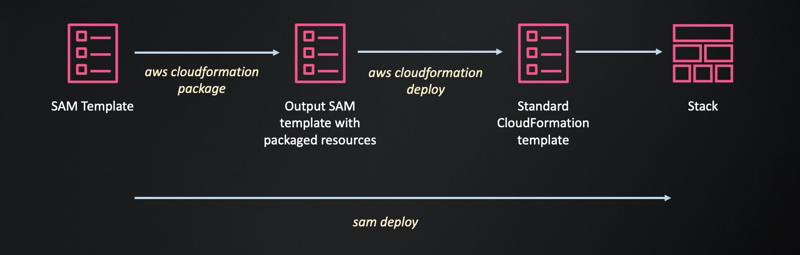
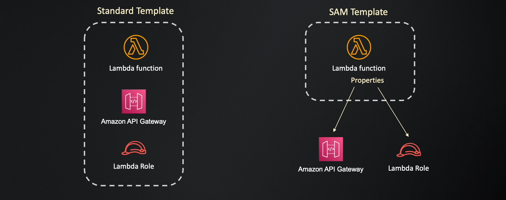

---
tags:
  - aws
  - aws/service
  - aws/domain/management-and-governance
  - aws/topic/cloudformation
aliases:
  - "Cfn Sam"
  - "CloudFormation Sam"
---

# SAM

- open source framework to build and deploy serverless applications on aws.
- an alternative to serverless framework, but maintained by a team in aws.
- a subset of aws cloudformation.
- you use cfn templates with some extensions to define serverless resources with simple and clean syntax.
- you can define all resource types supported by cfn in a sam template.
- you can use standard template sections, such as parameters, conditions, or mapping in a sam template.

---

## SAM CLI

- use to initialize, package and deploy sam projects.
- has more additional features to build and test aws lambda functions locally using docker containers.

## References

1. [SAM CLI Installation Reference](https://docs.aws.amazon.com/serverless-application-model/latest/developerguide/install-sam-cli.html)
1. [SAM Generated Resources FROM api Event Definition](https://github.com/aws/serverless-application-model/blob/master/docs/internals/generated_resources.rst#api)
1. [AWS SAM resources and properties](https://docs.aws.amazon.com/serverless-application-model/latest/developerguide/sam-specification-resources-and-properties.html)
1. [Globals section of the AWS SAM template](https://docs.aws.amazon.com/serverless-application-model/latest/developerguide/sam-specification-template-anatomy-globals.html)
1. [AWS SAM policy templates](https://docs.aws.amazon.com/serverless-application-model/latest/developerguide/serverless-policy-templates.html)
1. [AWS SAM CLI configuration file](https://docs.aws.amazon.com/serverless-application-model/latest/developerguide/serverless-sam-cli-config.html)
---

## Related Notes
- [[aws-services/1.management-governance/1.cloudformation/|Index]] - folder map
- [[aws-services/1.management-governance/1.cloudformation/8.2.cfn-codedeply|AWS CloudFormation templates for CodeDeploy referencehttps//docs.aws.amazon.com/codedeploy/latest/userguide/reference-cloudformation-templates.html]] - previous lesson
- [[aws-services/10.developer/1.4.aws-sam/2.3.sam-policy-templates|AWS SAM Policy Templates Smart Permissions for Serverless Apps]] - mentions Sam Policy Templates
- [[aws-services/11.analytics/glue/9.1.additional-features|AWS Glue Additional Features]] - mentions Additional Features
- [[aws-services/8.database/dynamodb/1.6.additional-features|AWS DynamoDB Additional Features]] - mentions Additional Features
- [[aws-services/1.management-governance/1.cloudformation/1.1.cfn|AWS CloudFormation]] - mentions AWS CloudFormation
- [[aws-daily/aws-architectures/3.1.serverless|Server-Based Architectures vs. Serverless Computing]] - mentions Serverless
- [[aws-services/10.developer/1.4.aws-sam/1.serverless|The Ultimate Guide to Serverless Computing & Tools]] - mentions Serverless
- [[aws-services/10.developer/1.4.aws-sam/2.1.aws-sam|AWS SAM Serverless Application Model]] - mentions AWS Sam
- [[aws-services/1.management-governance/4.3.config/x.config|AWS Config Track Manage and Secure Your AWS Resources]] - mentions Config
- [[aws-services/1.management-governance/1.cloudformation/.docs|CND Useful References]] - mentions Docs

---
