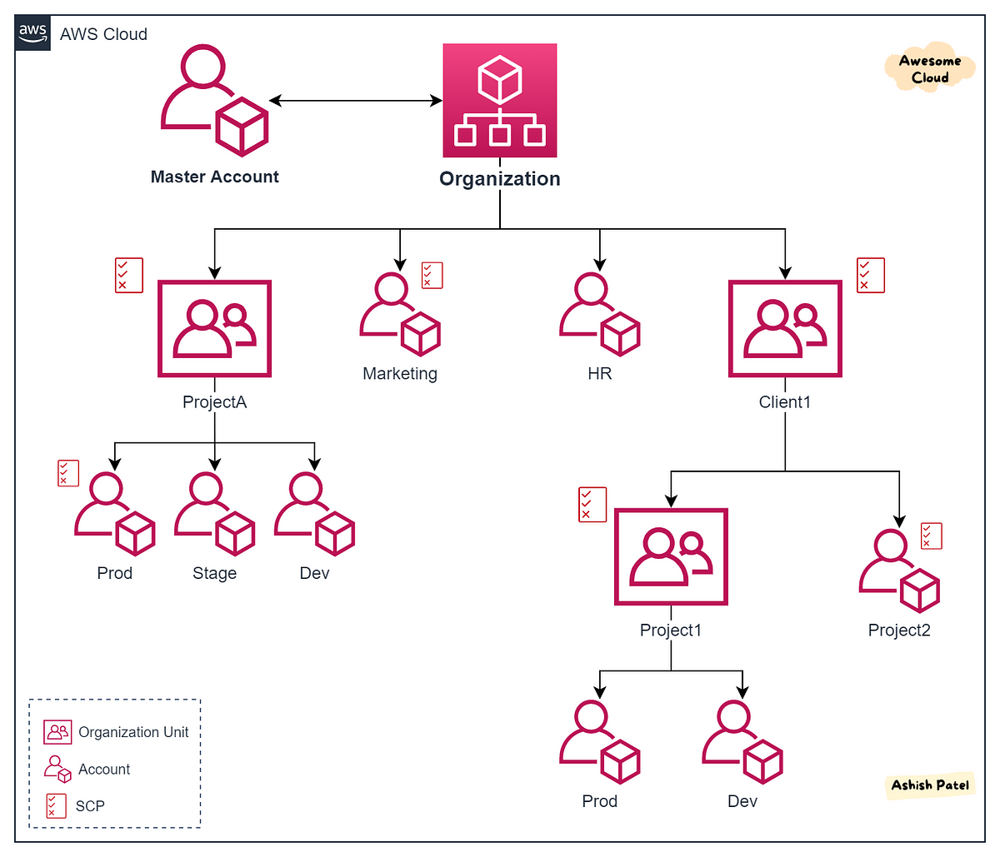

---
tags:
  - aws
  - aws/service
  - aws/domain/management-and-governance
  - aws/topic/organizations
aliases:
  - "AWS Organizations The Smart Way to Manage Multiple AWS Accounts"
  - "AWS Organizations"
---

# 🏢 AWS Organizations – The Smart Way to Manage Multiple AWS Accounts

> “One interface to rule them all.”

---

## 📚 What Is AWS Organizations?

**AWS Organizations** is a **centralized account management service** that helps you **govern**, **secure**, and **optimize** a growing number of AWS accounts — all from a **single control plane**.

Think of it like a **tree-structured command center** that links your AWS accounts, helps you apply **central policies**, enforce **security rules**, and optimize **billing** across teams, business units, or regions.

---

  

---

## 😰 Why You Need AWS Organizations

Managing multiple AWS accounts manually is like juggling chainsaws — here’s why:

| Problem                           | Without Organizations                             |
| --------------------------------- | ------------------------------------------------- |
| 🧾 Billing                        | Every account has a separate bill                 |
| 🔒 Policy enforcement             | Manual, inconsistent IAM setup                    |
| 🧑‍💻 Role access across accounts | Must configure cross-account roles manually       |
| 🧼 Tag and backup consistency     | Hard to enforce tagging or backup across accounts |
| 📊 Cost optimization              | No shared discounts or centralized visibility     |

---

## 🌟 Key Benefits of AWS Organizations

### 🛠️ Centralized Management

- Manage **all AWS accounts** from one root.
- Create **Organizational Units (OUs)** for logical grouping (e.g., by team, product, region).

### 💸 Consolidated Billing

- Pay **one bill** for all accounts.
- Share **volume discounts** (e.g., EC2 Reserved Instances) across accounts.

### 🔐 Policy Enforcement

- Use **Service Control Policies (SCPs)** to control what services/actions are allowed.
- SCPs apply **organization-wide**, or per OU/account.
- Enforce **backup**, **IAM**, and **networking** standards.

### 🎯 Tag & Backup Control

- Use **Tag Policies** to enforce tagging best practices.
- Use **AWS Backup** across accounts for unified disaster recovery.

### 🌍 Global Control Plane

- Highly available
- Scalable across 100s of accounts
- Region-agnostic policy enforcement

---

## ⚙️ Modes of Operation

| Mode                     | Description                                                                 |
| ------------------------ | --------------------------------------------------------------------------- |
| **All Features Mode**    | Full governance (SCPs, tagging, backups) — for **enterprise-grade control** |
| **Consolidated Billing** | Only shares billing — no SCPs or fine-grained policies                      |

---

## 🧠 Core Components Breakdown

### 🏛️ Root

- The **top-level node** of your organization
- All OUs and accounts live beneath this
- Policies at root level affect **everything**

### 🗂️ Organizational Units (OUs)

- Group AWS accounts logically
- Nested structure (OU inside OU)
- **Apply SCPs** to OUs for bulk policy enforcement

### 👥 Accounts

| Account Type           | Role                                                                 |
| ---------------------- | -------------------------------------------------------------------- |
| **Management Account** | The “admin” account – creates and manages the org                    |
| **Member Accounts**    | Regular accounts – added to the org, governed by policies from above |

✅ Accounts can be **invited** (existing AWS accounts) or **created** inside the org.

---

## 🚪 Account Joining & Leaving

### ✅ Creating a New Account

- Use AWS Console or CLI
- Automatically linked to org
- Role `OrganizationAccountAccessRole` is auto-created

### 🔗 Inviting Existing Account

- Use `invite-account-to-organization`
- You must **manually create** the `OrganizationAccountAccessRole` in the invited account

### ❌ Leaving the Org

- Must **add billing**, **support plans**, **update contacts**, and **remove inherited SCPs**

---

## 📌 Limitations to Keep in Mind

| Constraint                          | Description                                                                 |
| ----------------------------------- | --------------------------------------------------------------------------- |
| 🧷 1 org/account max                | Account can only belong to **one org at a time**                            |
| ❌ Cannot remove management account | You can’t delete or move the management account                             |
| 🔒 SCPs restrict only, don’t grant  | SCPs don’t give permission — IAM policies still required                    |
| 🔁 OU has only 1 parent             | OUs can’t belong to multiple parents (strict hierarchy)                     |
| 💳 Billing transfer                 | Invited accounts transfer billing to org’s management account automatically |
| 🔐 Cross-account access             | Must be explicitly configured via trust policies and role assumption        |

---

## 📒 **Notes**

1. **1️⃣ Member Account Limitations**:

   - Member accounts can't create their own organizations while part of another.
   - Member accounts are subject to Service Control Policies (SCPs) enforced by the management account.

2. **2️⃣ Service Control Policies (SCPs)**:

   - SCPs can restrict or allow specific services/actions for accounts or Organizational Units (OUs).
   - SCPs do not grant permissions by themselves; they only restrict actions granted by IAM policies.
   - SCPs is Multi-Hierarchy Level which is mean it affect to all nested children.

3. **3️⃣ Account Creation and Management**:

   - New accounts created in an organization are billed to the management account.
   - Removing an account from an organization involves a few steps and reconfigurations.

4. **4️⃣ Consolidated Billing**:

   - All accounts in an organization share a single billing method.
   - The management account is responsible for paying all charges.

5. **5️⃣ Billing When Inviting an Account with Existing Resources:** When you invite an account that already has existing resources and billing arrangements into your AWS Organization, the billing for that account will transition to the management account of the organization.

6. 6️⃣ When you create an account in your AWS Organization or invite an account to join your organization, AWS automatically handles some roles for you, but there are additional steps you might need to take:

### When Creating a New Account in Your Organization

1. **Automatic Roles**:
   - **OrganizationAccountAccessRole**: This role is automatically created and allows users and roles in the management account to have full administrative control over the new member account.
   - **AWSServiceRoleForOrganizations**: This service-linked role is also automatically created to enable integration with select AWS services.

### When Inviting an Existing Account to Join Your Organization

1. **Manual Role Creation**:
   - Unlike newly created accounts, invited accounts do not automatically get the OrganizationAccountAccessRole. You need to manually create this role in the invited account.
   - **Steps to Create the Role**:
     1. Sign in to the IAM console in the invited account.
     2. Navigate to Roles and choose Create role.
     3. Select AWS account and then Another AWS account.
     4. Enter the 12-digit account ID of your management account.
     5. Choose AdministratorAccess as the policy and create the role.
     6. Name the role OrganizationAccountAccessRole for consistency.

## 💡 Best Practices

- 🏛️ Use **OUs for departments** (Dev, QA, Prod)
- 🔐 Apply **SCPs restrictively** (deny by default, allow per OU)
- 📁 Standardize tagging with **Tag Policies**
- 🧾 Assign **cost allocation tags** for billing reports
- 🧯 Use **central backup** for all critical workloads
---

## Related Notes
- [[aws-services/1.management-governance/2.1.organizations/|Index]] - folder map
- [[aws-services/1.management-governance/2.1.organizations/2.scps-service_control_policy|Service Control Policies SCPs]] - next lesson
- [[aws-daily/aws-pricing/5.1.cost-allocation-tags|Cost allocation tags]] - mentions Cost allocation tags
- [[aws-daily/aws-waf/5.1.cost-optimization|Cost Optimization]] - mentions Cost Optimization
- [[aws-daily/aws-cloud-Concepts/6.disaster-recovery|Disaster Recovery DR in AWS]] - mentions Disaster Recovery
- [[aws-services/2.security/1.1.iam/1.fundmmentals/1.1.aws-account|AWS Account Your Gateway to the AWS Cloud]] - mentions AWS Account
- [[aws-services/4.storage/4.aws-backup/aws-backup|AWS Backup]] - mentions AWS Backup
- [[aws-services/8.database/dynamodb/1.4.backup|AWS DynamoDB Backup]] - mentions Backup
- [[aws-services/2.security/1.1.iam/1.fundmmentals/1.2.iam|AWS Identity and Access Management IAM]] - mentions IAM

---
