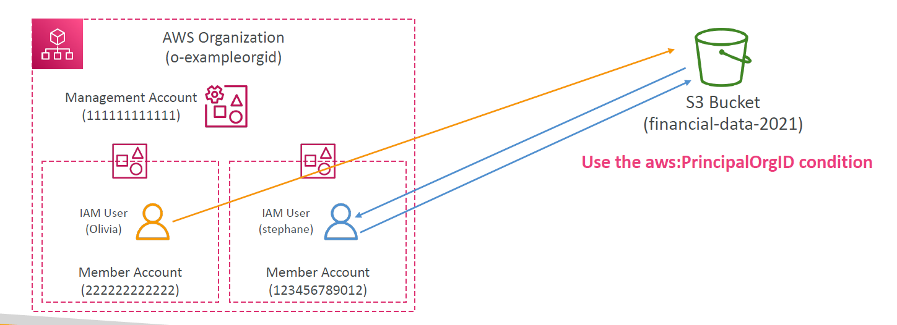
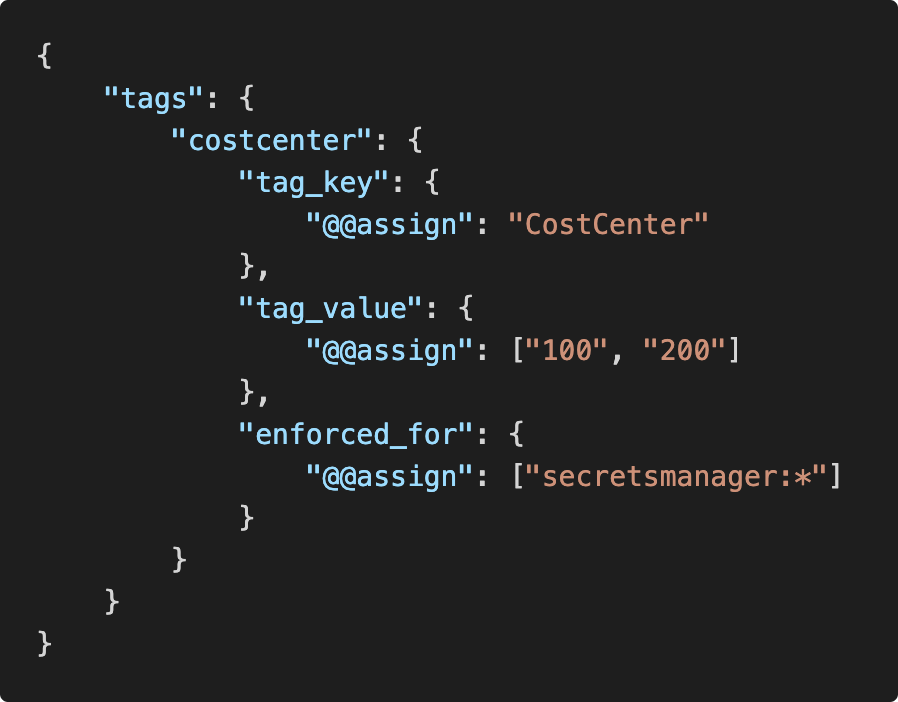

# 🏢 AWS Organizations for sysOps

**AWS Organizations** isn’t just for consolidated billing — it’s a powerful framework for **centralized governance**, **access control**, **cost optimization**, and **resource standardization** across your entire multi-account AWS environment.

---

## 📊 1. Reserved Instances & Savings Plans Sharing

When you manage multiple AWS accounts under **AWS Organizations**, you can **share Reserved Instances (RIs)** and **Savings Plans** across all member accounts. This helps optimize costs without needing to buy separate RIs in each account.

---

### ✅ How It Works

- When **RI/Savings Plan sharing is enabled**, all accounts in your organization can **automatically use the capacity** and **discounts** from RIs or Savings Plans purchased by **any account**, including the management account.

- This means:

  - You save more money.
  - You don’t have to predict usage per account.

---

### ❌ When You Might Disable Sharing

Sometimes, you may **not want to share** RIs/Savings Plans across accounts—for example:

- Departments have **separate billing** and budgets.
- You need **strict cost separation**.

In this case:

- The **payer account (management account)** can **turn off sharing** for any account.
- When sharing is turned off for an account:

  - That account **cannot use other accounts’ discounts**.
  - Its own discounts **won’t be shared** either.

---

### 🔄 Sharing Rules Summary

| Condition                       | Can Use Shared RI? | Can Share RI? |
| ------------------------------- | ------------------ | ------------- |
| Sharing turned ON in both A & B | ✅ Yes             | ✅ Yes        |
| Sharing turned OFF in A         | ❌ No              | ❌ No         |
| Sharing turned OFF in B         | ❌ No              | ❌ No         |

---

### 💡 Example Use Case

Let’s say:

- Your **Finance team** buys a 3-year Reserved Instance.
- Your **DevOps team** runs EC2 workloads in a different account.

👉 If **RI sharing is enabled**, the DevOps team automatically benefits from the reserved discount.

But…

👉 If you want **strict cost ownership**, you can disable RI sharing for the DevOps account.

---

### 🛠️ How to Configure It

1. Go to the **Billing and Cost Management console** in the **management account**.
2. Under **RI or Savings Plan Preferences**, toggle **sharing** ON or OFF per account.
3. Both accounts must have sharing **enabled** for it to work between them.

---

## 🛡️ 2. IAM Policy Enforcement with `aws:PrincipalOrgID`

When securing **shared resources** (like an S3 bucket, KMS key, or secret), you can lock access down to just **your organization**:

---

<div align="center">
    
</div>

---

```json
"Condition": {
  "StringEquals": {
    "aws:PrincipalOrgID": "o-exampleorgid"
  }
}
```

✅ Use this in:

- S3 bucket policies
- KMS key policies
- Secrets Manager
- EventBridge rules

📌 **Benefit:** No matter who tries to access it, unless they belong to your Org, they're blocked—even if they have the right credentials.

---

## 🏷️ 3. Enforcing Tag Policies (Tag Governance)

With **Tag Policies**, you can enforce **standardized tagging rules** across accounts, which is crucial for:

- Cost allocation
- Security compliance (ABAC)
- Resource tracking

👀 **Example:**

---

<div align="center">
    
</div>

---

```json
{
  "tags": {
    "costcenter": {
      "tag_key": { "@@assign": "CostCenter" },
      "tag_value": { "@@assign": ["100", "200"] },
      "enforced_for": { "@@assign": ["secretsmanager:*"] }
    }
  }
}
```

### ✅ Use Cases

- Force cost center tags on secrets, EC2, or S3
- Audit who forgot tagging
- Prevent launch of resources without compliant tags

📤 **Monitoring Tip:** Use **CloudWatch Events** or **AWS Config** to monitor tag compliance in near real-time.

---

## 📬 4. Secure Resource Sharing with `aws:PrincipalOrgID`

🛡️ Example Scenario:

- A central **S3 bucket** (financial-data) is used by multiple accounts.
- Instead of listing every account ID, use `aws:PrincipalOrgID` to **allow access to any account in the Org**.

<div align="center">
  
</div>

---

## 🧩 5. Aggregated Config Views with AWS Config Aggregators

🚀 Use a **Config Aggregator** in a management account to pull compliance and config data from all accounts and regions.

- View organization-wide **compliant/non-compliant** resource summary
- Combine with AWS Config Rules to audit **SSL enforcement**, **instance types**, **SG rules**, etc.
- Deploy config rules to accounts via **CloudFormation StackSets**

---

## 💡 Bonus Tips

| 🧠 Practice                               | Why it Matters                                                          |
| ----------------------------------------- | ----------------------------------------------------------------------- |
| Enable **CloudTrail Org Trail**           | Monitor all API activity org-wide, even if member accounts are tampered |
| Set **SCPs (Service Control Policies)**   | Enforce guardrails (e.g., deny public S3, block IAM changes)            |
| Use **Org-level Budgets**                 | Enforce cost control at a per-account or OU level                       |
| Use **AWS Organizations + Control Tower** | For auto-account provisioning with baseline security + governance       |
