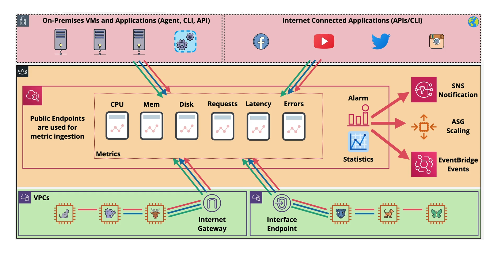

# 📊 **AWS CloudWatch Metrics – Monitor Everything, Smarter**

> CloudWatch **metrics** give you **numerical insights** into everything running on AWS — like CPU usage, network traffic, or custom business values.
> Whether you use EC2, Lambda, RDS, or your own app — **metrics help you see performance trends, detect problems, and trigger alarms.**

---

<div style="text-align: center;">
    
</div>

---

## 🔍 **What Is a CloudWatch Metric?**

A **metric** is just a **time-stamped number** that measures something.

| Example Metric Name | What It Measures                  |
| ------------------- | --------------------------------- |
| `CPUUtilization`    | How busy your EC2 instance is (%) |
| `NetworkIn`         | Bytes coming into your server     |
| `Latency`           | Response time for an API          |

> 🧠 Every AWS service publishes metrics to CloudWatch **automatically**.

---

## 🧭 **Key Concepts**

| Concept       | Explanation                                                                                             |
| ------------- | ------------------------------------------------------------------------------------------------------- |
| **Metric**    | The actual thing being tracked - It is a variable to monitor (e.g., `CPUUtilization`)                   |
| **Namespace** | Metrics belong to namespaces, Like a folder for metrics (e.g., `AWS/EC2`, `AWS/Lambda`, `Custom/MyApp`) |
| **Dimension** | is an attribute of a metric (e.g., `InstanceId`, `Environment=prod`)                                    |
| **Timestamp** | When the data point was collected                                                                       |
| **Value**     | The number itself (e.g., `CPU = 72%`)                                                                   |

> 📌You can add **up to 30 dimensions per custom metric**.

---

## 💻 **EC2 Monitoring Metrics**

By default, EC2 sends metrics **every 5 minutes**.

| Metric                 | Available Without Extra Setup? |
| ---------------------- | ------------------------------ |
| CPUUtilization         | ✅ Yes (default)               |
| NetworkIn / NetworkOut | ✅ Yes                         |
| DiskReadBytes          | ✅ Yes                         |
| **Memory usage**       | ❌ No (must use custom metric) |

### 🛠️ Want 1-minute resolution?

Enable **Detailed Monitoring** (paid):

- Ideal for **faster scaling** in Auto Scaling Groups
- AWS Free Tier includes **10 detailed metrics**

---

## ⚙️ **Custom Metrics**

> You can push **your own metrics** to CloudWatch from any app, server, or container.

### ✍️ **Example Use Cases:**

| Custom Metric      | Description                                    |
| ------------------ | ---------------------------------------------- |
| `RAMUtilization`   | Memory usage (not available by default on EC2) |
| `ActiveUsersCount` | Logged-in users in your application            |
| `QueueDepth`       | Number of jobs in a custom queue               |

### 🪜 **How to Send:**

Use the `PutMetricData` API (via AWS CLI, SDK, or CloudWatch Agent)

```bash
aws cloudwatch put-metric-data \
  --namespace "Custom/MyApp" \
  --metric-name "RAMUtilization" \
  --value 65 \
  --dimensions InstanceId=i-12345678,Environment=Prod
```

> 📌 **You can submit metrics up to 2 weeks in the past and 2 hours in the future**

---

## 📦 **Unified CloudWatch Agent (for EC2)**

> Use the **CloudWatch Unified Agent** to collect detailed system-level metrics.

### ✅ **Metrics Collected:**

| Category      | Examples                               |
| ------------- | -------------------------------------- |
| **CPU**       | Idle, user, system, steal, guest       |
| **RAM**       | Free, used, total, cached              |
| **Disk**      | Free, used, IOPS, bytes                |
| **Network**   | TCP/UDP connections, packets, bytes    |
| **Swap**      | Space free/used                        |
| **Processes** | Total, idle, sleeping, zombie, running |

> 📌 The agent runs on **Linux and Windows EC2** and can be customized via config files.

---

## 📊 **Use Metrics in Dashboards, Alarms & Autoscaling**

You can use metrics to:

- 🎯 **Visualize** → Add to CloudWatch Dashboards
- ⏰ **Alert** → Create Alarms (e.g., CPU > 80%)
- 🔄 **Autoscale** → Trigger EC2 or ECS Auto Scaling actions
- 🧪 **Troubleshoot** → Investigate slowdowns or failures

---

## ✅ Summary

| Feature                 | Value                                                  |
| ----------------------- | ------------------------------------------------------ |
| Native Metrics          | Available by default for most AWS services             |
| Custom Metrics          | Push your own values (like memory, active users, etc.) |
| Detailed Monitoring     | EC2 metrics every 1 minute instead of 5                |
| Unified Agent           | Collect in-depth OS-level metrics from inside EC2      |
| Use Cases               | Scaling, alerting, cost control, observability         |
| Dimensions + Namespaces | Help organize and filter metrics                       |
