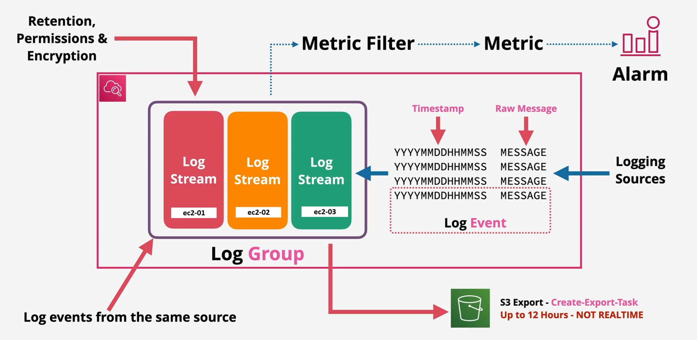
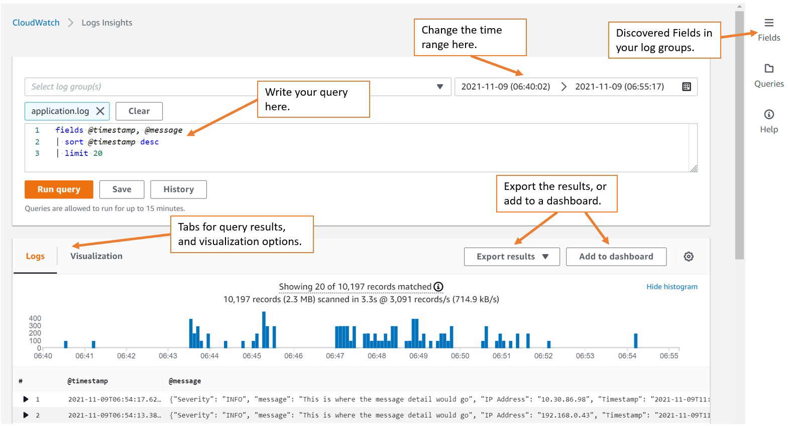
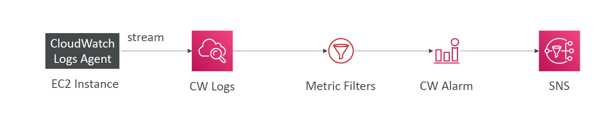
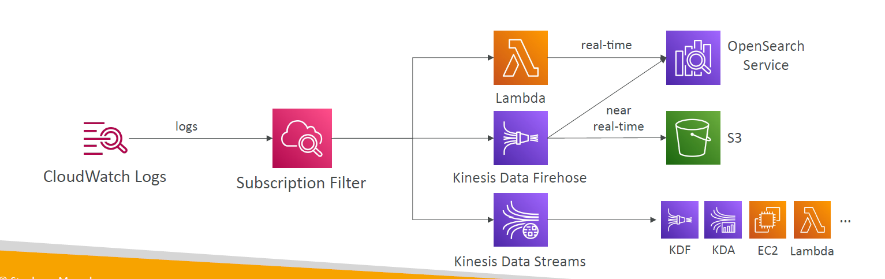
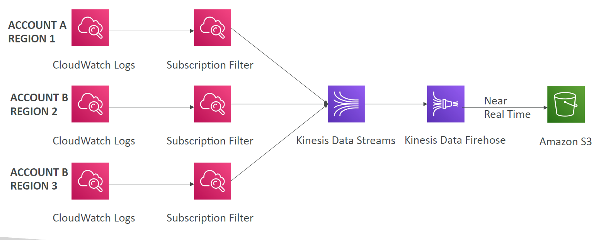
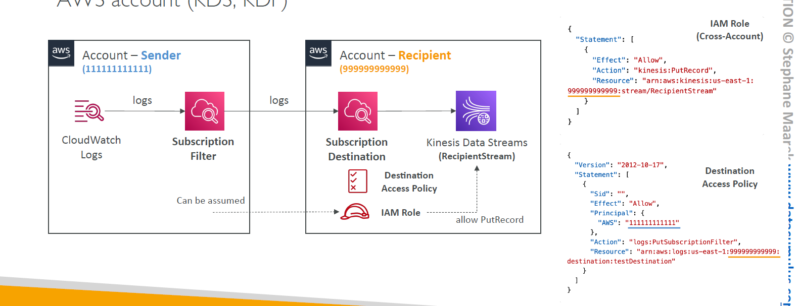

# 📜 **Amazon CloudWatch Logs**

> **CloudWatch Logs** is AWS’s central logging solution that allows you to **collect, monitor, search, and route** log data from nearly any source — AWS services, EC2 instances, containers, and even on-prem servers.

✅ Whether you're debugging an error, triggering alarms from log content, or analyzing trends — CloudWatch Logs is your go-to service.

---

<div style="text-align: center;">
    
</div>

---

## 🧱 Core Concepts of CloudWatch Logs

| Component        | Purpose                                                                |
| ---------------- | ---------------------------------------------------------------------- |
| **Log Event**    | A single entry or line in your log (e.g. `ERROR at 10:30 AM`)          |
| **Log Stream**   | A sequence of log events from a single source (e.g., one EC2 instance) |
| **Log Group**    | A container for multiple log streams (e.g., `MyApp-Prod-Logs`)         |
| **Retention**    | How long logs are kept (1 day to 10 years)                             |
| **Log Filter**   | Detect patterns like `ERROR` or specific IPs                           |
| **Subscription** | Stream logs in real-time to another service like S3, Lambda, Kinesis   |

---

## 🔧 What Can Send Logs to CloudWatch?

| Source Type         | Examples                                            |
| ------------------- | --------------------------------------------------- |
| **AWS Services**    | Lambda, API Gateway, ECS, CloudTrail, VPC Flow Logs |
| **EC2 Instances**   | System & application logs (via agent)               |
| **On-prem Servers** | Via CloudWatch Logs Agent or Unified Agent          |
| **Custom Apps**     | Use SDK to push logs via API                        |

---

## 🛠️ CloudWatch Logs Agents (for EC2 / On-Prem)

### 1. **CloudWatch Logs Agent (Legacy)**

- Basic log shipping to CloudWatch
- Manual config (JSON)

### 2. **CloudWatch Unified Agent (Preferred)**

- Unified metrics + logs agent
- Managed config via **SSM Parameter Store**
- Supports system metrics too (RAM, disk, CPU, processes)

✅ Use Unified Agent for:

- EC2 logs
- On-prem server logs
- Centralized config & monitoring

---

## 🧪 CloudWatch Log Insights

> CloudWatch Logs Insights is a **powerful query engine** to search and analyze logs using a simple query language.

---

<div style="text-align: center;">
    
</div>

---

| Feature                     | Benefit                                     |
| --------------------------- | ------------------------------------------- |
| 🔎 **Search logs**          | Quickly find messages, IPs, or status codes |
| 📊 **Visualize data**       | Show results in charts/tables               |
| 🧠 **Auto field discovery** | Supports JSON-based logs                    |
| 💾 **Save Queries**         | For dashboards and repeated analysis        |

### 🧠 Example Query

```sql
fields @timestamp, @message
| filter @message like /ERROR/
| stats count() by bin(5m)
```

> ✅ Find how many `ERROR`s occurred every 5 minutes.

---

## 📊 Log Metric Filters – _Turn Logs into Metrics_

> You can convert log patterns into **CloudWatch Metrics** (e.g., count of 500 errors)

---

<div style="text-align: center;">
    
</div>

---

### 🔍 Example Use Case

- Count how many times “Exception” appears in logs
- Create a metric: `MyAppExceptionCount`
- Trigger an alarm if >10 exceptions in 5 minutes

| Component          | Description                                    |
| ------------------ | ---------------------------------------------- |
| **Filter Pattern** | What to look for in the logs (e.g., `"ERROR"`) |
| **Custom Metric**  | Name of the metric to create                   |
| **Alarm**          | Set a threshold to get notified or take action |

📌 Filters only match logs **from the moment they’re created forward** (no retroactive matching).

---

## 🔁 Real-Time Streaming – Log Subscriptions

> You can **stream log events in near real-time** to other AWS services like:

---

<div style="text-align: center;">
    
</div>

---

- **AWS Lambda** (for alerts, processing)
- **Kinesis Data Streams / Firehose** (to store in S3 or analyze)
- **OpenSearch** (for full-text search)

### 🔧 Subscription Filter

A **filter** defines which log events are sent to the destination.

> Example: Only send logs that contain `status: 500`

📌 You can **cross-account stream logs** (e.g., send logs from prod account to central logging account)

### ✍🏻 Examples

#### CloudWatch Logs Aggregation Multi-Account & Multi Region

<div style="text-align: center;">
    
</div>

---

<div style="text-align: center;">
    
</div>

####

---

## 🪣 Export Logs to S3

> Want to archive logs for **long-term storage**?

✅ Use **CreateExportTask** API to send log data to an S3 bucket.

### **Important Notes:**

- Not real-time (up to **12 hours** delay)
- Great for compliance, backup, or offline processing

---

## 🔒 Security – Protect Your Logs

| Encryption Type  | Details                                             |
| ---------------- | --------------------------------------------------- |
| **In Transit**   | Logs are encrypted when sent over the network       |
| **At Rest**      | Encrypted with AWS-managed or **customer KMS keys** |
| **IAM Policies** | Control who can read, write, or delete logs         |

✅ Always enforce **least privilege** on log read/write/delete actions.

---

## 💰 Cost Considerations

| Cost Area                | Charged For                                                    |
| ------------------------ | -------------------------------------------------------------- |
| 📥 **Ingestion**         | Per GB ingested into CloudWatch Logs                           |
| 💾 **Storage**           | Per GB-month stored (based on retention)                       |
| 🔎 **Insights Queries**  | Charged per GB scanned                                         |
| 📤 **Exports/Streaming** | No charge for delivery, but destination service may incur cost |

---

## 💡 Use Cases

| Scenario              | How CloudWatch Logs Helps                        |
| --------------------- | ------------------------------------------------ |
| Debugging app crashes | Analyze Lambda logs or EC2 logs via Log Insights |
| Monitoring security   | Track failed login attempts or unusual IPs       |
| Auditing              | Retain CloudTrail logs with controlled access    |
| Alerting              | Trigger alarms when patterns appear in logs      |
| Compliance            | Archive logs to S3 for 7+ years                  |

---

## 🧠 Summary

| Feature                 | Description                                          |
| ----------------------- | ---------------------------------------------------- |
| **Log Group**           | Logical container for related logs                   |
| **Log Stream**          | Per-source or per-instance sequence of events        |
| **Metric Filter**       | Create metrics from logs                             |
| **Log Insights**        | Query logs using a custom search language            |
| **Subscriptions**       | Send logs to Lambda/Kinesis/OpenSearch in real-time  |
| **S3 Export**           | Archive logs (not real-time)                         |
| **Agent/Unified Agent** | Ship logs from EC2 or on-prem systems                |
| **Security**            | Logs encrypted at rest & in transit with IAM control |
