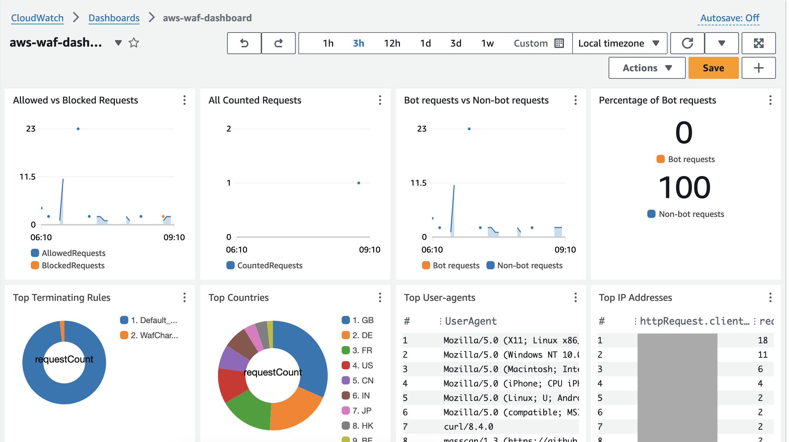

# 📊 **Amazon CloudWatch Dashboards**

> _A centralized, customizable way to visualize AWS resources and alarms across accounts and regions._

---

    

---

## 🚀 **What Are CloudWatch Dashboards?**

**CloudWatch Dashboards** are **customizable visual panels** that allow you to monitor **AWS services, custom metrics, and alarms** from a single, unified interface.

They are ideal for:

- ⚠️ Quickly spotting problems.
- 📈 Presenting real-time metrics for.
- 🌍 Monitoring across **teams, accounts, or regions**

---

## 🧱 **Key Features**

| Feature                  | Description                                                    |
| ------------------------ | -------------------------------------------------------------- |
| 🧩 **Custom Layout**     | Drag-and-drop widgets for metrics, text, alarms                |
| 🌐 **Global Scope**      | Combine metrics across AWS **regions** and **accounts**        |
| ⏰ **Custom Time Zones** | Adjust the time zone per dashboard or widget                   |
| 🔄 **Auto Refresh**      | Set dashboards to auto-refresh every 10s, 1m, 2m, 5m, or 15m   |
| 🛡️ **Access Control**    | Share dashboards **publicly** or restrict with **Cognito/SSO** |
| 📦 **Multi-Service**     | Add data from EC2, Lambda, RDS, S3, ALB, custom metrics, etc.  |

---

## 🖥️ **Common Use Cases**

✅ Operations Team:

- Track EC2 CPU, EBS IOPS, RDS connections, and alarms in one glance.

✅ DevOps Dashboard:

- Combine CloudFront, API Gateway, and Lambda metrics to visualize traffic flow.

✅ Billing & Usage:

- Display AWS usage metrics or billing stats for execs or finance teams.

✅ Multi-Region App Monitoring:

- Bring together logs and metrics from us-east-1, eu-west-1, and ap-south-1 in one global view.

---

## 🧰 **Widget Types**

You can mix-and-match widgets such as:

- 📈 **Line graphs**
- 📊 **Number & gauge indicators**
- 📋 **Text blocks for annotation**
- 🔔 **Alarm state summary**
- 🗂️ **Custom metric widgets**

---

## 🛡️ **Sharing Dashboards**

CloudWatch Dashboards can be shared:

| Method               | Use Case                                  |
| -------------------- | ----------------------------------------- |
| 🔗 **Public URL**    | Viewable by anyone, no AWS login required |
| 📧 **Email Share**   | Send read-only dashboards to stakeholders |
| 👥 **SSO (Cognito)** | Integrate with third-party SSO providers  |

Perfect for sharing real-time app status with clients, management, or external auditors.

---

## 💵 **Pricing**

CloudWatch Dashboards have a **free tier**, then a pay-as-you-grow model:

- ✅ **3 dashboards FREE** (up to 50 metrics)
- 💰 \$3/dashboard/month **after that**

> 💡 Tip: Use consolidated dashboards to minimize costs!

---

## ⚙️ **Best Practices**

- 🔍 Group related metrics into one dashboard (e.g., “Web Tier”, “DB Layer”)
- 🎯 Use alarm widgets to **highlight critical issues**
- 🌍 Combine global + regional dashboards for **end-to-end visibility**
- 🔄 Enable **auto-refresh** during incident monitoring sessions

---

## 🧠 Final Thoughts

CloudWatch Dashboards provide:

- **Real-time** visibility
- **Custom control** over how data is visualized
- **Seamless integration** with other AWS services

> _Monitor smarter, act faster, and keep everyone aligned with CloudWatch Dashboards._
