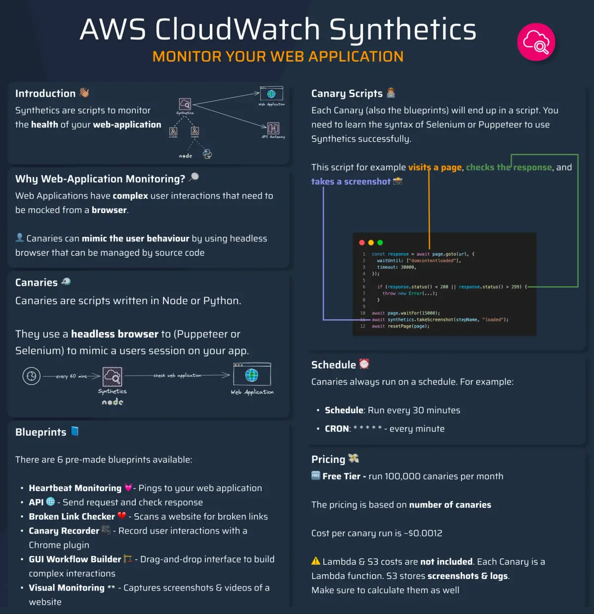

# 🕵️‍♂️ **Amazon CloudWatch Synthetics Canary**

> Configurable script that monitor your APIs, URLs, Websites, …etc

---

<div style="text-align: center;">
    
</div>

---

## 🚀 What Is a Synthetics Canary?

A **Canary** is a **scripted, automated browser test** that **simulates user interactions** with your application or API.

✅ It runs on a schedule, **just like a real user**, and helps detect:

- Broken links
- API failures
- Page load delays
- Visual issues

> Named after the **“canary in a coal mine”** 🐤 — it warns you _before_ users are impacted.

---

## 🧩 Real-World Example

> You build an ecommerce app. Create 3 canaries:

1. `HomepageCanary` – loads homepage every 1 min
2. `LoginCanary` – logs in with test credentials every 5 min
3. `CheckoutAPI` – checks response from `/api/checkout`

🎯 If login breaks or checkout fails, you’ll know **before your customers** do.

---

## ⚙️ Integration with CloudWatch

✅ Each canary automatically creates:

| Resource               | Use                                            |
| ---------------------- | ---------------------------------------------- |
| **CloudWatch Metrics** | For success %, duration, failures              |
| **CloudWatch Logs**    | Stores logs, results, failures, screenshots    |
| **Alarms**             | Optional alarms on failure rate, latency, etc. |
| **S3 Bucket**          | Stores screenshots and HAR files               |

---

## 🛠️ Scripting Canaries

- Written in **Node.js** or **Python**
- Use the [Synthetics API](https://docs.aws.amazon.com/AmazonCloudWatch/latest/monitoring/CloudWatch_Synthetics_Canaries_Library.html)
- Script is run by AWS Lambda in the background
- Headless Chrome browser is included

### 🧠 Example

```javascript
const synthetics = require("Synthetics");
const log = require("SyntheticsLogger");

exports.handler = async function () {
  const page = await synthetics.getPage();
  await page.goto("https://example.com");
  log.info("Loaded the homepage");
  await page.screenshot({ path: "/tmp/example.png" });
};
```

---

## 📦 Canary Types (Blueprints)

| Blueprint                | What It Does                                             |
| ------------------------ | -------------------------------------------------------- |
| **Heartbeat Monitor**    | Load a URL, take a screenshot, record HTTP archive (HAR) |
| **API Canary**           | Call REST APIs (GET, POST), validate responses           |
| **Broken Link Checker**  | Finds broken links on a webpage                          |
| **GUI Workflow Builder** | Automate flows like logging in, submitting forms         |
| **Visual Monitoring**    | Compare UI screenshots across runs                       |
| **Recorder**             | Auto-generate canary scripts by recording your clicks    |

---

## 🧠 Key Features

| Feature                           | Description                                         |
| --------------------------------- | --------------------------------------------------- |
| ✅ **Runs Headless Browser**      | Uses headless Chrome to simulate real interactions  |
| 🕐 **Scheduled Monitoring**       | Runs every X minutes (e.g., every 1, 5, or 15 mins) |
| 🔁 **Test Multiple Flows**        | API calls, login forms, checkout flows, etc.        |
| 🖼️ **Visual Screenshots**         | Captures screenshots & performance data             |
| 📦 **Stores HAR Files**           | Keeps HTTP Archive files for debugging              |
| 📊 **Integrated with CloudWatch** | Sends metrics and logs, triggers alarms             |
| 🔐 **Supports IAM & KMS**         | Secure, auditable, and encrypted                    |

---

## 🧪 Common Canary Use Cases

| Use Case                         | Example                                           |
| -------------------------------- | ------------------------------------------------- |
| 🌐 **Website Uptime**            | Ping homepage every minute                        |
| 🔐 **Login Flows**               | Simulate user login with form input               |
| 🔁 **API Monitoring**            | Check `/health` or `/orders` endpoint             |
| 🔗 **Broken Link Detection**     | Crawl pages and find 404s                         |
| 🧪 **Visual Regression Testing** | Compare current UI screenshot to a baseline image |

---

## 🔐 Security & Permissions

- Canaries use **IAM Roles** to access resources securely
- Logs & artifacts are **encrypted using AWS KMS**
- You can configure **VPC access** for private endpoint testing

---

## 💰 Pricing

| Cost Component     | Notes                            |
| ------------------ | -------------------------------- |
| Canary run         | Per run, based on duration       |
| Logs & screenshots | Stored in S3 and CloudWatch Logs |
| X-Ray trace data   | Extra if enabled                 |

🧠 You pay per **run** and **storage** used.

---

## ✅ Summary – Why Use Synthetics Canary?

| Benefit                      | Outcome                                             |
| ---------------------------- | --------------------------------------------------- |
| 🎯 Proactive Monitoring      | Catch issues _before_ users do                      |
| 👨‍💻 Simulates Real Users      | Not just uptime, but **user experience**            |
| 🧪 Easy to Script or Use GUI | Flexible for devs, testers, or SREs                 |
| 📊 Full observability        | Logs, metrics, screenshots, alarms — all integrated |
| 🔄 Runs on schedule          | Every minute if you want — auto-notify on failure   |

## 🎉 Very Important Examples

[Use CloudWatch Synthetics to Monitor Your Web Application](https://awsfundamentals.com/blog/use-cloudwatch-synthetics-to-monitor-your-web-application)

[Managing CloudWatch Synthetics canaries at scale](https://aws.amazon.com/blogs/mt/managing-cloudwatch-synthetics-canaries-at-scale/)
