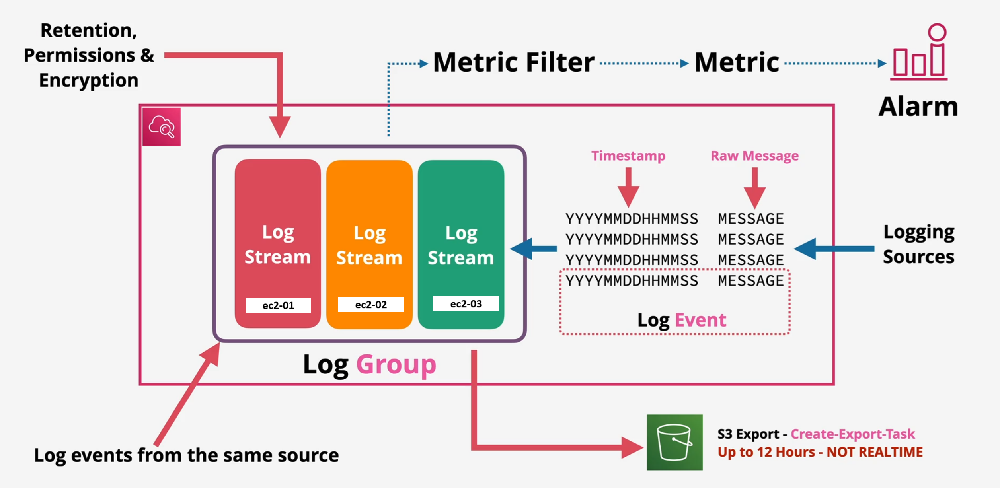
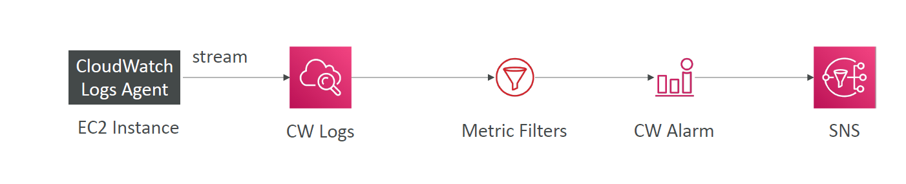
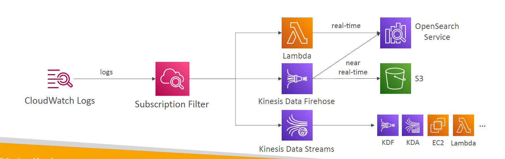
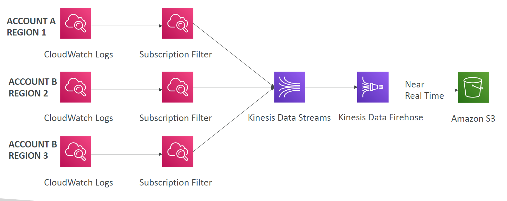
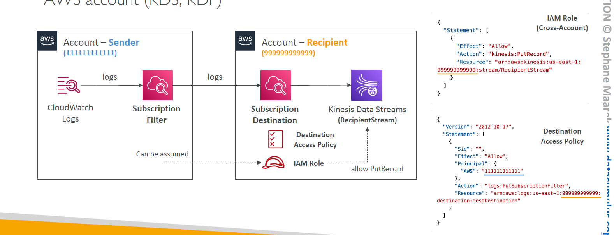

---
tags:
  - aws
  - aws/service
  - aws/domain/management-and-governance
  - aws/topic/cloud-watch
aliases:
  - "Amazon CloudWatch Logs"
  - "Cw Logs"
  - "CloudWatch Logs"
---

# 📜 **Amazon CloudWatch Logs**

> **CloudWatch Logs** is AWS’s central logging solution that allows you to **collect, monitor, search, and route** log data from nearly any source — AWS services, EC2 instances, containers, and even on-prem servers.

✅ Whether you're debugging an error, triggering alarms from log content, or analyzing trends — CloudWatch Logs is your go-to service.

---

    

---

## 🧱 Core Concepts of CloudWatch Logs

| Component        | Purpose                                                                |
| ---------------- | ---------------------------------------------------------------------- |
| **Log Event**    | A single entry or line in your log (e.g. `ERROR at 10:30 AM`)          |
| **Log Stream**   | A sequence of log events from a single source (e.g., one EC2 instance) |
| **Log Group**    | A container for multiple log streams (e.g., `MyApp-Prod-Logs`)         |
| **Retention**    | How long logs are kept (1 day to 10 years)                             |
| **Log Filter**   | Detect patterns like `ERROR` or specific IPs                           |
| **Subscription** | Stream logs in real-time to another service like S3, Lambda, Kinesis   |

---

## 🔧 What Can Send Logs to CloudWatch?

| Source Type         | Examples                                            |
| ------------------- | --------------------------------------------------- |
| **AWS Services**    | Lambda, API Gateway, ECS, CloudTrail, VPC Flow Logs |
| **EC2 Instances**   | System & application logs (via agent)               |
| **On-prem Servers** | Via CloudWatch Logs Agent or Unified Agent          |
| **Custom Apps**     | Use SDK to push logs via API                        |

---

## 🛠️ CloudWatch Logs Agents (for EC2 / On-Prem)

### 1. **CloudWatch Logs Agent (Legacy)**

- Basic log shipping to CloudWatch
- Manual config (JSON)

### 2. **CloudWatch Unified Agent (Preferred)**

- Unified metrics + logs agent
- Managed config via **SSM Parameter Store**
- Supports system metrics too (RAM, disk, CPU, processes)

✅ Use Unified Agent for:

- EC2 logs
- On-prem server logs
- Centralized config & monitoring

---

## 📊 Log Metric Filters – _Turn Logs into Metrics_

> You can convert log patterns into **CloudWatch Metrics** (e.g., count of 500 errors)

---

    

---

### 🔍 Example Use Case

- Count how many times “Exception” appears in logs
- Create a metric: `MyAppExceptionCount`
- Trigger an alarm if >10 exceptions in 5 minutes

| Component          | Description                                    |
| ------------------ | ---------------------------------------------- |
| **Filter Pattern** | What to look for in the logs (e.g., `"ERROR"`) |
| **Custom Metric**  | Name of the metric to create                   |
| **Alarm**          | Set a threshold to get notified or take action |

📌 Filters only match logs **from the moment they’re created forward** (no retroactive matching).

---

## 🔁 Real-Time Streaming – Log Subscriptions

> You can **stream log events in near real-time** to other AWS services like:

---

    

---

- **AWS Lambda** (for alerts, processing)
- **Kinesis Data Streams / Firehose** (to store in S3 or analyze)
- **OpenSearch** (for full-text search)

### 🔧 Subscription Filter

A **filter** defines which log events are sent to the destination.

> Example: Only send logs that contain `status: 500`

📌 You can **cross-account stream logs** (e.g., send logs from prod account to central logging account)

### ✍🏻 Examples

#### CloudWatch Logs Aggregation Multi-Account & Multi Region

    

---

    

####

---

## 🪣 Export Logs to S3

> Want to archive logs for **long-term storage**?

✅ Use **CreateExportTask** API to send log data to an S3 bucket.

### **Important Notes:**

- Not real-time (up to **12 hours** delay)
- Great for compliance, backup, or offline processing

---

## 🔒 Security – Protect Your Logs

| Encryption Type  | Details                                             |
| ---------------- | --------------------------------------------------- |
| **In Transit**   | Logs are encrypted when sent over the network       |
| **At Rest**      | Encrypted with AWS-managed or **customer KMS keys** |
| **IAM Policies** | Control who can read, write, or delete logs         |

✅ Always enforce **least privilege** on log read/write/delete actions.

---

## 💰 Cost Considerations

| Cost Area                | Charged For                                                    |
| ------------------------ | -------------------------------------------------------------- |
| 📥 **Ingestion**         | Per GB ingested into CloudWatch Logs                           |
| 💾 **Storage**           | Per GB-month stored (based on retention)                       |
| 🔎 **Insights Queries**  | Charged per GB scanned                                         |
| 📤 **Exports/Streaming** | No charge for delivery, but destination service may incur cost |

---

## 💡 Use Cases

| Scenario              | How CloudWatch Logs Helps                        |
| --------------------- | ------------------------------------------------ |
| Debugging app crashes | Analyze Lambda logs or EC2 logs via Log Insights |
| Monitoring security   | Track failed login attempts or unusual IPs       |
| Auditing              | Retain CloudTrail logs with controlled access    |
| Alerting              | Trigger alarms when patterns appear in logs      |
| Compliance            | Archive logs to S3 for 7+ years                  |

---

## 🧠 Summary

| Feature                 | Description                                          |
| ----------------------- | ---------------------------------------------------- |
| **Log Group**           | Logical container for related logs                   |
| **Log Stream**          | Per-source or per-instance sequence of events        |
| **Metric Filter**       | Create metrics from logs                             |
| **Log Insights**        | Query logs using a custom search language            |
| **Subscriptions**       | Send logs to Lambda/Kinesis/OpenSearch in real-time  |
| **S3 Export**           | Archive logs (not real-time)                         |
| **Agent/Unified Agent** | Ship logs from EC2 or on-prem systems                |
| **Security**            | Logs encrypted at rest & in transit with IAM control |
---

## Related Notes
- [[aws-services/1.management-governance/3.1.cloud-watch/|Index]] - folder map
- [[aws-services/1.management-governance/3.1.cloud-watch/2.3.cw-dashboards|Amazon CloudWatch Dashboards]] - previous lesson
- [[aws-services/1.management-governance/3.1.cloud-watch/3.2.cw-log-insights|CloudWatch Log Insights]] - next lesson
- [[aws-services/11.analytics/kds/1.1.kds|Amazon Kinesis Data Streams KDS - Real-Time Streaming Storage]] - mentions Kinesis Data Streams
- [[aws-services/11.analytics/kinesis-trash/2.kinesis-data-streams|Amazon Kinesis Data Streams Real-Time Data Processing]] - mentions Kinesis Data Streams
- [[aws-services/1.management-governance/4.1.system-manager/3.3.parameter_store|AWS SSM Parameter Store]] - mentions Parameter Store
- [[aws-services/10.developer/2.1.code-pipeline/5.multi-region|AWS CodePipeline Multi-Region Deployments with CloudFormation]] - mentions Multi Region
- [[aws-services/3.network/4.api-gateway/x.api-gateway|Amazon API Gateway Streamlining API Management]] - mentions API Gateway
- [[aws-services/3.network/4.api-gateway/1.1.api-gateway|AWS API Gateway The Front Door for Your APIs]] - mentions API Gateway
- [[aws-services/4.storage/1.s3/2.5.encryption|Amazon S3 Encryption]] - mentions Encryption
- [[aws-services/3.network/1.vpc/1.fundmentals/7.flow-logs|AWS VPC Flow Logs Monitor Analyze Secure Your Network]] - mentions Flow Logs
- [[aws-services/11.analytics/firehose/1.1.firehose|Amazon Data Firehose The Pipeline That Never Sleeps]] - mentions Firehose

---
