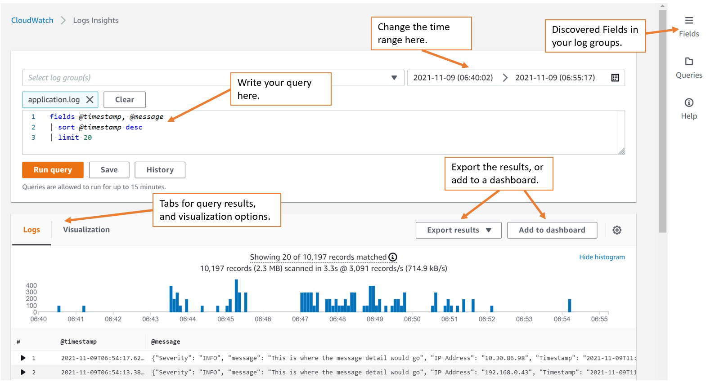

# 🧪 CloudWatch Log Insights

> CloudWatch Logs Insights is a **powerful query engine** to search and analyze logs using a simple query language.

---

<div style="text-align: center;">
    
</div>

---

| Feature                     | Benefit                                     |
| --------------------------- | ------------------------------------------- |
| 🔎 **Search logs**          | Quickly find messages, IPs, or status codes |
| 📊 **Visualize data**       | Show results in charts/tables               |
| 🧠 **Auto field discovery** | Supports JSON-based logs                    |
| 💾 **Save Queries**         | For dashboards and repeated analysis        |

## 🧠 Example Query

```sql
fields @timestamp, @message
| filter @message like /ERROR/
| stats count() by bin(5m)
```

> ✅ Find how many `ERROR`s occurred every 5 minutes.
