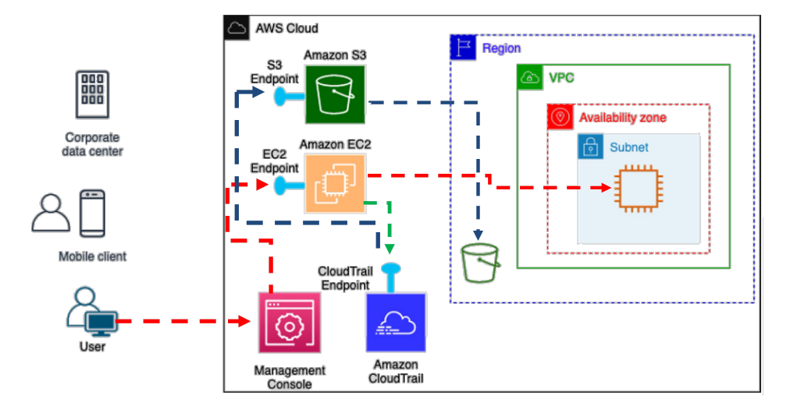
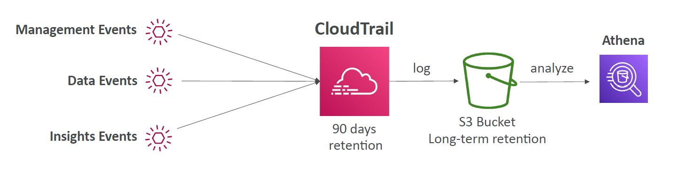
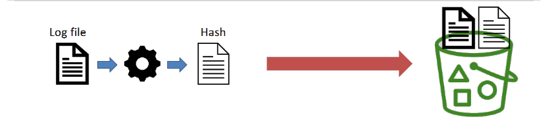

# 🛡️ **AWS CloudTrail – Full Visibility, Full Control**

> Think of **CloudTrail** as your AWS **security camera** and **audit logbook** – quietly tracking **everything that happens** in your account so you don’t miss a beat.

---

## 🔍 **What Is AWS CloudTrail?**

**AWS CloudTrail** provides **governance, compliance, auditing, and operational monitoring** for your AWS account by **recording all API activity** – whether triggered by the **Console**, **CLI**, **SDK**, or AWS **services**.

### ✅ Highlights

- 🧠 **Enabled by default**
- 📝 Logs **all API calls** and **event history**
- 📦 Stores events **90 days by default** (longer with S3)
- 🔁 Supports **multi-region** and **single-region** trails
- 🔄 Integrates with **CloudWatch Logs**, **S3**, **Athena**, and **EventBridge**
- 🔐 Critical for **security investigation**, **change tracking**, and **alerting**

---

## 🧰 **How CloudTrail Works (Internal Flow)**

<div align="center">
  
</div>

| Step | What Happens                                       |
| ---- | -------------------------------------------------- |
| 1️⃣   | User or service performs an API call               |
| 2️⃣   | CloudTrail **records the call**                    |
| 3️⃣   | Logs stored in **Event History (90d)**             |
| 4️⃣   | If trail exists → logs go to **S3**                |
| 5️⃣   | Optionally stream to **CW Logs, EventBridge, SNS** |

---

## 📜 **Types of CloudTrail Events**

### 🔧 **1. Management Events (Control Plane)**

- 💡 Track operations **on AWS resources** like creation, deletion, IAM changes.
- ✅ **Enabled by default** (Free)
- ✍🏻 Supports **Read vs. Write split**

> Example: `CreateBucket`, `AttachRolePolicy`, `CreateSubnet`

---

### 📦 **2. Data Events (Data Plane)**

- 💡 Track **resource-level activity** (e.g., S3 object actions, Lambda invokes)
- ❌ **Disabled by default** – must be enabled manually
- 💰 Charged due to high event volume

> Example: `GetObject`, `PutObject`, `InvokeFunction`

---

### 📊 **CloudTrail Insights Events**

> Detect **unusual patterns** in management API usage automatically

| 🔍 Use Cases                                   |
| ---------------------------------------------- |
| Unexpected resource provisioning               |
| IAM access spikes or surges                    |
| Gaps in expected maintenance activity          |
| Rapid service API bursts (e.g., failed logins) |

- ✅ Enables a baseline of normal
- 📬 **Anomalies appear in Console**
- 🪣 Sent to **S3**
- 🔔 Triggers **EventBridge event**

---

## 🗃️ **Where Can CloudTrail Send Logs?**

| Destination            | Description                                  |
| ---------------------- | -------------------------------------------- |
| 📁 **S3**              | Archive logs indefinitely                    |
| 📊 **CloudWatch Logs** | Real-time monitoring, metric filters, alarms |
| 🧠 **EventBridge**     | Automate workflows based on matching events  |

> ✅ Logs are **encrypted** by default using SSE-S3  
> 🔐 Can use **SSE-KMS** for custom keys

---

## 📅 **Event Retention & Analysis**

<div style="text-align: center;">
    
</div>

---

| Location                     | Retention                     |
| ---------------------------- | ----------------------------- |
| **CloudTrail Event History** | 90 days in console (default)  |
| **S3 Trail**                 | Infinite (as per your bucket) |
| **Athena Querying**          | Use SQL on archived JSON logs |

> Example:

```sql
SELECT eventTime, eventName, userIdentity.userName
FROM cloudtrail_logs
WHERE eventSource = 'iam.amazonaws.com'
  AND eventName = 'AttachUserPolicy';
```

---

## 🔐 **CloudTrail Log File Integrity Validation**

> CloudTrail offers **log file integrity validation** to ensure that your log files haven’t been tampered with.

---

<div align="center">
  
</div>

---

- Every log file stored in S3 can be **cryptographically signed and hashed**
- You can use the CloudTrail CLI or SDK to **validate** log files were not tampered with
- Crucial for **forensic investigations** or **security compliance audits**

---

## ✅ **Best Practices**

- ✅ Use **multi-region trails**
- ✅ Enable **data events** for critical buckets/functions
- ✅ Integrate with **CloudWatch Logs** or **EventBridge** for real-time reactions
- ✅ Archive to **S3 with lifecycle policy**
- ✅ Enable **Insights** in high-sensitivity environments
- ✅ Enable **log file integrity validation**

---

## 🧠 Summary

| Feature                   | Value                                       |
| ------------------------- | ------------------------------------------- |
| 🔍 Records API calls      | ✅ CLI, SDK, Console, AWS Service activity  |
| 📦 Retention Options      | ✅ 90 days (Event History) / unlimited (S3) |
| 📜 Event Types            | ✅ Management, Data, Insights               |
| ⚙️ Automation Compatible  | ✅ Triggers EventBridge, Lambda, SNS        |
| 🔐 Security-Grade Logging | ✅ KMS encryption, integrity validation     |
| 📊 Integrated Monitoring  | ✅ CloudWatch Logs, Athena, SIEM pipelines  |
