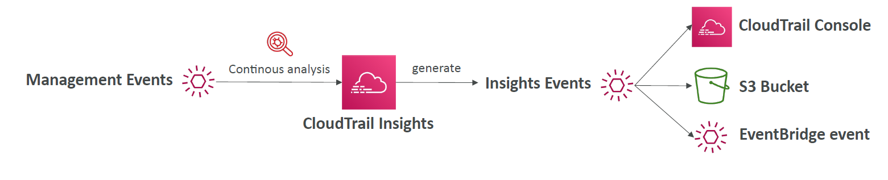

# 📊 **What is AWS CloudTrail Insights?**

> 📖 **CloudTrail Insights** is an _optional_ feature of AWS CloudTrail that helps you **automatically detect unusual or anomalous API activity** in your AWS account.  
> ✅ It uses **machine learning** to establish a baseline of "normal" behavior and then detects **anomalies** — such as sudden spikes in API calls or unexpected usage patterns.

---

<div style="text-align: center;">
    
</div>

---

## 🧠 **Why Use It?**

Regular CloudTrail logs **everything**, but they don’t tell you **what’s unusual**.

**CloudTrail Insights**:

- 🔎 Highlights **abnormal spikes or drops** in activity.
- 📈 Tracks **write-type management events** (e.g., launching EC2, creating users).
- 📬 Sends **notifications or triggers automation** when anomalies are detected.

---

## 🔧 **How It Works (Under the Hood)**

### Step-by-step

1. ✅ **Enabled on a Trail** (Insights are _not enabled by default_).
2. 📊 **Establishes a Baseline**: Learns "normal" behavior by monitoring patterns in API calls.
3. 🚨 **Detects Anomalies**: Flags when activity deviates significantly (e.g., 20x usual rate).
4. 💾 **Stores Insight Events** in your CloudTrail trail (S3 bucket).
5. 🔔 **Optional**: Sends real-time notifications via **EventBridge**.

---

## 🔍 **Examples of Detected Anomalies**

| Behavior                          | Example                                          |
| --------------------------------- | ------------------------------------------------ |
| 💥 Sudden API spikes              | `RunInstances` called 100x more than usual       |
| 🧑‍💻 IAM misuse                  | Burst of `AttachRolePolicy` calls                |
| ⌛ Missing expected behavior      | No scheduled `StartInstances` calls              |
| 🛠️ Abnormal provisioning patterns | Launching 200 EC2s in a region you've never used |

---

## 🧪 **Insight Event Format (Simplified)**

```json
{
  "eventName": "StartInstances",
  "insightDetails": {
    "state": "Start",
    "eventSource": "ec2.amazonaws.com",
    "insightType": "ApiCallRateInsight",
    "statistics": {
      "baseline": 1,
      "insight": 50
    }
  }
}
```

➡️ This means: The `StartInstances` API was called **50 times**, while baseline is just **1**.

---

## ⚙️ **How to Enable CloudTrail Insights**

In the AWS Console:

1. Go to **CloudTrail > Trails**
2. Click on your trail
3. Under **Management events**, check “Enable Insights events”
4. Choose **write-only** events (read-only are not supported)

---

## 📦 **Where Do Insights Go?**

- Stored in **S3** (if trail is configured to store there)
- Can be sent to **CloudWatch Logs** or **EventBridge**
- You can set up **alerts or remediation workflows**

---

## 💰 **Cost Consideration**

CloudTrail Insights is **not free**.

| Tier                              | Approximate Cost   |
| --------------------------------- | ------------------ |
| Per 100,000 write events analyzed | \~\$0.35 USD/month |

🧠 Only **write-type** **management events** are analyzed (not data events or read-only actions).

---

## ✅ **When to Use CloudTrail Insights**

| Use Case                 | Reason                                                |
| ------------------------ | ----------------------------------------------------- |
| 🔐 Security auditing     | Detect IAM or VPC misuse automatically                |
| 🚨 Alerting              | Get alerts for suspicious API surges                  |
| 📊 Anomaly Detection     | Monitor spikes in provisioning or destructive actions |
| 🛠️ Operational awareness | Know when something “unusual” starts happening        |

---

## 📌 Summary

| Feature               | CloudTrail Insights                        |
| --------------------- | ------------------------------------------ |
| Detects anomalies     | ✅ Yes – based on API rate/volume          |
| Works on event type   | ✅ Management Events (write-only)          |
| How to receive alerts | EventBridge, CloudWatch, or S3             |
| Uses ML               | ✅ Builds baselines automatically          |
| Billing               | 💰 Paid add-on, per API event analyzed     |
| Example use case      | Detect spike in `TerminateInstances` calls |
